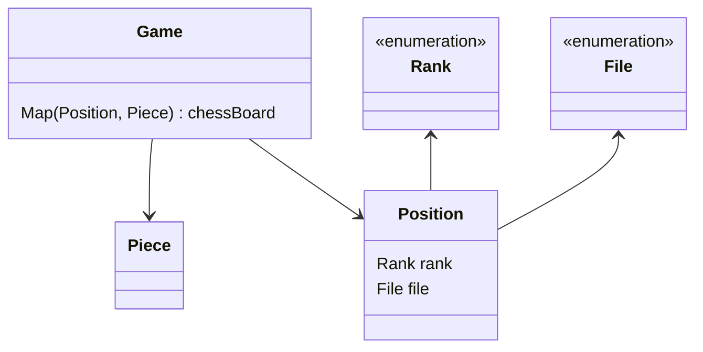
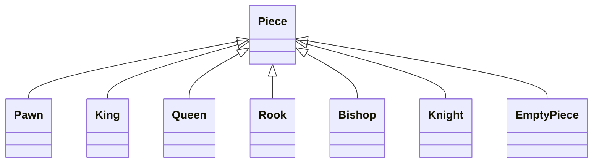

# java-chess

체스 미션 저장소

## 클래스 다이어그램

### 체스 말들의 상속 관계

# 기능 요구 사항

### Position

- [x] File, Rank로 위치 정보를 생성한다.
    - [x] col정보는 File인스턴스로 나타낸다.
    - [x] row정보는 Rank인스턴스로 나타낸다.
- [x] File, Rank의 증분을 계산한다.
- [x] Target position까지의 이동 경로를 반환한다.
    - [x] 요청받은 movement를 기준으로 해당 방향으로 한 칸 움직인다.

### Piece

- [ ] Source position에서 Target position으로 가는 경로를 반환한다.
    - [ ] Target position이 해당 말이 이동할 수 없는 위치일 경우 예외가 발생한다.
- [x] source piece와 target piece가 같은 팀인지 확인한다.
- [x] source piece와 target piece가 다른 팀인지 확인한다.

### Pawn

- [x] 이동할 수 있는지 확인한다.
    - [x] White 진영은 위로, Black 진영은 아래로 움직인다.
    - [x] 첫 움직임은 2칸까지, 나머지 움직임은 1칸까지 움직일 수 있다.
    - [x] 상대편 말을 잡을 때는 대각선으로만 움직일 수 있다.
- [x] 입력 받은 Target position으로 가는 경로를 반환한다.

### Bishop

- [x] 이동할 수 있는지 확인한다.
    - [x] 대각선으로만 움직일 수 있다.
    - [x] Target에 같은 진영 말이 있으면 움직일 수 없다.
- [x] 입력 받은 Target position으로 가는 경로를 반환한다.

### Rook

- [x] 이동할 수 있는지 확인한다.
    - [x] 수직 방향으로만 움직일 수 있다.
    - [x] Target에 같은 진영 말이 있으면 움직일 수 없다.
- [ ] 입력 받은 Target position으로 가는 경로를 반환한다.

### Game

- [ ] 각각의 Rank와 File을 표현하도록 체스판을 초기화한다.
    - [ ] Rank(가로 위치)는 왼쪽부터 a ~ h이다.
    - [ ] File(세로 위치)는 아래부터 위로 1 ~ 8이다.
    - [ ] 초기 위치에 맞는 말들을 배치한다.
- [ ] 이동 경로에 같은 진영의 말이 존재하는지 확인한다.
    - [ ] 존재하는 경우 예외가 발생한다.
- [ ] Source position, Target position를 입력 받아 말을 이동시킨다.
    - [ ] 상대방의 말을 움직일 경우, 예외가 발생한다.
    - [ ] Source position에 말이 존재하지 않는 경우, 예외가 발생한다.
    - [ ] 체스판 범위를 벗어난 위치를 입력받는 경우, 예외가 발생한다.
    - [ ] 목표 위치에 같은 편 말이 존재할 경우, 예외가 발생한다.
    - [ ] 목표 위치가 말의 이동 가능 범위에 벗어나는 경우, 예외가 발생한다.
    - [ ] 상대방의 말 위치로 이동한 경우, 상대방 말은 죽고 이동한 말이 그 위치를 대체한다.
        - [ ] 해당 위치의 Piece는 EmptyPiece로 대체한다.

### Movement

- [x] 어느 방향으로도 움직이지 않으면 예외가 발생한다.
- [x] 1칸 이내 움직임인지 확인한다.
- [x] 2칸 이내 움직임인지 확인한다.
- [x] 상, 하, 좌, 우(수직) 방향성의 움직임인지 확인한다.
- [x] 대각선 방향성의 움직임인지 확인한다.
- [x] 위(1,2사분면) 방향성의 움직임인지 확인한다.
- [x] 아래(3,4사분면) 방향성의 움직임인지 확인한다.
- [x] 오른쪽(1,4사분면) 방향성의 움직임인지 확인한다.
- [x] 왼쪽(2,3사분면) 방향성의 움직임인지 확인한다.

### File (enum)

- [x] Source file과 Target file간 거리 차이를 반환한다.
- [x] 다음 순서의 값을 반환한다.
- [x] 이전 순서의 값을 반환한다.

### Rank (enum)

- [x] Source rank와 Target rank간 거리 차이를 반환한다.
- [x] 다음 순서의 값을 반환한다.
- [x] 이전 순서의 값을 반환한다.

## 우아한테크코스 코드리뷰

- [온라인 코드 리뷰 과정](https://github.com/woowacourse/woowacourse-docs/blob/master/maincourse/README.md)

1칸
2칸
상,하,좌,우(수직)
대각선
위 (1,2 사분면)
아래 (3,4 사분면)
왼쪽 (2,3 사분면)
오른쪽 (1,4 사분면)

화이트 폰
기본 : 1칸 * 상,하,좌,우 * 위(기본 움직임)
첫 움직임 : 2칸 * 상,하,좌,우 * 위(기본 움직임)
잡을 때 : 1칸 * 대각선 * 위(기본 움직임)
블랙 폰 - 1칸 * 상하좌우 * 아래