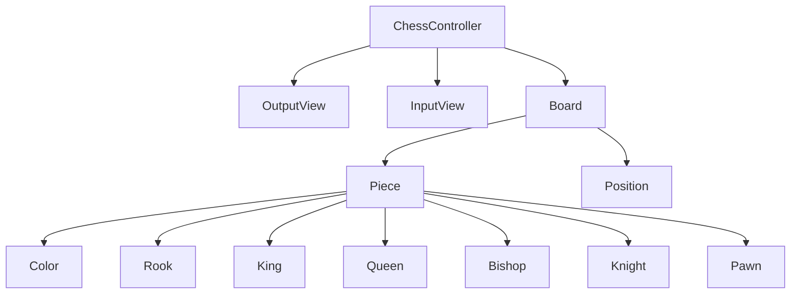

# java-chess

체스 미션 저장소

## 우아한테크코스 코드리뷰

- [온라인 코드 리뷰 과정](https://github.com/woowacourse/woowacourse-docs/blob/master/maincourse/README.md)

## 기능 구현 목록

### 도메인

- [x] 체스 게임을 할 수 있다.
    - [x] 체스판의 가로는 왼쪽부터 a ~ h이고, 세로는 아래부터 위로 1 ~ 8의 위치값을 가진다.
        - [x] 체스를 시작할 때 말의 위치는 고정된 위치 값을 가진다.
            - [x] R: a, h
            - [x] N: b, g
            - [x] B: c, f
            - [x] Q: d
            - [x] K: e
        - [x] 체스 말이 없는 위치는 .으로 표현한다.
    - [x] 체스 말이 있다.
        - [x] 체스 말은 검은색은 대문자, 흰색은 소문자로 구분한다.
    - [x] 체스 말을 이동할 수 있다.
    - [x] 이동 경로에 상대방 말이 있다면 그 말을 잡고 해당 위치로 이동한다.
        - [x] 폰
            - [x] 움직이지 않았을 때 앞으로 1칸 혹은 2칸 움직일 수 있다.
            - [x] 이미 움직였으면 앞으로 1칸을 움직일 수 있다.
            - [x] 대각선에 상대 말이 있다면 말을 잡고 그 방향으로 움직일 수 있다.
        - [x] 킹
            - [x] 상, 하, 좌, 우, 대각선으로 1칸 이동할 수 있다.
            - [x] 이동 경로에 상대 말이 있다면 말을 잡고 그 방향으로 움직일 수 있다.
        - [x] 퀸
            - [x] 상, 하, 좌, 우, 대각선으로 원하는 만큼 이동할 수 있다.
            - [x] 이동 경로에 상대 말이 있다면 말을 잡고 그 방향으로 움직일 수 있다.
        - [x] 룩
            - [x] 상, 하, 좌, 우로 원하는 만큼 이동할 수 있다.
            - [x] 이동 경로에 상대 말이 있다면 말을 잡고 그 방향으로 움직일 수 있다.
        - [x] 비숍
            - [x] 대각선으로 원하는 만큼 이동할 수 있다.
            - [x] 이동 경로에 상대 말이 있다면 말을 잡고 그 방향으로 움직일 수 있다.
        - [x] 나이트
            - [x] 한칸 전진 후 그 방향의 대각선으로 이동할 수 있다.
            - [x] 이동 경로에 상대 말이 있다면 말을 잡고 그 방향으로 움직일 수 있다.
### 입력

- [x] 체스 게임을 시작/종료할 수 있다.
    - [x] 게임 시작은 start로 입력받는다.
    - [x] 게임 종료는 end로 입력받는다.

### 출력

- [x] 체스 말의 현재 위치를 출력할 수 있다.
