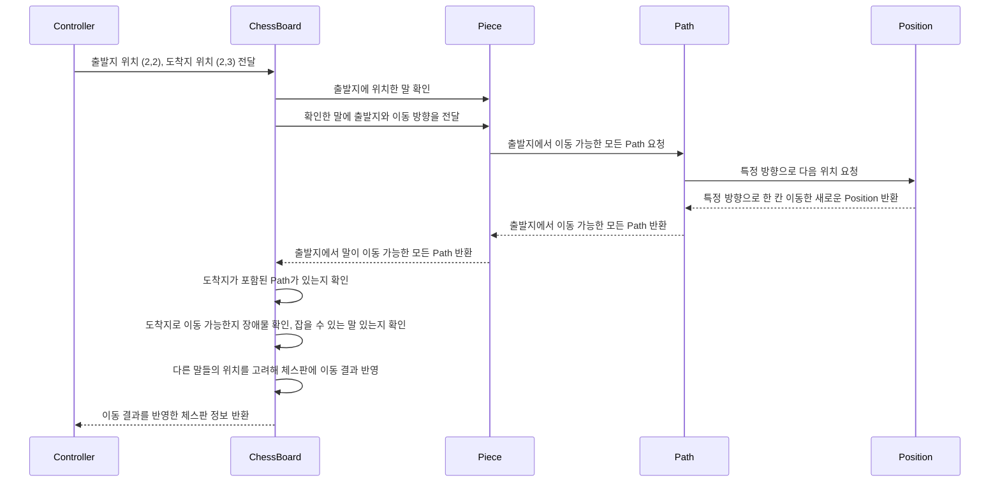

# java-chess

체스 미션 저장소

## 우아한테크코스 코드리뷰

- [온라인 코드 리뷰 과정](https://github.com/woowacourse/woowacourse-docs/blob/master/maincourse/README.md)

## 기능 목록

### 체스 규칙

- 두 명의 참여자가 있다.
    - 각 참여자는 하얀색, 검정색으로 구분한다.
- 한 명의 참여자 당 8개의 폰, 2개의 룩, 2개의 나이트, 2개의 비숍, 킹, 퀸을 가지고 있다.
- 각 말 타입마다 다른 이동 규칙을 가진다.
- 폰
    - 처음에는 앞으로 1칸 또는 2칸 이동 가능, 이후에는 앞으로만 1칸 이동 가능하다.
    - 말을 잡을 때에는 앞으로 대각선 1칸만 가능하다.
- 룩
    - 앞뒤양옆으로 장애물이 없을 때까지 원하는 만큼 이동 가능하다.
- 나이트
    - 앞뒤양옆 1칸 이동 후 대각선으로 1칸 이동 가능하다.
    - 나이트는 장애물을 무시할 수 있다.
- 비숍
    - 대각선으로 장애물이 없을 때까지 원하는 만큼 이동 가능하다.
- 킹
    - 앞뒤양옆, 대각선으로 1칸만 이동 가능하다.
- 퀸
    - 앞뒤양옆, 대각선으로 장애물이 없을 때까지 원하는 만큼 이동 가능하다.

### 시퀀스 다이어그램

도메인 기능 시퀀스 다이어그램

### 도메인 기능

- ChessGame
    - [x] 현재 플레이어 턴을 관리한다.
- ChessBoard
    - [x] 비어 있는 체스판을 생성한다.
        - [x] 체스판에 초기 말을 세팅한다.
    - [x] 출발지에 있는 말을 주어진 도착지로 움직인다.
        - [x] 출발지에 있는 말을 찾는다.
            - [x] `예외` 출발 위치에 말이 없으면 이동할 수 없다.
        - [x] 도착지에 상대방의 말이 있다면 잡는다.
            - [x] `예외` 출발지와 도착지가 동일할 수 없다.
        - [x] 도착지로의 경로를 따라 이동이 가능한지 확인한다.
            - [x] `예외` 이동 경로에 다른 말이 있으면(장애물) 이동할 수 없다.
- Piece
    - [x] 말은 움직일 수 있고, 종류 별로 구현할 수 있다.
        - [x] 종류에는 킹(King), 퀸(Queen), 룩(Rook), 비숍(Bishop), 나이트(Knight), 폰(Pawn)이 있다.
        - [x] 종류마다 이동 규칙이 다르다.
        - [x] 말은 이동 가능한 모든 방향을 가지고 있다.
    - [x] 말은 출발지를 전달받아서 이동 가능한 모든 경로를 반환한다.
    - [x] 말은 색을 가진다.
        - [x] 폰이 하얀색이면 북행이 전진이고, 검정색이면 남행이 전진이다.
- Path
    - [x] 한 방향에서 갈 수 있는 모든 도착 가능한 위치들의 목록을 가지고 있다.
        - [x] 출발지와 방향을 전달받아 도착 가능한 위치들의 목록을 생성한다.
            - [x] 단일 칸 이동경로 생성 (경로를 이루는 칸이 하나 뿐이다.)
            - [x] 다중 칸 이동경로 생성 (경로를 이루는 칸이 여러가지일 수 있다.)
- Position
    - [x] 말의 위치는 랭크(y축), 파일(x축)로 이루어져 있다.
        - [x] `예외` 가로 및 세로 좌표값가 정해진 범위(8)를 벗어날 수 없다.
    - [x] 위치는 시작 위치에서 현재 방향으로 이동할 수 있는 다음 위치을 반환한다.
- Direction
    - [X] 모든 이동 가능 방향을 가지고 있다.

### 입출력 기능

- 출력
    - [x] 체스 게임 시작 안내문을 출력한다.
    - [x] 초기 세팅 된 체스판을 출력한다.
    - [x] 이동 결과를 출력한다.
    - [x] 말의 타입과 색에 따라 이름을 출력한다.
- 입력
    - [x] 게임 명령어를 입력받는다. (start, end, move)
        - [x] 입력이 end 일 때 까지 입력 받는다.
            - [x] `예외` 명령어가 유효하지 않으면 예외를 발생시킨다.
        - [x] 입력이 move 일 때는 출발지와 도착지 경로를 함께 입력받는다.
            - [x] `예외` 입력이 move 일 때, 출발지나 도착지 정보가 유효하지 않으면 예외를 발생시킨다.
    - [x] 이동 위치를 입력받는다.
