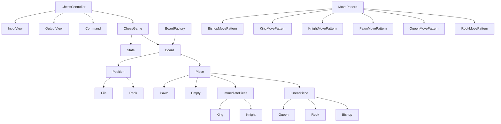

# java-chess

체스 미션 저장소

## 우아한테크코스 코드리뷰

- [온라인 코드 리뷰 과정](https://github.com/woowacourse/woowacourse-docs/blob/master/maincourse/README.md)

## 도메인 다이어그램

## 도메인

### 체스 게임

- [x] 게임 진행 상태를 확인할 수 있다.
- [x] 커맨드를 통해 게임 진행 상태를 바꿀 수 있다.

### 체스판

- [x] 기물의 위치 상태를 가진다.
- [x] 어떤 위치의 기물의 진영 상태를 반환한다.

### 위치

- [x] 위치 정보를 가진다.
- [x] 기물이 갈 수 있는 다음 위치를 반환한다.

### 파일

- [x] 가로 좌표 값을 가진다.

### 랭크

- [x] 세로 좌표 값을 가진다.

### 기물

- [x] 타입을 가진다.
- [x] 진영을 가진다.

### 입력

- [x] 커맨드를 입력 받는다.

### 출력

- [x] 에러 메세지를 출력한다.
- [x] 시작 문구를 출력한다.
- [x] 체스판을 출력한다.