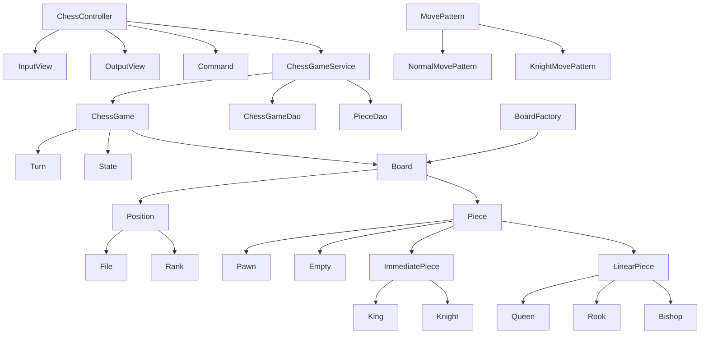

# java-chess

체스 미션 저장소

## 우아한테크코스 코드리뷰

- [온라인 코드 리뷰 과정](https://github.com/woowacourse/woowacourse-docs/blob/master/maincourse/README.md)

## 도메인 다이어그램



## 도메인

### 체스 게임

- [x] 게임 진행 상태를 확인할 수 있다.
- [x] 커맨드를 통해 게임 진행 상태를 바꿀 수 있다.
- [x] 올바른 움직임이 들어오면 보드를 수정할 수 있다.
- [x] 흑팀, 백팀의 점수를 계산할 수 있다.
- [x] 승리 팀을 계산할 수 있다.

### 턴

- [x] 턴을 바꿀 수 있다.

### 체스판

- [x] 기물의 위치 상태를 가진다.
- [x] 어떤 위치의 기물의 진영 상태를 반환한다.
- [x] 기물을 움직일 수 있다.
- findMovablePositions
- [x] 움직일 수 있는 포지션들을 반환할 수 있다.
- [x] 해당 진영의 점수를 계산할 수 있다.
- [x] 승리 진영을 계산할 수 있다.

### 위치

- [x] 위치 정보를 가진다.
- [x] 기물이 갈 수 있는 다음 위치를 반환한다.

### 파일

- [x] 가로 좌표 값을 가진다.

### 랭크

- [x] 세로 좌표 값을 가진다.

### 기물

- [x] 타입을 가진다.
- [x] 진영을 가진다.

### 입력

- [x] 커맨드를 입력 받는다.

### 출력

- [x] 에러 메세지를 출력한다.
- [x] 시작 문구를 출력한다.
- [x] 체스판을 출력한다.
- [x] 점수를 출력한다.
- [x] 승리팀을 출력한다.

### ChessGameService
- [x] chessGame을 찾을 수 있다.
- [x] chessGame을 저장할 수 있다.
- [x] piece 위치를 업데이트 할 수 있다.
- [x] chessGame을 삭제할 수 있다.

### DB연결(4단계)
- [x] 애플리케이션을 재시작하더라도 이전에 하던 체스 게임을 다시 시작할 수 있어야 한다.
 - [x] 이어하기
   - 이전 게임이 있다면 이어서
   - 이전 게임이 없다면 새로운 게임 시작
 - [x] 새로하기
   - 이전 게임이 있어도 다시 시작
- [x] 이동할 때 마다 피스 테이블 업데이트

### ChessGameDao
- [x] chess_game을 저장할 수 있다.
- [x] chess_game을 찾을 수 있다.
- [x] 턴을 변경할 수 있다.
- [x] 삭제할 수 있다.

### PieceDao
- [x] piece를 저장할 수 있다.
- [x] piece를 삭제할 수 있다.
- [x] 모든 피스(보드)를 찾을 수 있다.
- [x] 피스를 삭제할 수 있다.

### DB 테이블
```sql
create table chess_game(
    id BIGINT NOT NULL AUTO_INCREMENT,
    turn VARCHAR(16) NOT NULL,
    PRIMARY KEY (id)
);

CREATE TABLE piece (
    id BIGINT NOT NULL AUTO_INCREMENT,
    chess_game_id BIGINT NOT NULL,
    piece_file int NOT NULL,
    piece_rank int NOT NULL,
    side VARCHAR(16) NOT NULL,
    type VARCHAR(16) NOT NULL,
    PRIMARY KEY (id)
);
```