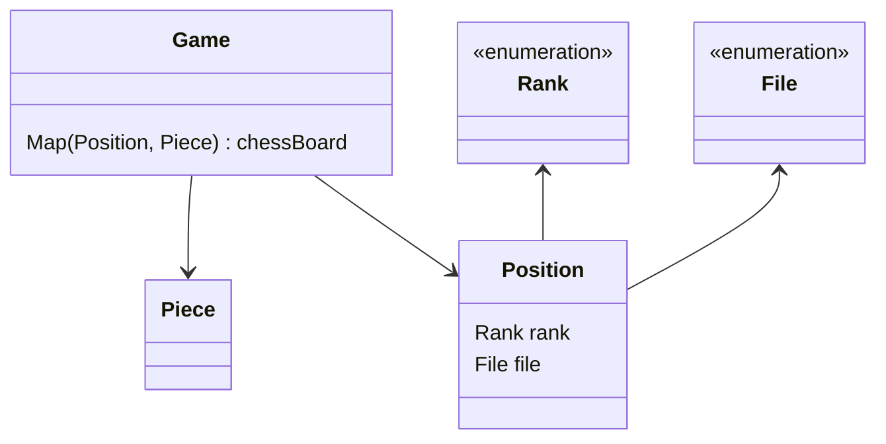
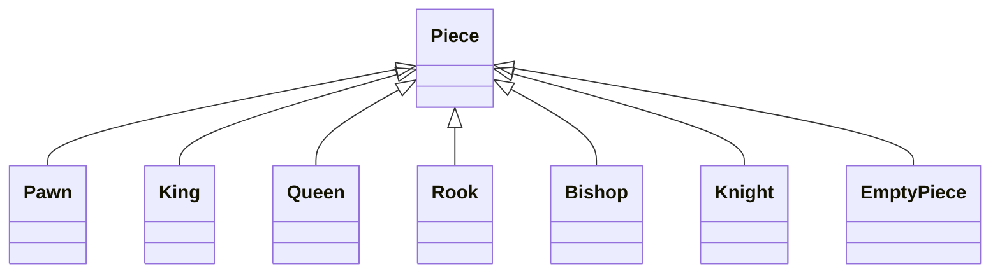

# java-chess

체스 미션 저장소

## 클래스 다이어그램

### 체스 말들의 상속 관계

# 기능 요구 사항

### Position

- [x] File, Rank로 위치 정보를 생성한다.
    - [x] col정보는 File인스턴스로 나타낸다.
    - [x] row정보는 Rank인스턴스로 나타낸다.
- [x] File, Rank의 증분을 계산한다.

### Piece

- [ ] Source position에서 Target position으로 가는 경로를 반환한다.
    - [ ] Target position이 해당 말이 이동할 수 없는 위치일 경우 예외가 발생한다.

### Game

- [ ] 각각의 Rank와 File을 표현하도록 체스판을 초기화한다.
    - [ ] Rank(가로 위치)는 왼쪽부터 a ~ h이다.
    - [ ] File(세로 위치)는 아래부터 위로 1 ~ 8이다.
    - [ ] 초기 위치에 맞는 말들을 배치한다.
- [ ] 이동 경로에 같은 진영의 말이 존재하는지 확인한다.
    - [ ] 존재하는 경우 예외가 발생한다.
- [ ] Source position, Target position를 입력 받아 말을 이동시킨다.
    - [ ] 상대방의 말을 움직일 경우, 예외가 발생한다.
    - [ ] Source position에 말이 존재하지 않는 경우, 예외가 발생한다.
    - [ ] 체스판 범위를 벗어난 위치를 입력받는 경우, 예외가 발생한다.
    - [ ] 목표 위치에 같은 편 말이 존재할 경우, 예외가 발생한다.
    - [ ] 목표 위치가 말의 이동 가능 범위에 벗어나는 경우, 예외가 발생한다.
    - [ ] 상대방의 말 위치로 이동한 경우, 상대방 말은 죽고 이동한 말이 그 위치를 대체한다.
        - [ ] 해당 위치의 Piece는 EmptyPiece로 대체한다.

### Movement

- [x] 어느 방향으로도 움직이지 않으면 예외가 발생한다.

### File (enum)

- [x] Source file과 Target file간 거리 차이를 반환한다.

### Rank (enum)

- [x] Source rank와 Target rank간 거리 차이를 반환한다.

## 우아한테크코스 코드리뷰

- [온라인 코드 리뷰 과정](https://github.com/woowacourse/woowacourse-docs/blob/master/maincourse/README.md)
