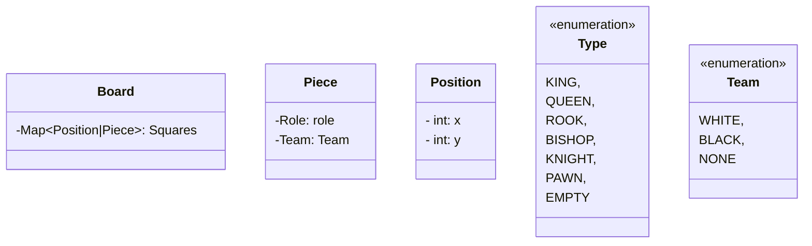

# java-chess

체스 미션 저장소

## 우아한테크코스 코드리뷰

- [온라인 코드 리뷰 과정](https://github.com/woowacourse/woowacourse-docs/blob/master/maincourse/README.md)



### Query Statement
```sql
create table chess_game
(
    id          int         not null primary key,
    board_id    int         not null,
    status      varchar(30),
);

create table board
(
    id      int         not null,
    game_id int         not null,
    x_pos   int         not null,
    y_pos   int         not null,
    role    varchar(30) not null,
    team    varchar(30) not null,

    foreign key (game_id_id) references chess_game (id)
    primary key (id, x_pos, y_pos)
)

```

## 기능 요구 사항

### 체스 게임 실행

- [ ] 현재 게임에 입장 할 수 있는 체스 게임 목록을 보여준다.
  - [ ] 종료되지 않은 게임만 보여준다.
  - [ ] `START`를 입력하는 경우, 새로운 게임을 시작한다.
  - [ ] `입장 할 수 있는 체스 게임을 선택`하는 경우, 해당 게임을 이어서 시작한다.
- [ ] `end`를 입력해 게임을 종료하는 경우, 현재 상태를 저장한다.
  - [ ] 기존에 존재하던 게임인 경우, board 상태를 업데이트 한다.
  - [ ] 새로운 게임인 경우, chessGame과 board를 DB에 생성한다.


### 게임 진행

- [X] 체스판의 가로 위치는 왼쪽부터 a ~ h 이다.
- [X] 체스판의 세로 위치는 아래부터 1 ~ 8 이다.
- [X] 각 진영은 검은색(대문자)와 흰색(소문자) 편으로 구분한다.
- [x] 게임을 시작하고, `start`를 입력해야 체스판을 출력한다.
- [x] 게임을 시작하고, `status`를 입력하면, 현재 차례인 팀의 점수를 출력한다.
- [x] 게임을 시작하고, `end`를 입력하면 게임을 종료한다.
- [X] 게임을 시작하면, 보드에 말이 세팅되어야 한다.
- [X] 체스판이 초기화되고, `move source위치 target위치`를 입력하면 체스 말이 이동한다.
- [X] 체스판이 초기화되지 않고 `move`를 입력하면 예외가 발생한다.
- [X] 체스말이 움직일 수 없는 위치로 이동하면 예외가 발생한다.
- [X] 해당 차례인 팀 말이 아닌 다른 팀의 말을 움직이는 경우 예외가 발생한다.

### 점수
- [x] 팀별로 현재까지 남아 있는 말에 따라 점수를 계산한다.
  - [x] queen: 9점
  - [x] rook: 5점
  - [x] bishop: 3점
  - [x] knight: 2.5점
  - [x] pawn: 1점
    - [x] 같은 세로줄에 같은 색의 폰이 있는 경우 0.5점으로 계산한다.


### 승패
- [x] `king`이 잡히면 게임이 종료된다.


### 예외 상황

- [X] 커맨드가 `start`, `end`, `move`가 아닌 경우 예외가 발생한다.
- [X] 보드가 세팅되지 않았는데 `move`를 입력하는 경우 예외가 발생한다.
- [X] `move`에 잘못된 위치를 입력하면 예외가 발생한다.
  - [X] source와 target의 위치가 동일하면 예외가 발생한다.
  - [X] source와 target의 위치가 체스판을 벗어나는 경우 예외가 발생한다.
  - [X] target에 같은 팀의 말이 있는 경우 예외가 발생한다.
  - [X] source에 말이 없는 경우 예외가 발생한다.

### 움직임

- [X] 체스말이 역할에 맞게 올바르게 움직일 수 있어야 한다.
- [X] KNIGHT를 제외한 모든 말은 이동 경로 상에 말이 있으면 지나갈 수 없다.

### PAWN

- [X] 화이트는 y값이 `증가`만 가능하고, 블랙은 y값이 `감소`만 가능하다.
- [X] 화이트는 y가 1일때, 블랙은 y가 6일때만 2칸 움직일 수 있다.
- [X] 길이가 1만큼 떨어진 대각선으로 이동하는 경우, 해당 위치에 상대 말이 있어야 한다.

### ROOK

- [X] x, y 거리 상관 없이 `직선 방향`으로 움직일 수 있다.

### BISHOP

- [X] x, y 거리 상관 없이 `대각선`으로만 움직일 수 있다.

### KNIGHT

- [X] 상,하,좌,우 대각선 1칸 기준 바깥쪽 한칸에 대해 1칸 움직일 수 있다.
- [X] `이동 경로 상에 말이 있어도 이동이 가능하다.`

### QUEEN

- [X] x, y 거리 상관 없이 `직선`, `대각선`으로 움직일 수 있다.

### KING

- [X] `직선`, `대각선` 1칸 거리만 움직일 수 있다.
