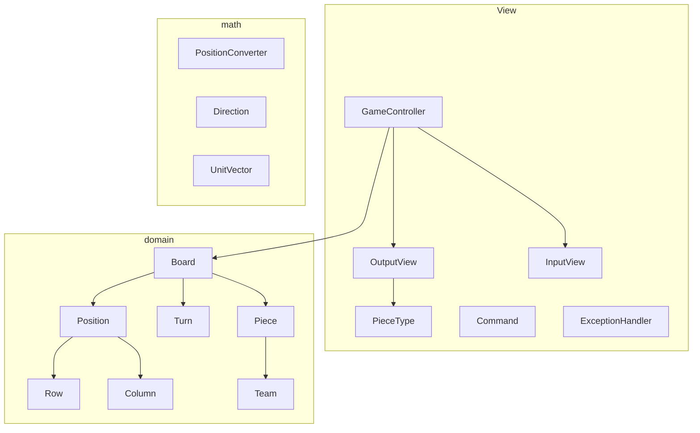
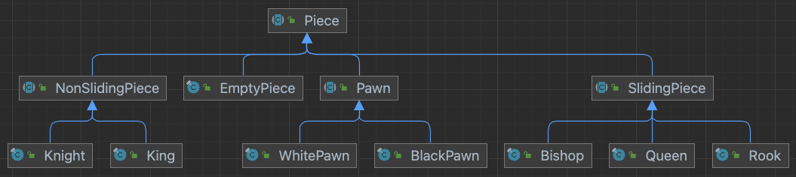

# java-chess
체스 미션 저장소

# 우아한테크코스 코드리뷰
- [온라인 코드 리뷰 과정](https://github.com/woowacourse/woowacourse-docs/blob/master/maincourse/README.md)

# 클래스 다이어그램





# 기능 요구 사항
## 1단계
- [x] 체스판을 초기화한다.
  - [x] 체스판은 8x8 크기이다.
  - [x] 처음에 정해진 규칙대로 기물들을 배치한다. 
- [x] 각 진영은 대문자(검은색)와 소문자(흰색)으로 구분한다.
  - [x] 검은색 팀은 12시 방향이다.
  - [x] 흰색 팀은 6시 방향이다.

## 2단계
- [x] 체스 게임을 할 수 있는 기능을 구현한다.
  - [x] 흰색 팀부터 기물을 움직인다.
  - [x] 상대 팀의 기물을 움직일 수 없다.
  - [x] 기물을 뛰어넘을 수 없다.
- [x] 체스 규칙에 따라 기물들을 이동한다.
  - [x] 공통
    - [x] 아군이 있는 위치로 갈 수 없다.
    - [x] 기물마다 정해진 방법으로만 이동할 수 있다.
  - [x] 폰
    - [x] 첫 움직임은 최대 2칸 움직일 수 있다.
    - [x] 두 번째 움직임부터는 1칸만 움직일 수 있다.
    - [x] 대각선은 상대방의 기물이 있을 때만 움직일 수 있다.
    - [x] 위 또는 아래 방향으로만 갈 수 있다. 옆으로는 갈 수 없다.
  - [x] 룩
    - [x] 수직 방향으로만 갈 수 있다.
    - [x] 정해진 거리는 없다.
  - [x] 나이트
    - [x] 기물을 뛰어넘을 수 있다.
    - [x] 상하로 2칸, 좌우로 1칸 또는 상하로 1칸, 좌우로 2칸으로만 움직일 수 있다.
  - [x] 퀸
    - [x] 8 방향 모두 갈 수 있다.
    - [x] 정해진 거리는 없다.
  - [x] 킹
    - [x] 8 방향 모두 갈 수 있다.
    - [x] 1칸만 이동할 수 있다.
- [x] `move source위치 target위치`를 실행해 이동한다.

## 3단계
- [x] King이 죽었을 때 게임을 종료한다.
- [x] 현재 남아있는 말에 대한 점수를 구한다.
  - [x] "status"를 입력한다.
  - [x] 각 진영의 점수와 어느 진영이 이겼는 지를 출력한다.
  - 점수 계산 규칙
    - [x] 퀸은 9점을 가진다.
    - [x] 룩은 5점을 가진다.
    - [x] 비숍은 3점을 가진다.
    - [x] 나이트은 2.5점을 가진다.
    - [x] 폰은 1점을 가진다.
      - [x] 같은 세로 줄에 같은 팀의 폰이 있으면 해당 줄에 있는 폰은 각 0.5 
    - [x] 한 번에 한 팀의 점수를 계산한다.

## 4단계
- [x] 애플리케이션을 재시작하더라도 이전에 하던 체스 게임을 다시 시작할 수 있어야 한다.
  - [ ] 킹이 죽으면 게임을 초기화한다.
  - [x] 사용자의 입력을 받아 게임을 초기화한다.
- [x] 도메인 객체의 변경을 최소화해야한다.

```mysql
CREATE TABLE board (
    position_row int NOT NULL,
    position_column int NOT NULL,
    piece_type VARCHAR(10) NOT NULL,
    piece_team VARCHAR(10) NOT NULL,
    turn VARCHAR(5) NOT NULL
);

INSERT INTO board (position_row, position_column, piece_type, piece_team, turn) VALUES (?, ?, ?, ?, ?);
```
