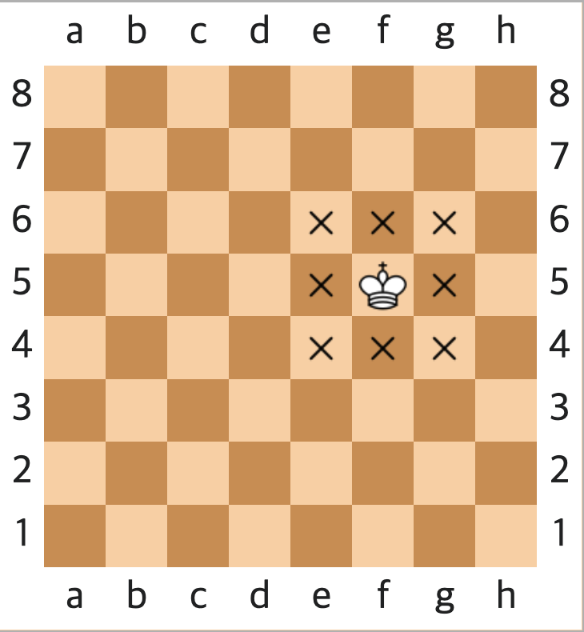
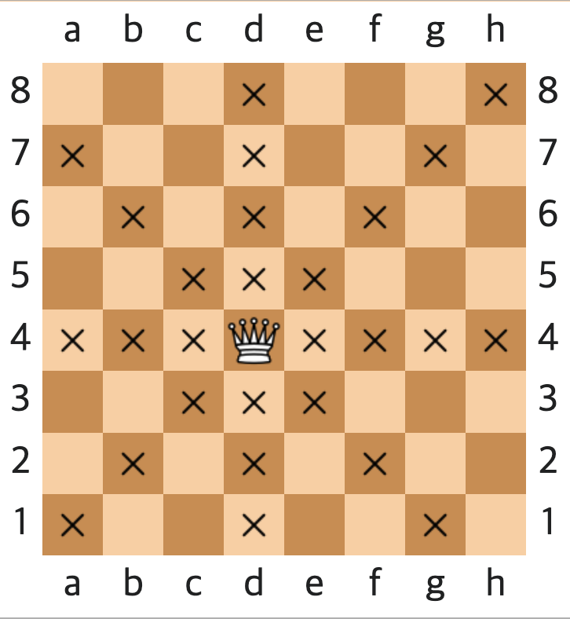
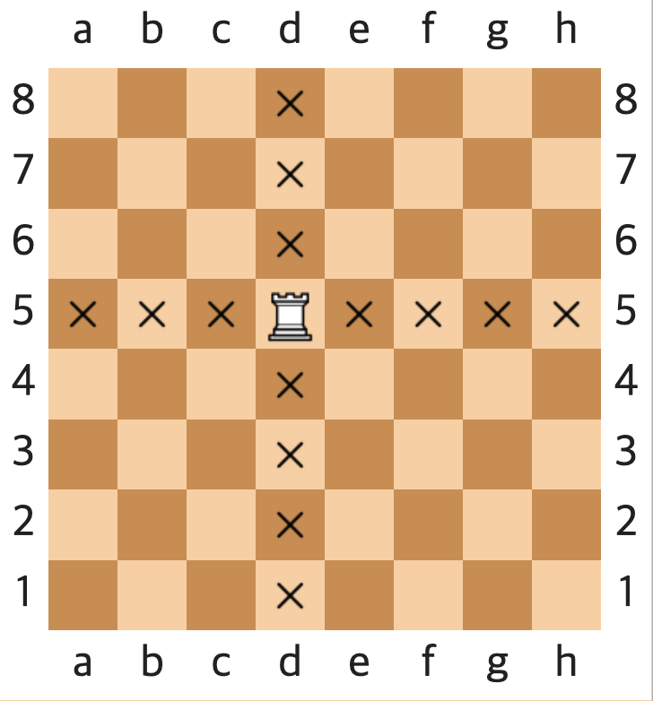
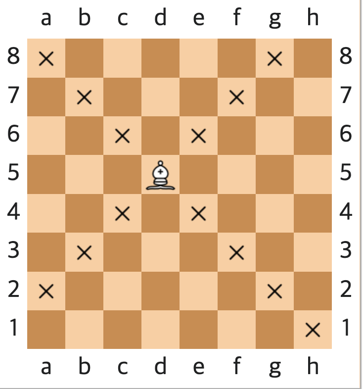
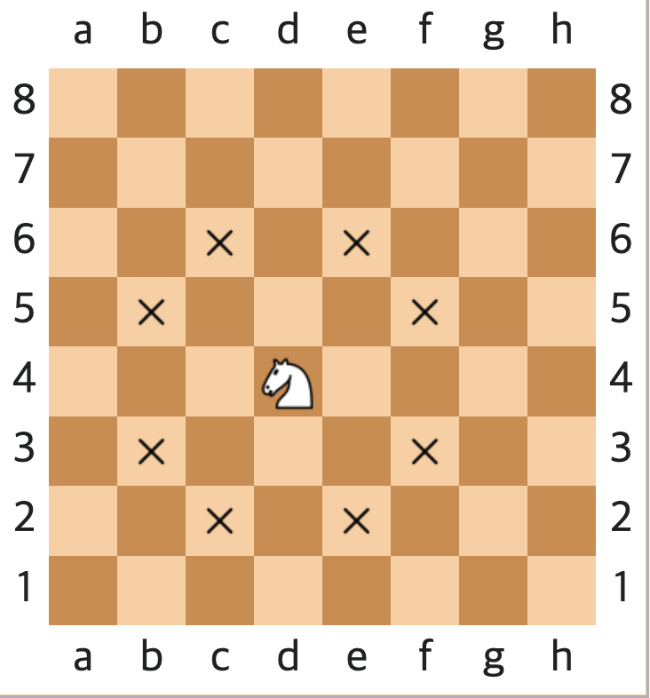
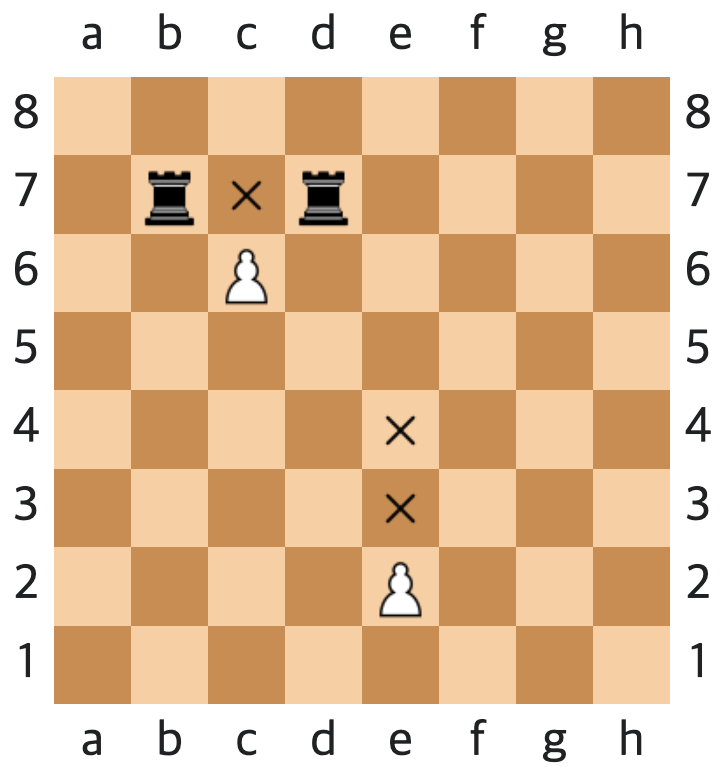

# java-chess

체스 미션 저장소

## 우아한테크코스 코드리뷰

- [온라인 코드 리뷰 과정](https://github.com/woowacourse/woowacourse-docs/blob/master/maincourse/README.md)

## 구현 기능

### 1. 체스판 초기화

- 체스판은 8x8 크기이다.
- 각 플레이어는 하나의 킹, 퀸과 2개의 비숍, 나이트, 룩, 8개의 폰을 가진다.
- 각 플레이어는 아래 혹은 위 진영을 가지고 시작한다.
- 체스판에서 말의 위치 값은 가로 위치는 왼쪽부터 a ~ h이고, 세로는 아래부터 위로 1 ~ 8로 구현한다.

### 2. 말 이동

#### 모든 기물

- 같은 팀 기물이 있는 곳으로 이동할 수 없다.
- 상대 팀 기물이 있는 곳으로 이동하면 상대 기물이 잡힌다.

#### 킹, 퀸, 룩, 비숍, 폰

- 이동 경로에 다른 기물이 있는 경우 뛰어 넘을 수 없다.

#### 니이트

- 이동 경로에 다른 기물이 있더라도 뛰어넘을 수 있다.

### 킹

- 상, 하, 좌, 우, 대각선 1칸씩 이동

### 퀸

- 상, 하, 좌, 우, 대각선 한 방향으로 칸수 제한 없이 이동

### 룩

- 상, 하, 좌, 우 한 방향으로 칸수 제한 없이 이동

### 비숍

- 대각선 한 방향으로 칸수 제한 없이 이동

### 나이트

- 8방향으로 이동 가능

### 폰

- 앞으로 1칸 이동할 수 있다.
    - 예외적으로 초기 위치에 있을 때 최대 2칸 이동할 수 있다.
- 상대편 기물을 잡을 경우, 대각선 방향 잡을수 있다.

## 3. 승패 및 점수

## 4. 게임 커맨드

- `start`: 게임을 시작하고 체스판을 초기화 한다.
- `end`: 게임을 종료한다.
- `move source위치 target위치`: source위치에 있는 기물을 target위치로 옮긴다.