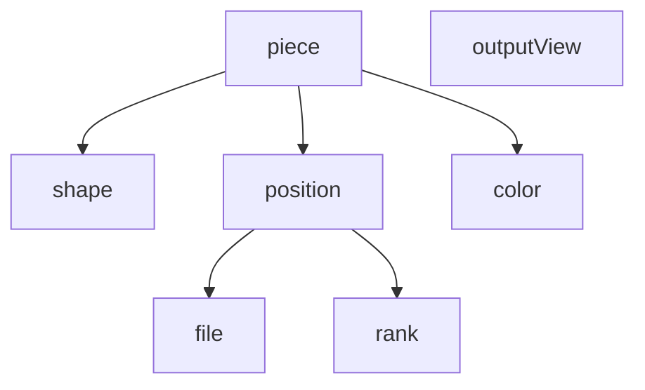

# java-chess

체스 미션 저장소

## 우아한테크코스 코드리뷰

- [온라인 코드 리뷰 과정](https://github.com/woowacourse/woowacourse-docs/blob/master/maincourse/README.md)

### 기능 요구 사항

## View
### In
- [ ] start 또는 end 입력
  - [ ] start 입력시 시작
  - [ ] end 입력시 끝

### Out
- [ ] `체스 게임을 시작합니다.` 출력
- [ ] `게임 시작은 start, 종료는 end 명령을 입력하세요.` 출력
- [ ] 체스 판 출력
  - [ ] 가로 8칸, 세로 8칸
