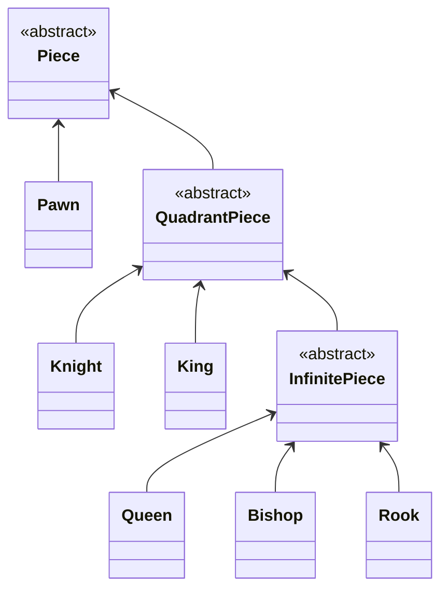

# java-chess

체스 미션 저장소

# 기능 목록

- 게임
    - 턴을 가진다
        - 한 움직임 이후 턴을 바꾼다
        - 백부터 시작한다.
    - 기물을 움직이게 한다.
- 체스판
    - 체스판 시작 배열로 초기화한다
    - 위치 별 기물을 가진다
    - 기물을 움직인다
        - 목표 위치에 같은 색상의 말이 있으면 움직일 수 없다
        - 다른 말을 뛰어넘을 수 없다
        - 목표 위치에 다른 색의 기물이 있으면 공격할 수 있다
        - 현재 턴에 일치하는 말만 움직일 수 있다.
        

            
기물 이동 로직

        0. 출발 위치에 기물이 존재하는지 확인한다.
            - 해당 기물의 색이 현재 턴과 일치하는지 확인한다.
        1. 목표 위치에 기물이 존재하는지 확인한다.
            - 같은 색 기물이 있으면: 예외
            - 다른 색 기물이 있으면: 공격
            - 기물이 없으면: 이동
        2. 기물이 목표 위치에 도달할 수 있는지 확인한다.
        3. 목표에 도달하는중 다른 기물이 있는지 확인한다.
            - 있으면: 예외
        4. 도달한다.
            - 공격이면: 기존 말을 해당 말로 대체한다.
            - 이동이면: 해당 말을 위치시킨다.
        

    - 특수 룰
        - [ ] 폰이 상대진영 끝까지 도달하면 퀸으로 교체된다
- 기물
    - 폰, 비숍, 나이트, 룩, 퀸, 킹이 있다.
        - 하단 기물 클래스다이어그램 참조
    - 이동 가능한 수인지 판단한다
    - 공격 가능한 수인지 판단한다
    - 색을 구분한다
    - 기본적으로 한 수 단위로 움직인다.
    - `Touched` 상태로 만든다.
- 기물별 특성
    - 폰
        - 처음에는 1칸 혹은 2칸 앞으로 움직일 수 있다.
        - 첫 수 이후 1칸 앞으로 움직일 수 있다.
        - 공격은 앞대각선으로 할 수 있다.
            - 앞 방향으로는 공격할 수 없다
        - 흑은 아래방향, 백은 윗방향으로 움직인다.
    - 비숍
        - 대각선 무한으로 움직일 수 있다.
    - 나이트
        - 한 방향으로 한 칸, 그리고 그 방향의 양 대각선 방향 중 한 방향으로 움직일 수 있다.
    - 룩
        - 가로/세로 무한으로 움직일 수 있다.
    - 퀸
        - 가로/세로/대각선 무한으로 움직일 수 있다.
    - 킹
        - 가로/세로/대각선 한 칸 움직일 수 있다.
- 위치
    - 이동할 수 있다
    - 다른 위치까지의 수직, 수평 방향들을 알 수 있다
- 수
    - 시작위치, 도착위치로 수를 만들 수 있다.
    - 다수의 방향을 가진다.
        - 양방향이 존재하면 예외를 던진다.
    - 수끼리 비교할 수 있다.
        - 방향의 순서에 관련없이 같다.
    - 상하 대칭 할 수 있다.
    - 좌우 대칭 할 수 있다.
    - 기울기가 같은지 알 수 있다.
    - 단위 수를 찾을 수 있다.
    - 목적지를 찾을 수 있다.
    - n번 반복할 수 있다.
- 단위 수
    - 목적지를 찾을 수 있다.
    - 단위 수가 아니면 예외를 던진다.
    - 방향들의 단위 수를 만들 수 있다.
    - 방향이 없으면 예외를 던진다.
    - 수직, 수평 축을 기준으로 뒤집을 수 있다.
    - 반복할 수 있다.
- 방향들(방향 컬렉션)
    - 수직이나 수평으로 양방향이면 예외를 던진다.
    - 특정 방향이 몇 개인지 센다.
    - 특정 축의 방향이 몇 개인지 센다.
    - 목적지를 찾을 수 있다.
    - 수직, 수평 축을 기준으로 뒤집을 수 있다.
    - 방향 컬렉션끼리 합칠 수 있다.
    - 단위가 몇 개인지 셀 수 있다.
- 방향
    - 상하좌우
    - 수직, 수평 축을 기준으로 뒤집을 수 있다.
- 축
    - 수직, 수평 축이 있다.
- file
    - a~h
    - 좌우로 이동 할 수 있다
        - 범위를 벗어난 이동은 예외를 던진다
- rank
    - 1~8
    - 위 아래로 이동 할 수 있다
        - 범위를 벗어난 이동은 예외를 던진다

### 기물 클래스 다이어그램

## 우아한테크코스 코드리뷰

- [온라인 코드 리뷰 과정](https://github.com/woowacourse/woowacourse-docs/blob/master/maincourse/README.md)
