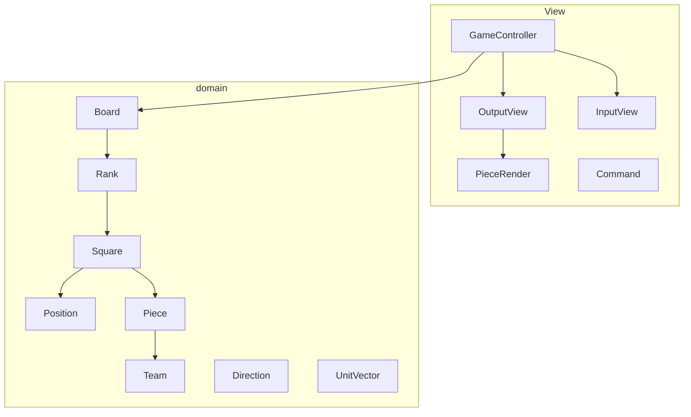

# java-chess

체스 미션 저장소

# 우아한테크코스 코드리뷰

- [온라인 코드 리뷰 과정](https://github.com/woowacourse/woowacourse-docs/blob/master/maincourse/README.md)

# 클래스 다이어그램

# 기능 요구 사항
## 1단계
- [x] 체스판을 초기화한다.
- [x] 각 진영은 대문자(검은색)와 소문자(흰색)으로 구분한다.

## 2단계
- [x] 체스 게임을 할 수 있는 기능을 구현한다.
- [x] 체스 규칙에 따라 기물들을 이동한다.
- [x] `move source위치 target위치`를 실행해 이동한다.
