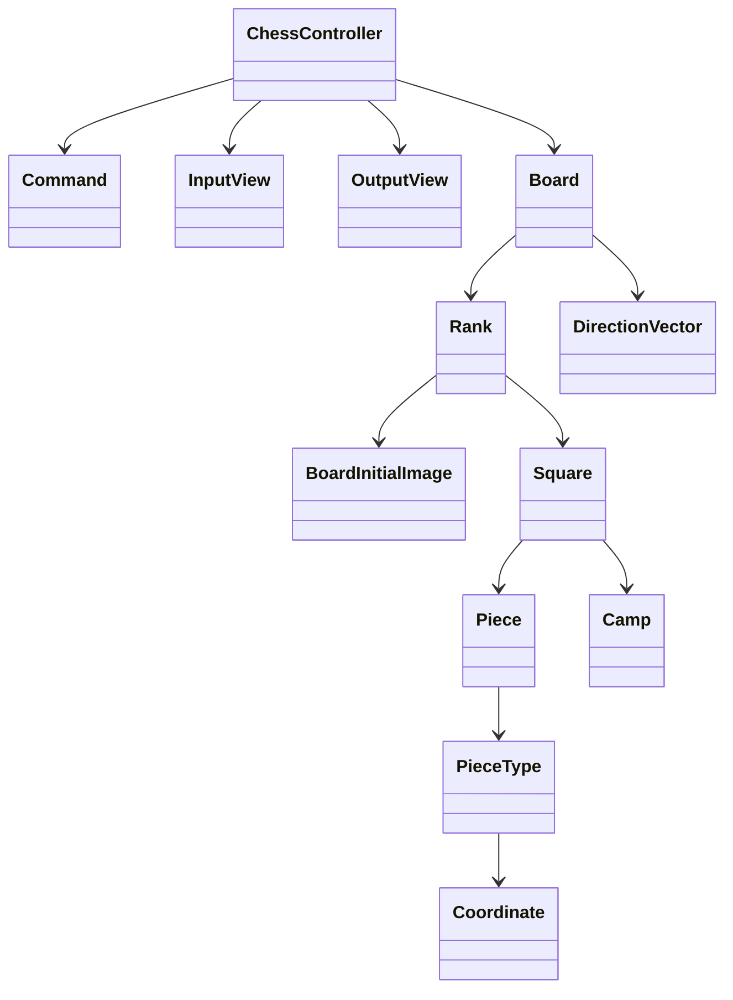

# java-chess

체스 미션 저장소

## 우아한테크코스 코드리뷰

- [온라인 코드 리뷰 과정](https://github.com/woowacourse/woowacourse-docs/blob/master/maincourse/README.md)

---
## 기능 목록

### 입력
- [x] 게임 시작 혹은 종료 명령을 입력한다
- [x] 게임 이동 명령을 입력한다
- [ ] 게임 결과 생성 명령을 입력한다

### 출력
- [x] 체스판을 출력한다
  - [x] 체스판의 각 행을 출력한다
- [ ] 게임 결과를 출력한다
  - [ ] 각 진영의 최종 점수를 출력한다
  - [ ] 어떤 진영이 승리했는지를 출력한다

### 도메인

- 체스 게임
- [x] 보드를 알고 있다
- [x] 기물이 움직일지 말지 결정할 수 있다
  - [x] 기물이 움직일 수 없는 경우를 판단할 수 있다
    - [x] 특정 위치로부터 다른 위치까지의 경로에 기물이 존재하는지 확인한다
  - [x] 움직일 수 있는 경우, 해당 위치로 기물을 이동시킨다
- [x] 기물은 다른 진영의 기물을 잡을 수 있다
- [x] 킹이 잡히면 게임이 종료된다
- [x] 올바른 턴이 아니라면 기물의 움직임을 제한할 수 있다
  - [x] 턴마다 해당 진영의 기물만 움직일 수 있다
- [ x 각 진영의 최종 점수를 계산할 수 있다
  - [x] 생존한 기물들의 점수의 총합으로 계산된다
    - [x] 폰의 경우, 일직선 상에 같은 진영의 폰이 이미 존재한다면 특별하게 계산한다

 - 보드
- [x] 칸들을 알고 있다
- [x] 칸을 찾을 수 있다
- [x] 특정 칸에 있는 기물을 찾을 수 있다
- [x] 특정 칸에 있는 기물을 교체할 수 있다
- [x] 명시된 칸에 있는 기물이 움직일 수 있는지 물을 수 있다

- 기물
- [x] 자신의 점수를 알고 있다
- [x] 자신의 진영을 알고 있다
- [x] 기물 종류를 알고 있다
- [x] 이동 규칙을 알고 있다
- [x] 특정 좌표로 움직일 수 있는지 판단할 수 있다
  
---

### 이동 규칙
|  기물   | 이동규칙                                                                                |
|:-----:|:------------------------------------------------------------------------------------|
|킹| 모든 방향으로 한 칸씩 이동할 수 있다.                                                              |
|퀸| 모든 방향으로 원하는 만큼 이동할 수 있다.                                                            |
|룩| 앞뒤, 양옆으로만 원하는 만큼 이동할 수 있다.                                                          |
|비숍| 대각선으로만 원하는 만큼 이동할 수 있다.                                                             |
|나이트| 한 방향으로 두칸을 이동한 뒤, 90도 방향으로 한칸 이동할 수 있다. 다른 기물을 뛰어넘을 수 있다.                       |
|폰| 일반은 이동은 앞으로 한다. - 처음 움직일 때는 두 칸 이동도 가능하다. - 처음 이동이 아니라면 한 칸 이동만 가능하다.  잡을 때는 대각선으로 이동할 수 있다. |

### Main Dependency

---
### 1, 2단계 고민사항
- `Coordinate`는 column 값을 알고 있는데, 굳이 파라미터로 받아야 하나? getter를 써서 column 값을 가져오면 안되나?
- `Coordinate` 에서 row, col이 양수인지, 음수인지, 그리고 0인지 체크하는 메소드가 존재하는데 이건 getter와 다름없지 않나?
- `Pawn`을 위해서 Typecast를 했는데, 추상화 레벨을 깨는 것이 아닌가? 그런데 인터페이스에 메소드를 정의하느니, 이것이 더 좋은 방법이 아닐까?

### 1, 2단계 리팩토링 고민사항
- `Coordinate`는 객체라기보다는 전달이 목적인 데이터에 가깝다. 하지만 그렇다고 해서 DTO처럼 getter, setter만 갖고 있는 것은 아니며,
  비즈니스 로직을 수행하기도 한다. 이 객체가 정체성이 모호하지는 않나?
- 부정문을 사용하고 싶지 않은데(`!`를 붙이는 것), 코드를 재사용하기 위해서는 부정문이 사용되어야 한다. 어쩔 수 없는 부분일까?
- 일급 컬렉션에 대한 테스트가 필요할까? 특별한 로직이 있는 것이 아니라면 컬렉션에 대한 테스트나 다름없지 않을까?

### 3단계 미션 고민사항
- [x] `BoardInitialImage` 객체가 `Square` 객체를 반환하는데, `Square` 객체가 가변이기 때문에 한 테스트가 다른 테스트에 영향을 준다.
  일단은 `BoardInitialImage`에서 `Square` 반환 시 복사해서 반환하도록 조치해두었는데, 좋은 방법이 있을까? (static 사용 시 가변 객체를 다루면 조심하자!)
  이건 캐싱을 하는 의미가 없지 않나?
> Square 객체를 불변으로 만듬으로써 해결 완료
- [x] Turn의 개념을 도입할 때, Square에서 `hasSameCampWith` 등의 메소드를 도입해서 Camp를 비교해 처리할 수 있다. 하지만 이게 좋은걸까? 상태를 외부에서
  추측할 수 있다는 점에서, getter 사용과 다른 점이 뭘까? 저번에도 이런 문제가 발생해서 기물의 타입을 비교하는 메소드를 getter로 변경했었는데, 그냥 getter를 쓸까?
  즉, getter와 동일한 역할을 하는 메소드를 도메인 용어를 사용해 그럴듯하게 포장할 것이냐, 아니면 getter로 이름을 만들고 명확하게 할 것이냐.
> 관련된 아티클 하나 써보면서 공부해보기
- [x] 같은 팀인지 판단하기 위해서 Camp끼리 비교해야 하는 상황이 왔다. 하지만 이것을 `Square`에 둘 것인가? `EmptySquare`는 사용하지 않는 속성인데.. 하지만 반대로
  생각해보면 `EmptySquare`는 null Object Pattern을 사용한 것이기에 다형성을 사용한 것과는 거리가 멀지 않을까?
- [x] 일급 컬렉션에서 체스 게임과 관련된 비즈니스 로직을 수행해야 하는가?(InitPawn -> Pawn 변환 등)
  일급 컬렉션은 단순히 컬렉션에 대한 명령 - 쿼리의 책임만으로 두고, 비즈니스 로직은 `ChessGame`에 두면 디미터의 법칙을 위반하지 않나?
