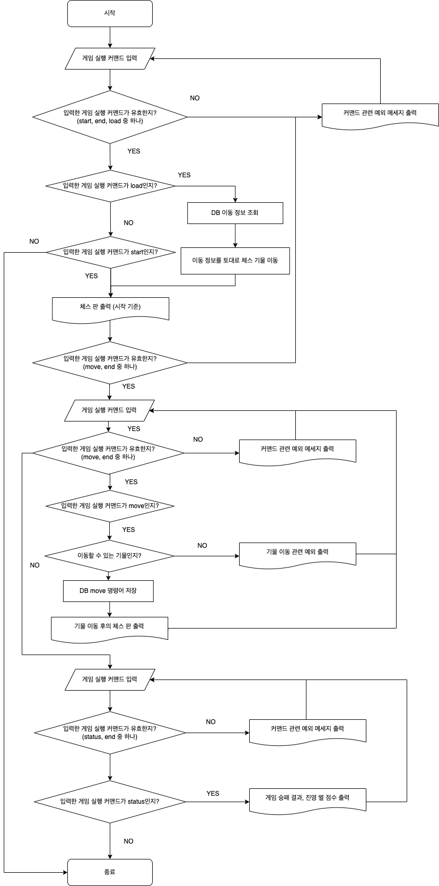

# 체스 게임 구현 미션

## ✔️ 기능 요구사항

- 체스판 (Board)
  - [x] 체스판은 64개의 칸을 가져야 한다.
  - 위치 (Position)
    - [x] 체스판의 위치는 열(File)과 행(Rank)을 가져야 한다.
    - 열 (File)
      - [x] 열은 8개의 알파벳(a ~ h)을 가질 수 있다.
    - 행 (Rank)
      - [x] 행은 8개의 숫자(1 ~ 8)를 가질 수 있다.
  - [ ] 체스판은 각 진영의 승패를 계산할 수 있어야 한다.
  - [ ] 체스판은 진영 별로 점수를 계산할 수 있어야 한다.

- 기물 (Piece)
  - [x] 기물은 6가지를 가져야 한다.
    - 킹 (K, k)
    - 퀸 (Q, q)
    - 룩 (R, r)
    - 비숍 (B, b)
    - 나이트 (N, n)
    - 폰 (P, p)
  - [x] 기물은 검정색 또는 흰색을 가져야 한다.
    - 색 (Color)
      - [x] 색은 2가지 종류를 가져야 한다.
        - 검정색(BLACK), 흰색(WHITE)
  - [x] 기물을 기본 규칙대로 움직여야 한다.
    - [x] 움직이려고 선택한 칸에 기물이 있어야만 한다.
    - [x] 움직이려고 선택한 칸에 자신의 기물이 있어야만 한다.
  - [x] 기물을 특수 규칙대로 움직여야 한다.
    - 폰, 나이트
  - [ ] 기물은 자신이 폰인지 판단할 수 있어야 한다.
  - [ ] 기물은 자신이 킹인지 판단할 수 있어야 한다.
  - [ ] 기물은 자신의 점수가 몇 점인지 알고 있어야 한다.
    - 점수(Score)
      - [ ] 점수는 자신이 몇 점인지 알고 있어야 한다.
      - [ ] 점수는 다른 점수를 받아 더할 수 있어야 한다.
      - [ ] 점수는 다른 점수를 받아 뺄 수 있어야 한다.

## InputView

- [x] 체스 게임 시작 안내 문구를 출력한다.
- [x] 체스 게임 시작 여부를 입력 받는다.
- [x] 체스 게임 종료 여부를 입력 받는다.
- [x] 체스 기물을 움직일지 여부를 입력 받는다.
- [x] 움직일 체스 기물의 위치와 도착 지점을 입력 받는다.
  - [x] 체스 판에 포함되는 위치만을 입력 받아야만 한다.
  - [x] 동일한 위치를 입력할 수 없다.
- [ ] 체스 게임의 승패와 진영 별 점수를 출력할지 여부를 입력 받는다.
  - [ ] 체스 게임이 종료되기 전에는 입력할 수 없다.

## OutputView

- [x] 체스 판을 출력한다.
- [ ] 체스 게임의 승패를 출력한다.
- [ ] 진영 별 점수를 출력한다.

---

## Flow Chart

---

## ✔️ 프로그래밍 요구사항

- indent(인덴트, 들여쓰기) depth를 2를 넘지 않도록 구현한다. 1까지만 허용한다.
- 3항 연산자를 쓰지 않는다.
- else 예약어를 쓰지 않는다. (switch/case 포함)
- 모든 기능을 TDD로 구현해 단위 테스트가 존재해야 한다. 단, UI(System.out, System.in) 로직은 제외
- 핵심 로직을 구현하는 코드와 UI를 담당하는 로직을 구분한다.
- 함수(또는 메서드)의 길이가 10라인을 넘어가지 않도록 구현한다.
- 함수(또는 메소드)가 한 가지 일만 하도록 최대한 작게 만들어라.
- 배열 대신 컬렉션을 사용한다.
- 모든 원시 값과 문자열을 포장한다
- 줄여 쓰지 않는다(축약 금지).
- 일급 컬렉션을 쓴다.
- 모든 엔티티를 작게 유지한다.
- 3개 이상의 인스턴스 변수를 가진 클래스를 쓰지 않는다.
- 딜러와 플레이어에서 발생하는 중복 코드를 제거해야 한다.
- 도메인의 의존성을 최소한으로 구현한다.
- 한 줄에 점을 하나만 찍는다.
- 게터/세터/프로퍼티를 쓰지 않는다.
- 모든 객체지향 생활 체조 원칙을 잘 지키며 구현한다.
