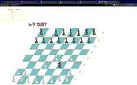

# java-chess

****

- 체스판
    - [x] 체스판은 8*8로 생성한다.
    - [x] 구현: 플레이어의 말을 움직일 수 있다.
        - [X] 구현: 말의 이동은 move [source] [target] 으로 이루어 진다.

- 체스 말
    - [x] 구현: 체스 말은 검은색과 흰색으로 나누어져 있다.
    - [x] 구현: 검은말은 대문자, 흰말은 소문자로 표현한다.
    - [X] 구현: 각 팀의 체스말은 룩 2개, 나이트 2개, 비숍2개, 퀸1개, 킹1개, 폰8개로 이루어져 있다.
    - [x] 구현: 말의 첫 위치는 아래의 그림에 따른다.
      ```
        RNBQKBNR  8 (rank 8)
        PPPPPPPP  7
        ........  6
        ........  5
        ........  4
        ........  3
        pppppppp  2
        rnbqkbnr  1 (rank 1)
      ```
    - [x] 구현: 말의 이동은 아래의 offset에 따른다
        - 룩 : 가로, 세로로 갈 수 있는만큼 끝까지 간다.
        - 나이트 : 상하좌우 2칸 이동 후 대각선 1칸을 이동한다. 이동 경로 중간에 있는 말들은 무시 가능하다.
        - 비숍 : 대각선으로 갈 수 있는 만큼 끝까지 같다.
        - 퀸 : 가로세로대각선으로 갈 수 있는 만큼 끝까지 간다.
        - 킹 : 가로세로대각선으로 한칸씩 간다.
        - 폰 : 첫 움직임에는 2칸 또는 한칸 전진이 가능하며, 그 이후 움직임은 한칸 전진이 가능하다. 적 말이 자신의 이동방향의 대각선에 존재하면 적 말을 먹기 위해 대각선 이동 한칸이 가능하다.

    - [x] 예외: RNBQKP를 제외한 체스말은 존재하지 않는다.
    - [x] 예외: 소스에 말이 존재하지 않는 경우
    - [x] 예외: 소스에 상대편 말이 있을 경우
    - [x] 예외: 타켓에 내 말이 있을 경우
    - [x] 예외: 체스 말은 판을 벗어날 수 없다.
    - [x] 예외: source에 자신의 말이 없으면 예외

- 플레이어
    - [x] 구현: 검은색, 흰색으로 나뉜다.


- 말의 위치
    - [X] 구현: 말의 위치는 가로는 a~h, 세로는 1~8로 이루어진다.
    - [X] 구현: 위치값은 변경될 수 있다.
    - [X] 구현: 위치값이 같은지 확인한다.
    - [X] 구현: target에 적 말이 있으면, 적 말을 잡고 해당 위치로 이동한다.
    - [X] 예외: 같은팀의 말이 해당 위치에 있으면 이동할 수 없다.
    - [X] 예외: 체스판의 크기를 벗어날 수 없다.
    - [X] 예외: 나이트를 제외한 말들은 이동경로에 존재하는 말을 통과할 수 없다.

- [x] start 를 하면 시작, 종료는 end.
- [x] King이 잡혔을 때 게임을 종료한다.

- 점수 출력
    - [x] 구현: status명령을 입력하면 각 진영의 점수를 출력


- 테이블 구조
  


### 실행 예시


