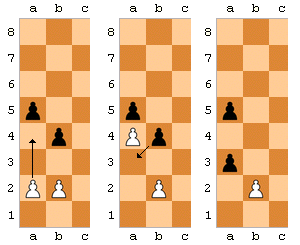
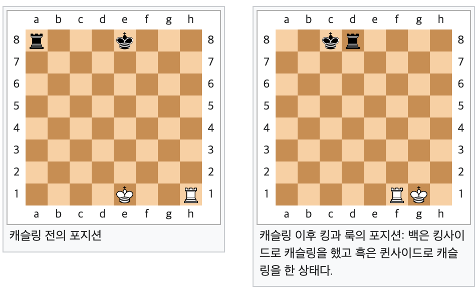

# java-chess

체스 미션 저장소

## 우아한테크코스 코드리뷰

- [온라인 코드 리뷰 과정](https://github.com/woowacourse/woowacourse-docs/blob/master/maincourse/README.md)

## 주요 요구 사항
- 도메인의 의존성을 최소한으로 구현한다.
- 한 줄에 점을 하나만 찍는다.

## 도메인 프로세스 및 요구 기능
"체스판을 생성한다."
"기물들을 생성한다."
"입력된 명령을 실행한다."

## 체스 룰
### 기물 행마법
1. Pawn
   - 폰은 기본적으로, 가고자하는 칸에 기물이 없을 경우 앞으로 한 칸 전진할 수 있다.
   - 처음 움직이는 폰은 두 칸을 전진할 수 있다.
   - 전진하는 방향의 대각선에 있는 칸에 상대편의 기물이 있다면, 그 칸으로 이동하며 상대편 기물을 잡아 먹을 수 있다.
2. Rook
   - 룩은 경로에 기물이 없는 한, 상하좌우로 어느 칸이든 갈 수 있다. 
3. Knight
   - 나이트는 상하좌우로 두 칸을 전진하고 그 방향으로 대각선으로 한 칸 더 전진할 수 있다.
   - 경로에 기물이 있어도 뛰어넘을 수 있다.
4. Bishop
   - 비숍은 경로에 기물이 없는 한, 대각선으로 어느 칸이든 갈 수 있다.
5. Queen
   - 퀸은 경로에 기물이 없는 한, 상하좌우와 대각선으로 어느 칸이든 갈 수 있다.
6. King
   - 킹은 상하좌우와 대각선 모두 한칸씩 이동할 수 있다. 즉, 주위의 모든 칸으로 이동할 수 있다.

### 추가 룰
1. 프로모션
   - 상대편 진영의 끝 랭크까지 전진한 폰은 퀸, 룩, 비숍, 나이트 중에서 아무 기물로 바꿀 수 있다.
2. 앙파상
   - 폰이 두칸 전진했을 때, 바로 옆 파일에 상대편 폰이 존재한다면 그 상대편 폰은 대각선으로 전진하며 폰을 잡을 수 있다.
   
3. 캐슬링
   - 킹과 룩이 움직인 적이 없고, 사이에 기물이 없다면 킹은 룩 쪽으로 두 칸을 가고, 룩은 킹이 한 칸을 이동한 위치로 넘어갈 수 있다.
   - 킹이 체크인 상황에서는 캐슬링을 할 수 없다.
   - 킹이 캐슬링을 하기 위해 지나가는 칸들 중에 상대 기물에 의해서 공격받는 칸이 있으면 안된다.
   - 킹이 최종 위치에서 공격 받게 되면 안된다.

4. 체크
   - 자신의 킹이 상대의 기물 한개 이상에 의해 공격받고 있을 때, 그 상태를 "체크"라고 한다.
   - 자신의 킹을 체크에 노출시키는 수는 절대 둘 수 없다.
   - 체크를 막거나 피할 수 없는 상황이 된다면 "체크메이트"라고 하며, 체크메이트를 당한 쪽이 패배한다.

## 이번 미션에서 집중할 부분
1. OOP
2. DB

