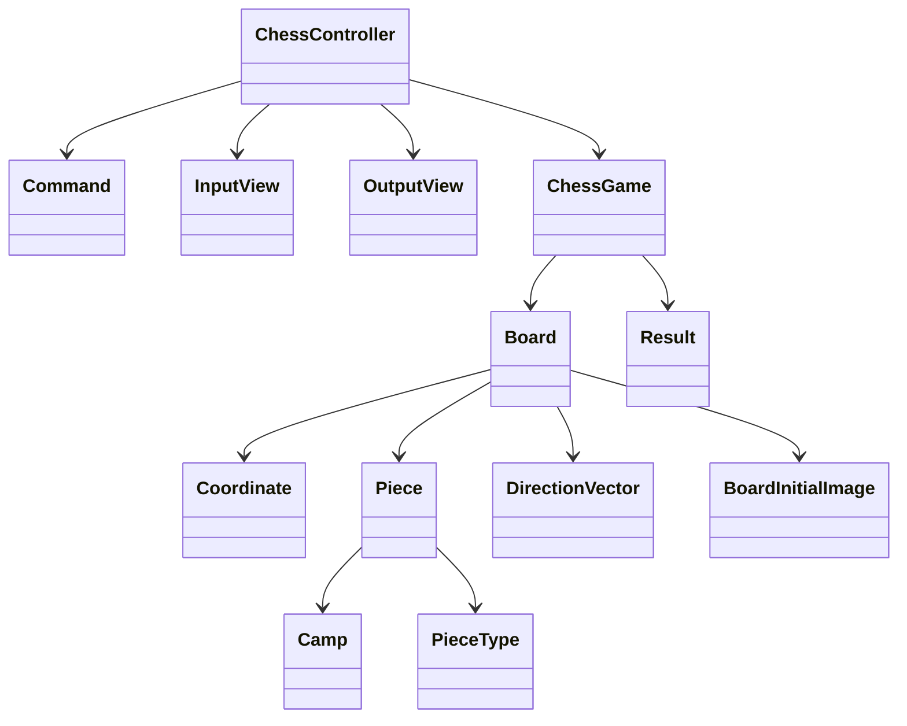

# java-chess

체스 미션 저장소

## 우아한테크코스 코드리뷰

- [온라인 코드 리뷰 과정](https://github.com/woowacourse/woowacourse-docs/blob/master/maincourse/README.md)

---
## 기능 목록

### 입력

- [x] 게임 시작 혹은 종료, 상태 명령을 입력한다
- [x] 게임 이동 명령을 입력한다

### 출력

- [x] 체스판을 출력한다
  - [x] 체스판의 각 행을 출력한다
- [x] 현재 체스 상태를 출력한다
- [x] 체스 결과를 출력한다

### 도메인

- 게임
- [x] 체스판을 초기화할 수 있다
- [x] 차례를 초기화할 수 있다
- [x] 차례를 판단할 수 있다
  - [x] 차례가 맞다면 말을 움직이는 명령을 한다
- [x] 킹이 잡히면 게임을 종료 시킨다
- [x] 게임의 상태를 가져올 수 있다

- 결과
- [x] 현재 게임 보드의 상태에 따른 각 팀의 점수를 구할 수 있다
  - [x] 점수 계산 규칙은 다음과 같다
    - queen은 9점, rook은 5점, bishop은 3점, knight는 2.5점
    - pawn의 기본 점수는 1점, 세로줄에 같은 색의 pawn이 있다면 0.5점으로 계산

- 체스판
- [x] 칸들을 알고 있다
- [x] 말이 움직일지 말지 결정할 수 있다
  - [x] 말이 움직일 수 없는 경우를 판단할 수 있다
    - [x] 말이 특정 좌표로 움직일 수 있는지 여부를 묻는다
    - [x] 특정 위치로부터 다른 위치까지의 경로에 말이 존재하는지 확인한다
  - [x] 움직일 수 있는 경우, 해당 위치로 말을 이동시킨다
- [x] 특정 좌표까지의 경로를 반환한다
- [x] 도착 위치에 상대 말이 있다면 잡을 수 있다

- 말
- [x] 자신의 진영을 알고 있다
- [x] 기물 종류를 알고 있다
- [x] 특정 좌표로 움직일 수 있는지 판단한다
- [x] 서로 다른 이동 규칙을 가진다

- DB 연결
- [x] DB 접속을 위한 커넥션을 생성한다

- 체스 게임 테이블
- [x] 체스 게임을 저장한다
  - 체스 게임 턴, 체스 기물 테이블
- [x] ID를 통해 체스 게임을 조회한다
- [x] 가장 최근 체스 게임을 조회한다
- [x 체스 게임 턴을 수정한다
- [ ] 체스 게임을 삭제한다

- 체스 기물 테이블
- [x] 체스 기물을 저장한다
  - 행(rank), 열(file), 기물 이름, 팀
- [x] 체스 게임 ID를 통해 체스 기물들을 조회한다
- [ ] 위치에 따른 기물의 종류 및 진영을 수정한다
- [ ] 위치에 따른 기물을 삭제할 수 있다
- [ ] 체스 게임 ID를 통해 가모든 체스 기물들을 삭제할 수 있다

---

### 이동 규칙

| 기물  | 이동규칙                                                                                                     |
|:---:|:---------------------------------------------------------------------------------------------------------|
|  킹  | 모든 방향으로 한 칸씩 이동할 수 있다.                                                                                   |
|  퀸  | 모든 방향으로 원하는 만큼 이동할 수 있다.                                                                                 |
|  룩  | 앞뒤, 양옆으로만 원하는 만큼 이동할 수 있다.                                                                               |
| 비숍  | 대각선으로만 원하는 만큼 이동할 수 있다.                                                                                  |
| 나이트 | 한 방향으로 두칸을 이동한 뒤, 90도 방향으로 한칸 이동할 수 있다. 다른 기물을 뛰어넘을 수 있다.                                            |
|  폰  | 일반은 이동은 앞으로 한다. - 처음 움직일 때는 두 칸 이동도 가능하다. - 처음 이동이 아니라면 한 칸 이동만 가능하다.  잡을 때는 대각선으로 이동할 수 있다. |

### Main Dependency

---
### 1, 2단계 고민사항
- `Coordinate`는 column 값을 알고 있는데, 굳이 파라미터로 받아야 하나? getter를 써서 column 값을 가져오면 안되나?
- `Coordinate` 에서 row, col이 양수인지, 음수인지, 그리고 0인지 체크하는 메소드가 존재하는데 이건 getter와 다름없지 않나?
- `Pawn`을 위해서 Typecast를 했는데, 추상화 레벨을 깨는 것이 아닌가? 그런데 인터페이스에 메소드를 정의하느니, 이것이 더 좋은 방법이 아닐까?
