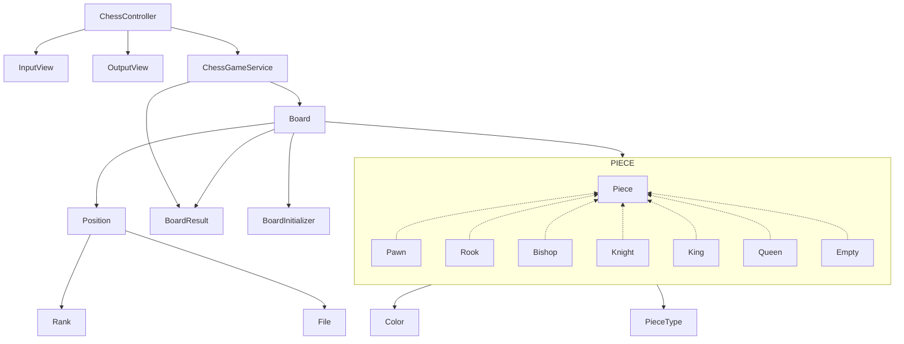

# java-chess

체스 미션 저장소

## 우아한테크코스 코드리뷰

- [온라인 코드 리뷰 과정](https://github.com/woowacourse/woowacourse-docs/blob/master/maincourse/README.md)

### 개요

체스는 가로와 세로가 각각 8줄씩 64칸으로 격자로 배열 된 체스보드에서 두 명의 플레이어가 기물들을 규칙에 따라 움직여 싸우는 보드 게임이다.

### 요구사항

**체스**

- [x] 화이트, 블랙으로 나뉘며 한 턴씩 번갈아 가며 기물을 움직인다.
- [x] 화이트가 기물을 먼저 움직인다.
- [x] 킹이 잡히면 게임이 종료된다.
- [x] 남아있는 말에 대한 점수를 계산할 수 있다.
- [x] 데이터베이스에 행마를 저장하는 기능

**보드**

- [x] 보드는 가로 8칸, 세로 8칸로 이루어져있고, 총 64칸이 존재한다.
    - [x] 가로(Rank)줄은 왼쪽부터 오른쪽으로 1 ~ 8이다.
    - [x] 세로(File)줄은 아래부터 위로 a ~ h이다.
    - [x] 칸의 좌표는 세로줄-가로줄 순으로 조합하여 표시한다.
- [x] 각 칸에는 기물이 존재하거나, 존재하지 않을 수 있다.

**기물**

- [x] 체스 기물에는 킹(King), 퀸(Queen), 룩(Rook), 비숍(Bishop), 나이트(Knight), 폰(Pawn)이 존재한다.
- [x] 각 기물은 움직일 수 있다.
    - [x] 킹: 직선, 대각선 모두 1칸 움직일 수 있다.
    - [x] 퀸: 직선, 대각선 칸 수 제한없이 움직일 수 있다.
    - [x] 룩: 직선 칸 수 제한없이 움직일 수 있다.
    - [x] 비숍: 대각선 칸 수 제한없이 움직일 수 있다.
    - [x] 나이트: 2칸 전진한 상태에서 좌우로 1칸 움직일 수 있다. 다른 기물을 뛰어넘을 수 있다.
    - [x] 폰: 전진만 가능하다. 초기에는 2칸, 그 이외에는 1칸 움직일 수 있다. 기물을 잡는 경우 반드시 대각선으로 움직여야 한다.
- [x] 기물을 여러 칸 움직이는 경우 사이에 다른 기물이 존재한다면 움직일 수 없다.
- [x] 움직이려는 칸에 같은 편 기물이 존재하는 경우 움직일 수 없다.
- [x] 움직이려는 칸에 상대 편 기물이 존재하는 경우 해당 기물을 잡는다.

**점수**
- [x] 킹을 제외한 기물들은 점수를 가진다. 
  - [x] 퀸: 9점
  - [x] 룩: 5점
  - [x] 비숍: 3점
  - [x] 나이트: 2.5점
  - [x] 폰: 1점
- [x] 폰은 File(세로줄)에 같은 색의 폰이 있는 경우 0.5점이다.

### 다이어그램

