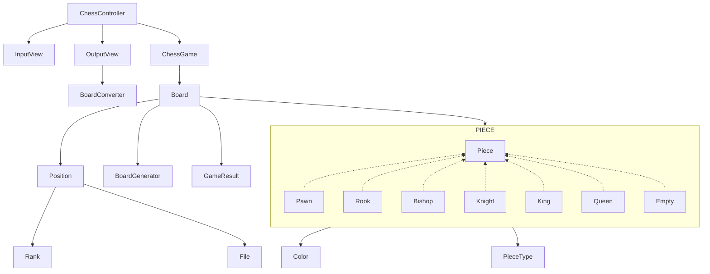
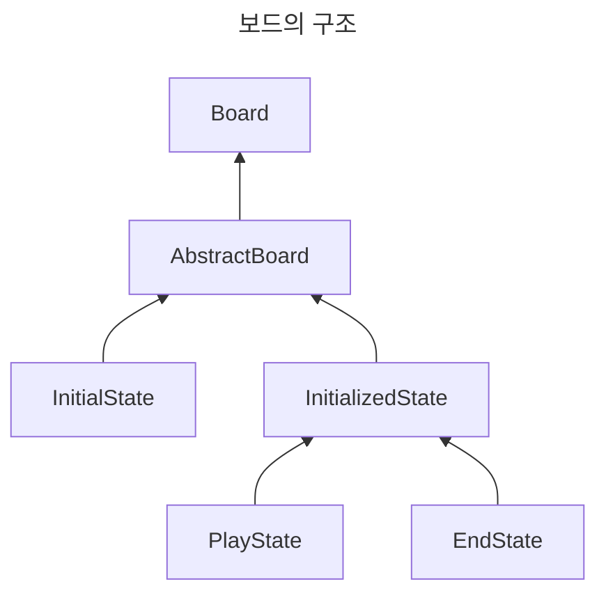

# java-chess

체스 미션 저장소

## 우아한테크코스 코드리뷰

- [온라인 코드 리뷰 과정](https://github.com/woowacourse/woowacourse-docs/blob/master/maincourse/README.md)

### 개요

체스는 가로와 세로가 각각 8줄씩 64칸으로 격자로 배열 된 체스보드에서 두 명의 플레이어가 기물들을 규칙에 따라 움직여 싸우는 보드 게임이다.

### 요구사항

**체스**

- [x] 흰색, 검은색으로 나뉘며 한 턴씩 번갈아 가며 기물을 움직인다.
- [x] 흰색 진영이 기물을 먼저 움직인다.
- [x] 킹이 잡힌 경우 게임을 종료한다.

**보드**

- [x] 보드는 가로 8칸, 세로 8칸로 이루어져있고, 총 64칸이 존재한다.
    - [x] 가로(Rank)줄은 아래부터 위로 1 ~ 8이다.
    - [x] 세로(File)줄은 왼쪽에서 오른쪽으로 A ~ H이다.
- [x] 각 칸에는 기물이 존재하거나, 존재하지 않을 수 있다.
- [x] 보드의 상태는 초기(InitialState), 게임 진행(PlayState), 종료(EndState)가 있다.
    - [x] 초기(Initial) 상태는 초기화되지 않은 보드를 의미한다.
        - [x] 초기화하는 경우 게임 진행(Play) 상태가 된다.
    - [x] 게임 진행(Play) 상태는 초기화 된, 게임을 진행되고 있는 상태를 의미한다.
        - [x] 어느 한 쪽의 왕이 잡힌 겨우 게임이 종료(End) 상태가 된다.
    - [x] 종료(End) 상태는 게임을 진행할 수 없다.

**기물**

- [x] 체스 기물에는 킹(King), 퀸(Queen), 룩(Rook), 비숍(Bishop), 나이트(Knight), 폰(Pawn)이 존재한다.
- [x] 각 기물은 움직일 수 있다.
    - [x] 킹: 직선, 대각선 모두 1칸 움직일 수 있다.
    - [x] 퀸: 직선, 대각선 칸 수 제한없이 움직일 수 있다.
    - [x] 룩: 직선 칸 수 제한없이 움직일 수 있다.
    - [x] 비숍: 대각선 칸 수 제한없이 움직일 수 있다.
    - [x] 나이트: 2칸 전진한 상태에서 좌우로 1칸 움직일 수 있다. 다른 기물을 뛰어넘을 수 있다.
    - [x] 폰: 전진만 가능하다. 초기에는 2칸, 그 이외에는 1칸 움직일 수 있다. 기물을 잡는 경우 반드시 대각선으로 움직여야 한다.
- [x] 기물을 여러 칸 움직이는 경우 사이에 다른 기물이 존재한다면 움직일 수 없다.
- [x] 움직이려는 칸에 같은 편 기물이 존재하는 경우 움직일 수 없다.
- [x] 움직이려는 칸에 상대 편 기물이 존재하는 경우 해당 기물을 잡는다.

**점수 계산**

- [x] 각 진영의 점수를 구한다. 기물의 점수는 아래와 같다.
    - [x] 킹: 0점
    - [x] 퀸: 9점
    - [x] 룩: 5점
    - [x] 비숍: 3점
    - [x] 나이트: 2.5점
    - [x] 폰: 1점
- [x] 폰의 경우 세로(File)줄에 여러 개 있는 경우(더블 폰, 트리플 폰) 각 0.5점으로 계산한다.

### 입력

- [x] 시작(START) 명령어는 초기에 한 번만 입력 가능하다.
- [x] 게임을 시작하고 나면 상태 확인(STATUS) 명령어를 입력할 수 있다.
- [x] 게임을 시작하고 나면 이동(MOVE) 명령어를 입력할 수 있다.
- [x] 게임 종료(END)는 언제나 입력할 수 있다. 입력시 게임이 종료된다.

### 출력

- [x] 게임 시작시 명령어를 안내하는 내용을 출력한다.

```
> 체스 게임을 시작합니다.
> 게임 시작 : start
> 게임 상태 : status
> 게임 종료 : end
> 게임 이동 : move source위치 target위치 - 예. move b2 b3
```

- [x] 시작(START) 명령어 입력시 초기화된 보드가 출력된다.

```
RNBQKBNR
PPPPPPPP
........
........
........
........
pppppppp
rnbqkbnr
```

- [x] 이동(MOVE) 명령어 입력시 이동 후의 보드가 출력된다.

```
RNBQKBNR
PPPPPPPP
........
........
....p...
........
pppp.ppp
rnbqkbnr
```

- [x] 상태(STATUS) 명령어 입력시 각 진영의 점수를 확인한다.
    - [x] 왕이 잡히는 경우 패배로 출력된다.
    - [x] 양쪽 진영 다 왕이 잡히지 않은 경우 점수로 결과를 출력한다.

```
흰색 점수: 38.0
검은색 점수: 38.0
현재 상태: 백색 승
```

### 다이어그램




