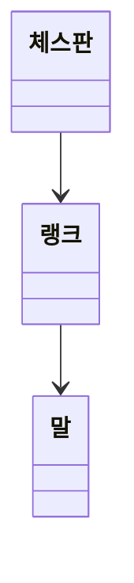

# java-chess

체스 미션 저장소

## 우아한테크코스 코드리뷰

- [온라인 코드 리뷰 과정](https://github.com/woowacourse/woowacourse-docs/blob/master/maincourse/README.md)

---
## 기능 목록

### 입력
- [x] 게임 시작 혹은 종료 명령을 입력한다
- [ ] 게임 이동 명령을 입력한다

### 출력
- [x] 체스판을 출력한다
  - [x] 체스판의 각 행을 출력한다

### 도메인

- 체스판
- [x] 랭크를 초기화할 수 있다
- [x] 랭크들을 알고 있다
- [ ] 말이 움직일 수 없는 경우를 판단할 수 있다
  - [ ] 특정 위치로부터 다른 위치까지의 경로에 말이 존재하는지 확인한다
- [ ] 말이 움직일지 말지 결정할 수 있다
  - [ ] 움직일 수 있는 경우, 해당 위치로 말을 이동시킨다
- [ ] 특정 좌표까지의 경로를 반환한다

- 랭크
- [x] 칸을 초기화할 수 있다
- [x] 칸들을 알고 있다
- [x] 특정 위치에 있는 말을 찾을 수 있다
- [x] 특정 위치에 있는 말을 바꿔줄 수 있다
- [x] 말이 특정 좌표로 움직일 수 있는지 여부를 묻는다

- 말
- [x] 자신의 진영을 알고 있다
- [x] 기물 종류를 알고 있다
- [x] 특정 좌표로 움직일 수 있는지 판단한다
- [x] 서로 다른 이동 규칙을 가진다
  
---

### 이동 규칙
|  기물   | 이동규칙                                                                                |
|:-----:|:------------------------------------------------------------------------------------|
|킹| 모든 방향으로 한 칸씩 이동할 수 있다.                                                              |
|퀸| 모든 방향으로 원하는 만큼 이동할 수 있다.                                                            |
|룩| 앞뒤, 양옆으로만 원하는 만큼 이동할 수 있다.                                                          |
|비숍| 대각선으로만 원하는 만큼 이동할 수 있다.                                                             |
|나이트| 한 방향으로 두칸을 이동한 뒤, 90도 방향으로 한칸 이동할 수 있다. 다른 기물을 뛰어넘을 수 있다.                       |
|폰| 일반은 이동은 앞으로 한다. - 처음 움직일 때는 두 칸 이동도 가능하다. - 처음 이동이 아니라면 한 칸 이동만 가능하다.  잡을 때는 대각선으로 이동할 수 있다. |

---
### 1, 2단계 고민사항
- `Coordinate`는 column 값을 알고 있는데, 굳이 파라미터로 받아야 하나? getter를 써서 column 값을 가져오면 안되나?
