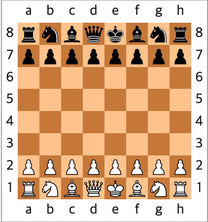

# java-chess

체스 미션 저장소

## 우아한테크코스 코드리뷰

- [온라인 코드 리뷰 과정](https://github.com/woowacourse/woowacourse-docs/blob/master/maincourse/README.md)

## 🚀 기능 목록

- 1단계
  - 체스판
    - [x] 행(row), 열(col)으로 나누어짐
    - [x] 행은 1~8까지, 열은 a~h까지
  - 플레이어
    - [x] 플레이어는 Black과 White로 나눔
    - [ ] 각 플레이어는 각자의 체스 기물을 사용할 수 있음
  - 초기 체스판
    - [x] 각 플레이어의 초기 사용 가능한 기물 
      - 룩 2개, 나이트 2개, 비숍 2개, 퀸 1개, 킹 1개, 폰 8개
    - [x] 체스 초기 모습
      - 
    
  - 뷰
    - [x] start 명령어를 통해 체스 게임 시작
    - [x] end 명령어를 통해 체스 게임 종료

  - 1단계 키워드
    - 행 (Row) 
    - 열 (Col)
    - 플레이어 (BlackTeam, WhiteTeam)
    - 기물
      - 룩 (Rook)
      - 퀸 (Queen)
      - 나이트 (Knight)
      - 비숍 (Bishop)
      - 킹 (King)
      - 폰 (Pawn)
    - 체스판 (ChessBoard)
    - 체스 (Chess)

- 2단계
  - 체스 규칙
    - [ ] 각 플레이어는 번갈아가며 반드시 기물을 움직여야 함.
    - [x] 움직이려는 기물의 위치에서 기물이 없으면 예외 발생
    - [ ] 움직이려는 위치에 같은 색깔의 기물이 있을 경우 예외 발생
    - [ ] 앞에 장애물이 있을 경우 넘어서 이동 불가 (나이트는 제외)
    
  - 기물 이동
    - 폰
      - [x] 초기상태에서 한 칸 혹은 두 칸 전진
      - [x] 그 이후로는 한 칸씩만 전진
      - [x] 후퇴가 불가능
      - [x] 양 옆으로 이동 불가
      - [ ] 상대방의 피스는 대각선 한 칸으로만 잡을 수 있다.
      - (프로모션) 폰이 상대방 진영 끝까지 갔을때 퀸, 룩, 비숍, 나이트로 바꿀 수 있다. (선택 사항)
      - (앙파상) 흰색 폰이 5번 랭크에 있고 검은색 폰이 처음 2칸 전진을 하면 앙파상을 이용해 대각선으로 이동하면서 검은색 폰을 넘은 규칙으로 검은색 폰을 잡을 수 있다. (선택 사항)
    - 룩
      - [x] 앞으로 제한 없이 이동 가능
      - [x] 뒤로 제한 없이 이동 가능
      - [x] 오른쪽으로 제한 없이 이동 가능
      - [x] 왼쪽으로 제한 없이 이동 가능
      - [ ] (캐슬링) 킹과 룩을 한 번에 동시에 움직일 수 있다. (선택 사항)
    - 킹
      - [ ] 전후좌우, 대각선 방향으로 한 칸씩 움직일 수 있다.
      - [ ] 스스로 체크가 되는 곳으로 움직일 수 없다.
      - (캐슬링) 룩하고 캐슬링이 가능하다. (선택 사항)
    - 나이트
      - [ ] 두 칸 전진 + 좌우로 한 칸 움직일 수 있다. (장기의 마처럼 이동)
      - [ ] 피스들 중에서 유일하게 다른 피스를 뛰어넘을 수 있다.
    - 비숍 
      - [x] 대각선 방향으로 칸 수의 제한 없이 움직일 수 있다. 
      - [x] 어두운 칸 비숍, 밝은 칸 비숍은 자기의 색의 칸에서만 이동이 가능하다.
    - 퀸
      - [ ] 전후좌우, 대각선으로 칸수 제한 없이 움직일 수 있다.
  
  - 뷰
    - [ ] 게임 이동 명령어 처리
    - [ ] 기물을 이동한 체스 보드 출력
    - [ ] 예외 사항 발생 시 메시지 출력
  
  - 2단계 모델 키워드
    - 체스 보드
    - 체스
    - 기물
      - 폰, 룩, 퀸, 킹, 나이트, 비숍
    - 플레이어
    - 위치
    - 움직임 (Movement) -> from, to 정보 가지고 있음
    - 방향
      - 대각선
      - 전후좌우
      - 후퇴 불가
      - 전진
      - 기존 피스의 장애물 여부
    - 체크
    - 턴
    - 체스 보드 칸
      - 색깔 (어두운 칸, 밝은 칸)
      - 수량 (거리)
    - 초기 상태
    - 기물 제거 (Capture)
    
  - 2단계 뷰 키워드
    - move 명령 
  
- 3단계