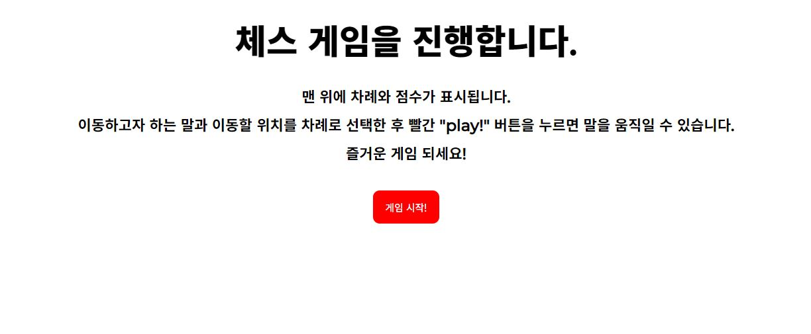
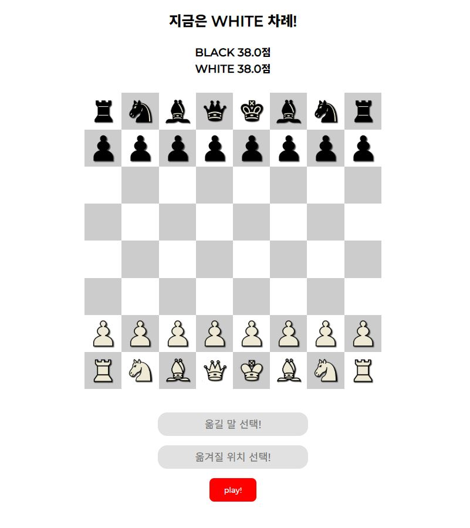
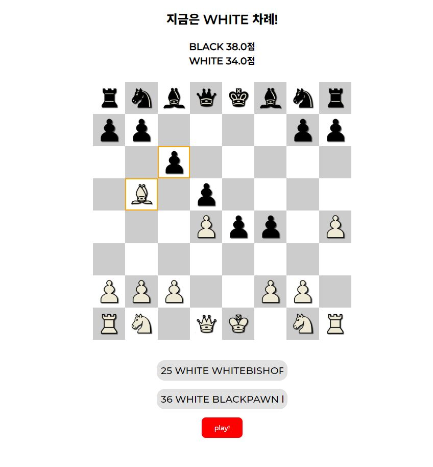
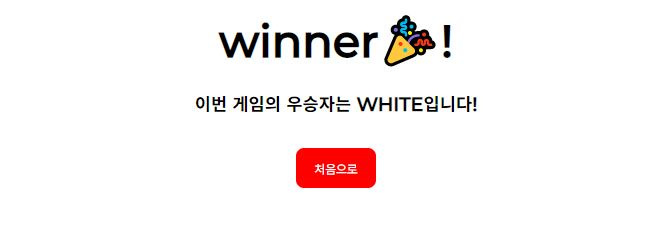

# java-chess
체스 게임 구현을 위한 저장소

# 체스

### 기능 요구사항
- 1단계는 체스 게임을 할 수 있는 체스판을 초기화한다.
- 체스판에서 말의 위치 값은 가로 위치는 왼쪽부터 a ~ h이고, 세로는 아래부터 위로 1 ~ 8로 구현한다.
- 체스 말의 이동 규칙을 찾아보고 체스 말이 이동할 수 있도록 구현한다.
- 체스 게임은 상대편 King이 잡히는 경우 게임에서 진다. King이 잡혔을 때 게임을 종료해야 한다.
- 체스 게임은 현재 남아 있는 말에 대한 점수를 구할 수 있어야 한다.
- 각 말의 점수는 queen은 9점, rook은 5점, bishop은 3점, knight는 2.5점이다.
- pawn의 기본 점수는 1점이다. 하지만 같은 세로줄에 같은 색의 폰이 있는 경우 1점이 아닌 0.5점을 준다.
- king은 잡히는 경우 경기가 끝나기 때문에 점수가 없다.
- 한 번에 한 쪽의 점수만을 계산해야 한다.

---
### 기능 목록
1. 말
	- 각각의 말은 자신의 위치와 팀을 알고 있다.
	- 각 말의 이동 방식에 따라 이동할 위치가 들어오면 이동 가능한지 판단한다.

2. 체스판
	- 초기화할 수 있다.
	- 말을 이동하거나 말을 잡는다.
	- King의 생존 여부를 판단하여 게임을 종료할 수 있다.
	- status 명령이 들어오면 점수를 계산하여 반환할 수 있다.

3. 게임 진행
	- 현재 어떤 팀의 차례인지 안다.
	- start, end, move, status 등의 명령을 받아 게임을 진행한다.
	
4. Web
    - 이동할 말과 움직일 위치를 선택하여 이동한다.
    - 현재 각 팀의 남아있는 말의 점수를 보여준다.
    - king이 죽으면 우승자를 알려주고 게임을 다시 시작한다.
    
5. DB
    - 체스판의 가로 한 줄씩 저장한다.
    - 진행중인 게임의 현재 차례의 팀을 저장한다.

---    
### 실행 결과

