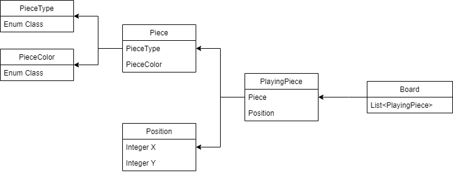

# java-chess
체스 게임 구현을 위한 저장소

## 기능 요구사항
- 콘솔 UI에서 체스 게임을 할 수 있는 기능을 구현한다.
- 체스 말의 이동 규칙을 찾아보고 체스 말이 이동할 수 있도록 구현한다.
- `move source위치 target위치`을 실행해 이동한다.
- 체스판의 위치 값은 가로 위치는 왼쪽부터 a ~ h이고, 세로는 아래부터 위로 1 ~ 8로 구현한다.

## 프로그래밍 요구사항
- [프로그래밍 체크리스트](https://github.com/woowacourse/woowacourse-docs/blob/master/cleancode/pr_checklist.md)의 원칙을 지키면서 프로그래밍 한다.