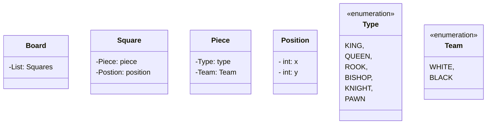

# java-chess

체스 미션 저장소

## 우아한테크코스 코드리뷰

- [온라인 코드 리뷰 과정](https://github.com/woowacourse/woowacourse-docs/blob/master/maincourse/README.md)

## 기능 요구 사항

### 게임 진행

- [ ] 체스판의 가로 위치는 왼쪽부터 a ~ h 이다.
- [ ] 체스판의 세로 위치는 아래부터 1 ~ 8 이다.
- [X] 각 진영은 검은색(대문자)와 흰색(소문자) 편으로 구분한다.
- [ ] 게임을 시작하고, start를 입력해야 체스판을 출력한다.
- [ ] 게임을 시작하고, end를 입력하면 게임을 종료한다.
- [X] 게임을 시작하면, 보드에 말이 세팅되어야 한다.
