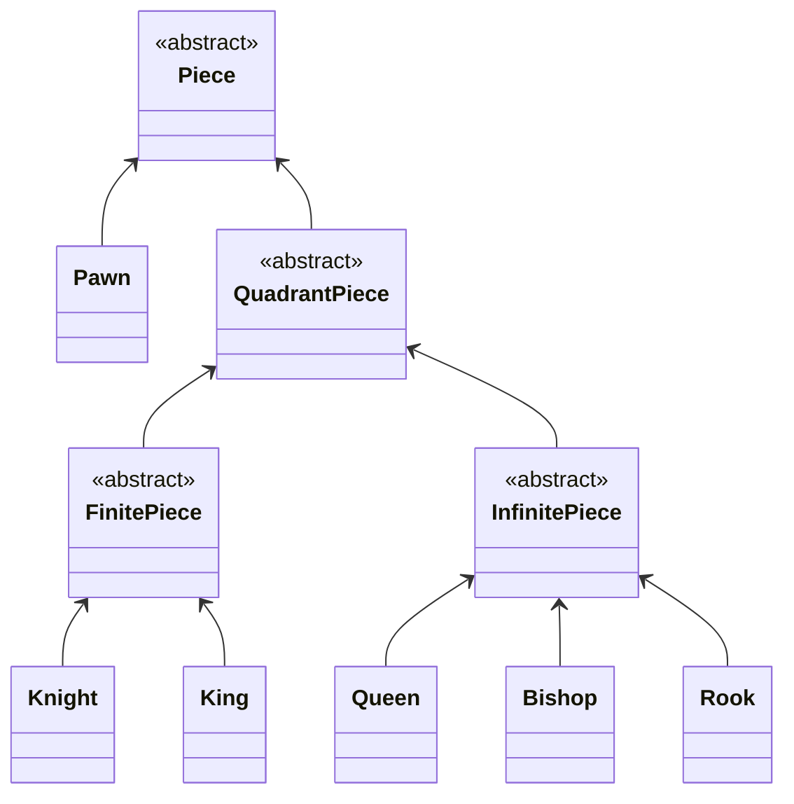

# java-chess

체스 미션 저장소

# 기능 목록

- 체스판
    - [ ] 체스판 시작 배열로 초기화한다
    - [ ] 위치 별 기물을 가진다
    - [ ] 기물을 움직인다
        - [ ] 목표 위치에 같은 색상의 말이 있으면 움직일 수 없다
        - [ ] 다른 말을 뛰어넘을 수 없다
        - [ ] 목표 위치에 다른 색의 기물이 있으면 공격할 수 있다
- 기물
    - [ ] 폰, 비숍, 나이트, 룩, 퀸, 킹이 있다.
        - 하단 기물 클래스다이어그램 참조
    - 가능한 수인지 판단한다
    - 1사분면의 수으로 모든 사분면의 수을 만든다
    - 색을 구분한다
- 기물별 특성
    - 폰
        - [ ] 처음에는 1칸 혹은 2칸 앞으로 움직일 수 있다.
        - [ ] 1칸 앞으로 움직일 수 있다.
        - [ ] 공격은 앞대각선으로 할 수 있다.
    - 비숍
        - 대각선 무한으로 움직일 수 있다.
    - 나이트
        - 한 방향으로 한 칸, 그리고 그 방향의 양 대각선 방향 중 한 방향으로 움직일 수 있다.
    - 룩
        - 가로/세로 무한으로 움직일 수 있다.
    - 퀸
        - 가로/세로/대각선 무한으로 움직일 수 있다.
    - 킹
        - 가로/세로/대각선 한 칸 움직일 수 있다.
- 위치
    - file,rank 를 가진다
    - 이동할 수 있다
- 수
    - 다수의 방향을 가진다.
        - 양방향이 존재하면 예외를 던진다.
    - 수끼리 비교할 수 있다.
        - 방향의 순서에 관련없이 같다.
    - 상하 대칭 할 수 있다.
    - 좌우 대칭 할 수 있다.
    - 기울기가 같은지 알 수 있다.
    - 단위 수를 찾을 수 있다.
    - 목적지를 찾을 수 있다.
- 방향
    - 상하좌우
    - 상하 대칭 할 수 있다.
    - 좌우 대칭 할 수 있다.
- file
    - a~h
    - 좌우로 이동 할 수 있다
        - 범위를 벗어난 이동은 예외를 던진다
- rank
    - 1~8
    - 위 아래로 이동 할 수 있다
        - 범위를 벗어난 이동은 예외를 던진다

### 기물 클래스 다이어그램

## 우아한테크코스 코드리뷰

- [온라인 코드 리뷰 과정](https://github.com/woowacourse/woowacourse-docs/blob/master/maincourse/README.md)
