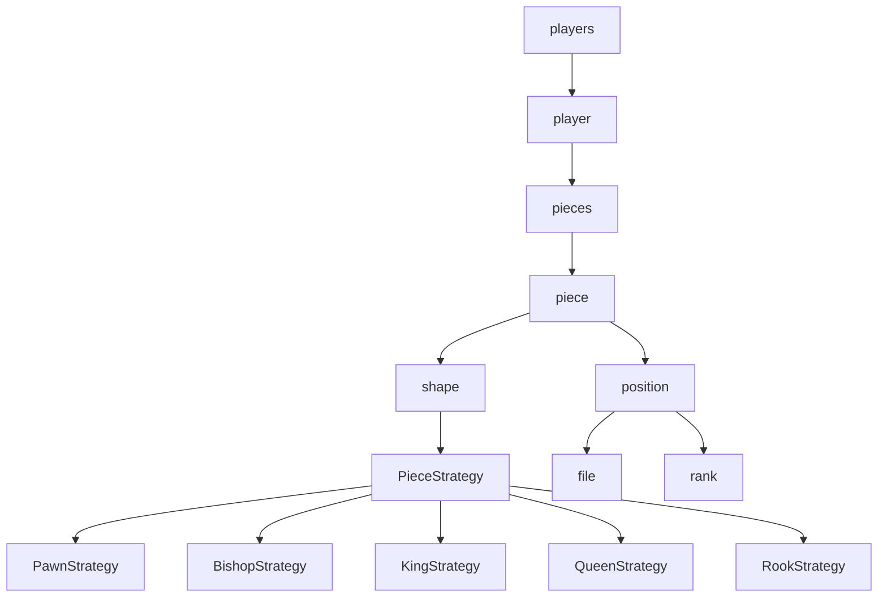

# java-chess

체스 미션 저장소

## 우아한테크코스 코드리뷰

- [온라인 코드 리뷰 과정](https://github.com/woowacourse/woowacourse-docs/blob/master/maincourse/README.md)

### 기능 요구 사항



## View

### In

- [x] start 또는 end 입력
  - [x] start 입력시 시작
  - [x] end 입력시 끝
- [x] status 입력 

### Out

- [x] `> 체스 게임을 시작합니다.` 출력
- [x] `> 게임 시작 : start` 출력
- [x] `> 게임 종료 : end` 출력
- [x] `> 게임 이동 : move source위치 target위치 - 예. move b2 b3` 출력
- [x] 체스 판 출력
  - [x] 가로 8칸, 세로 8칸

## Domain

### Players

- [x] white player와 black player를 가진다.
- [x] white 플레이어와 black 플레이어의 모든 position 반환한다.
- [x] 입력받은 위치의 포지션에 기물이 존재하는지 확인한다.

### Player

- [x] 기물들을 관리하는 객체를 가진다.
- [x] 진영(white, black)을 가진다.

### Pieces

- [x] 기물들을 가진다.
- [x] 진영에 따라 기물들을 생성한다.
  - [x] 폰을 8개 생성한다.
  - [x] 킹, 퀸을 1개씩 생성한다.
  - [x] 비숍, 룩, 나이트를 2개씩 생성한다.

### Piece

- [x] 좌표를 가진다.
- [x] 모양을 가진다.

### Shape

- [x] 기물 모양을 관리한다.

### Position

- [x] 가로(rank), 세로(file) 를 가진다.
  - [x] 가로는 a~h, 세로는 최소 1, 최대 8 까지의 값을 가진다.
  - [x] 가로가 a~h, 세로가 1~8 범위를 벗어나면 예외가 발생한다.

## Strategy

### PawnStrategy
- [x] 첫번째 차례에 앞으로 최대 2칸 이동할 수 있다.
  - [x] 첫번째 차례가 아닌 경우 화이트 폰이 앞으로 2칸 이동시 예외가 발생한다.
  - [x] 첫번째 차례가 아닌 경우 블랙 폰이 앞으로 2칸 이동시 예외가 발생한다.
- [x] 앞으로 1칸 이동할 수 있다.
  - [x] 뒤로 1칸 이동하는 경우 예외가 발생한다.
- [x] 대각선 앞에 상대 진영 기물이 존재할 경우 이동하고 잡을 수 있다.

### RookStrategy
- [x] 세로로 움직인다.
- [x] 가로로 움직인다.
- [x] 타겟이 대각에 있으면 예외가 발생한다.

### BishopStrategy
- [x] 상하좌우로 움직일 수 없다.
  - [x] 위로 움직일 수 없다.
  - [x] 밑으로 움직일 수 없다.
  - [x] 오른쪽으로 움직일 수 없다.
  - [x] 왼쪽으로 움직일 수 없다.

### KingStrategy
- [x] 모든 방향으로 한 칸 이동할 수 있다.
- [x] 한 칸 이상 움직일 수 없다.
  - [x] 두 칸 이상 위로 움직일 수 없다.
  - [x] 두 칸 이상 아래로 움직일 수 없다.
  - [x] 두 칸 이상 대각선으로 움직일 수 없다.
  - [x] 두 칸 이상 왼쪽으로 움직일 수 없다.
  - [x] 두 칸 이상 오른쪽으로 움직일 수 없다.

### QueenStrategy
- [x] 올바른 위치일 경우 타겟 포지션이 반환된다.
- [x] 올바르지 않은 위치일 경우 예외가 발생한다.

### KnightStrategy
- [x] rank가 1, file이 2가 아닐 때 움직일 수 없다.
- [x] rank가 1, file이 2이면 움직일 수 있다.
- [x] rank가 2, file이 1이 아닐 때 움직일 수 없다.
- [x] rank가 2, file이 1일 때 움직일 수 있다.

## Database
- 애플리케이션을 재시작하더라도 이전에 하던 체스 게임을 다시 시작할 수 있어야 한다.
  - [x] 애플리케이션이 중간에 종료되더라도 그 전까지의 기록을 불러올 수 있다.
  - [x] 킹을 잡아 게임이 종료되면 기록은 사라진다.
  - [x] 재시작하면 마지막 주자의 다음 사람이 시작한다.  
- [x] DB를 적용할 때 도메인 객체의 변경을 최소화해야한다.

### DDL
```sql
create table piece(
    id     bigint auto_increment primary key,
    `rank` bigint   null,
    file   char(2)  null,
    color  char(16) null,
    shape  char(16) null
)

create table turn(
   id             bigint not null auto_increment,
   current_color  char(16) default 'white',
   primary key (id)
);
```
### DML
> turn 테이블 생성 후 turn의 기본 값을 추가하는 쿼리입니다.
> 
> 처음에 한번만 실행해주세요.
```sql
insert into turn values ('WHITE');
```
