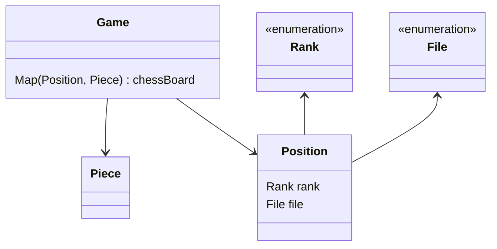
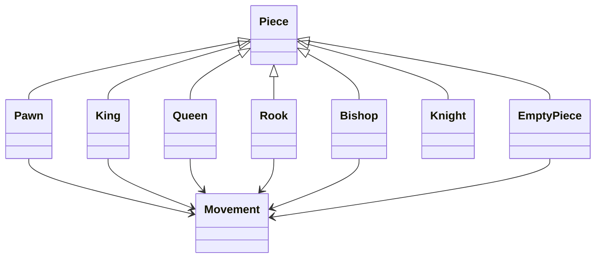

# java-chess

체스 미션 저장소

## 클래스 다이어그램

### 체스 말들의 상속 관계

# 기능 요구 사항

## Domain
### Position
- [x] File, Rank로 위치 정보를 생성한다.
- [x] File, Rank의 차이에 대한 움직임을 계산한다.
- [x] Target position까지의 이동 경로를 반환한다.
  - [x] 요청받은 Movement를 기준으로 해당 방향으로 한 칸 움직인다.

### Piece
- [x] Source position에서 Target position으로 가는 경로를 반환한다.
  - [x] Target position이 해당 말이 이동할 수 없는 위치일 경우 예외가 발생한다.
- [x] Source piece와 Target piece가 같은 팀인지 확인한다.
- [x] Source piece와 Target piece가 다른 팀인지 확인한다.

### Pawn
- [x] 이동할 수 있는지 확인한다.
  - [x] White 진영은 위로, Black 진영은 아래로 움직인다.
  - [x] 첫 움직임은 2칸까지, 나머지 움직임은 1칸까지 움직일 수 있다.
  - [x] 상대편 말을 잡을 때는 대각선으로만 움직일 수 있다.
- [x] 입력 받은 Target position으로 가는 경로를 반환한다.
- [x] 점수를 반환한다.

### Bishop
- [x] 이동할 수 있는지 확인한다.
  - [x] 대각선으로만 움직일 수 있다.
  - [x] Target에 같은 진영 말이 있으면 움직일 수 없다.
- [x] 입력 받은 Target position으로 가는 경로를 반환한다.
- [x] 점수를 반환한다.

### King
- [x] 이동할 수 있는지 확인한다.
  - [x] 한 칸이면, 모든 방향으로 움직일 수 있다.
  - [x] Target Position에 같은 진영 말이 있으면 움직일 수 없다.
- [x] 입력 받은 Target position으로 가는 경로를 반환한다.
- [x] 점수를 반환한다.

### Queen
- [x] 이동할 수 있는지 확인한다.
  - [x] 대각선, 수직, 수평으로 움직일 수 있다.
  - [x] Target Position에 같은 진영 말이 있으면 움직일 수 없다.
- [x] 입력 받은 Target position으로 가는 경로를 반환한다.
- [x] 점수를 반환한다.

### Rook
- [x] 이동할 수 있는지 확인한다.
  - [x] 수직 방향으로만 움직일 수 있다.
  - [x] Target Position에 같은 진영 말이 있으면 움직일 수 없다.
- [x] 입력 받은 Target position으로 가는 경로를 반환한다.
- [x] 점수를 반환한다.

### Knight
- [x] 이동할 수 있는지 확인한다.
  - [x] 수직 2칸 + 수평 1칸 또는 수직 1칸 + 수평 2칸으로 움직일 수 있다.
  - [x] Target Position에 같은 진영 말이 있으면 움직일 수 없다.
- [x] 입력 받은 Target position으로 가는 경로를 반환한다.
  - [x] Knight는 아군 말을 뛰어 넘을 수 있기 때문에 빈 경로를 반환한다.
- [x] 점수를 반환한다.

### EmptyPiece
- [x] 이동할 수 있는지 확인하면 예외가 발생한다.
- [x] 움직임의 경로를 확인하면 예외가 발생한다.
- [x] 빈 기물이 맞는지 확인한다.
- [x] 기물의 종류를 반환한다.
- [x] 상대 진영의 기물인지 확인하면 예외가 발생한다.
- [x] 점수를 요청하면 예외가 발생한다.

### Game
- [x] 각각의 Rank와 File을 표현하도록 체스판을 초기화한다.
  - [x] Rank(가로 위치)는 왼쪽부터 a ~ h이다.
  - [x] File(세로 위치)는 아래부터 위로 1 ~ 8이다.
- [x] Source position, Target position를 입력 받아 말을 이동시키고 턴을 바꾼다.
  - [x] 이동 경로에 같은 진영의 말이 존재하는지 확인한다.
  - [x] 상대방의 말을 움직일 경우, 예외가 발생한다.
  - [x] Source position에 말이 존재하지 않는 경우, 예외가 발생한다.
  - [x] 목표 위치에 같은 편 말이 존재할 경우, 예외가 발생한다.
  - [x] 목표 위치가 말의 이동 가능 범위에 벗어나는 경우, 예외가 발생한다.
  - [x] 상대방의 말 위치로 이동하는 경우, 이동한 말이 그 위치를 대체한다.
    - [x] Source position의 Piece는 EmptyPiece로 대체한다.
- [x] 게임이 종료되었는지 확인한다.
- [x] 점수를 계산한다. (White, Black 따로)
  - [x] 모든 기물들의 점수를 계산한다.
  - [x] 같은 File에 있는 Pawn에 의한 점수 패널티를 계산한다.

### Score
- [x] 더한 점수를 반환한다.

### ChessBoardGenerator
- [x] 체스 판과 규칙에 맞는 초기 말들을 생성한다.

### Movement
- [x] 어느 방향으로도 움직이지 않으면 예외가 발생한다.
- [x] 1칸 이내 움직임인지 확인한다.
- [x] 2칸 이내 움직임인지 확인한다.
- [x] 상, 하, 좌, 우(수직) 방향성의 움직임인지 확인한다.
- [x] 대각선 방향성의 움직임인지 확인한다.
- [x] 위(1,2사분면) 방향성의 움직임인지 확인한다.
- [x] 아래(3,4사분면) 방향성의 움직임인지 확인한다.
- [x] 오른쪽(1,4사분면) 방향성의 움직임인지 확인한다.
- [x] 왼쪽(2,3사분면) 방향성의 움직임인지 확인한다.
- [x] '수직 2칸 + 수평 1칸' 또는 '수직 1칸 + 수평 2칸'의 움직임인지 확인한다.

### File (enum)
- [x] Source file과 Target file간 거리를 반환한다.
- [x] 다음 순서의 값을 반환한다.
- [x] 이전 순서의 값을 반환한다.

### Rank (enum)
- [x] Source rank와 Target rank간 거리를 반환한다.
- [x] 다음 순서의 값을 반환한다.
- [x] 이전 순서의 값을 반환한다.

### Side (enum)
- [x] 상대 진영인지 확인한다.
  - [x] 중립 진영에게 확인한 경우, 예외가 발생한다.

## View
### InputView
- [x] 게임 커맨드를 입력받는다.

### OutputView
- [x] 게임 가이드 메시지를 출력한다.
- [x] 체스판 현황을 출력한다.
- [x] 현재 턴을 가지고 있는 진영을 출력한다.
- [x] 예외 메시지를 출력한다.
- [x] 서버 에러 메시지를 출력한다.

### PieceMapper
- [x] 기물 종류에 따라 알맞은 텍스트로 변환한다.

## Controller
### ChessController
- [x] 게임을 시작한다.
  - [x] 시작하는 커맨드가 아니면 예외가 발생한다.
- [x] 말 이동을 통해 게임을 진행한다.
  - [ ] 게임 진행 상황(점수 포함)을 알려준다.
  - [x] 종료 커맨드를 입력 받으면, 프로그램을 종료한다.
- [x] King이 죽으면 게임을 종료한다.
  - [ ] 종료 시, 게임 진행 상황(점수 포함)을 알려준다.

### Command
- [x] 사용자 입력을 내부 커맨드로 저장하는 객체

### Start
- [x] 게임 시작을 나타내는 커맨드인지 확인한다.

### Move
- [x] 이동을 나타내는 커맨드인지 확인한다.
- [x] File, Rank 좌표 반환한다.

### Status
- [x] 게임 진행 상황 출력을 요청하는 커맨드인지 확인한다.

### End
- [x] 게임 종료를 나타내는 커맨드인지 확인한다.

### FileMapper
- [x] File에 대한 사용자 입력을 File로 변환한다.

### RankMapper
- [x] Rank에 대한 사용자 입력을 Rank로 변환한다.

## 우아한테크코스 코드리뷰

- [온라인 코드 리뷰 과정](https://github.com/woowacourse/woowacourse-docs/blob/master/maincourse/README.md)
