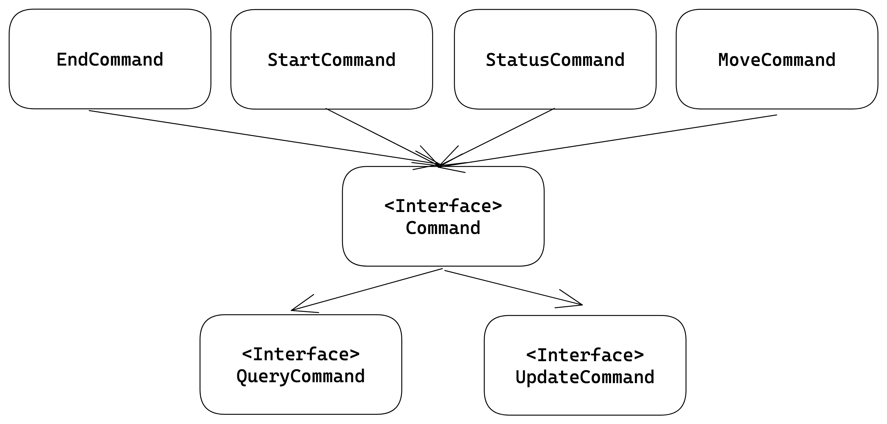
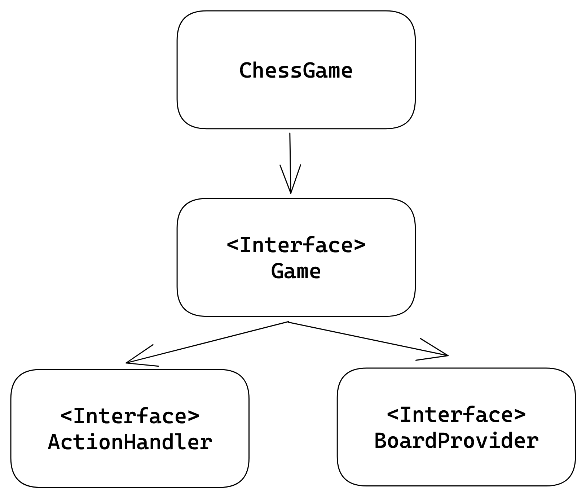
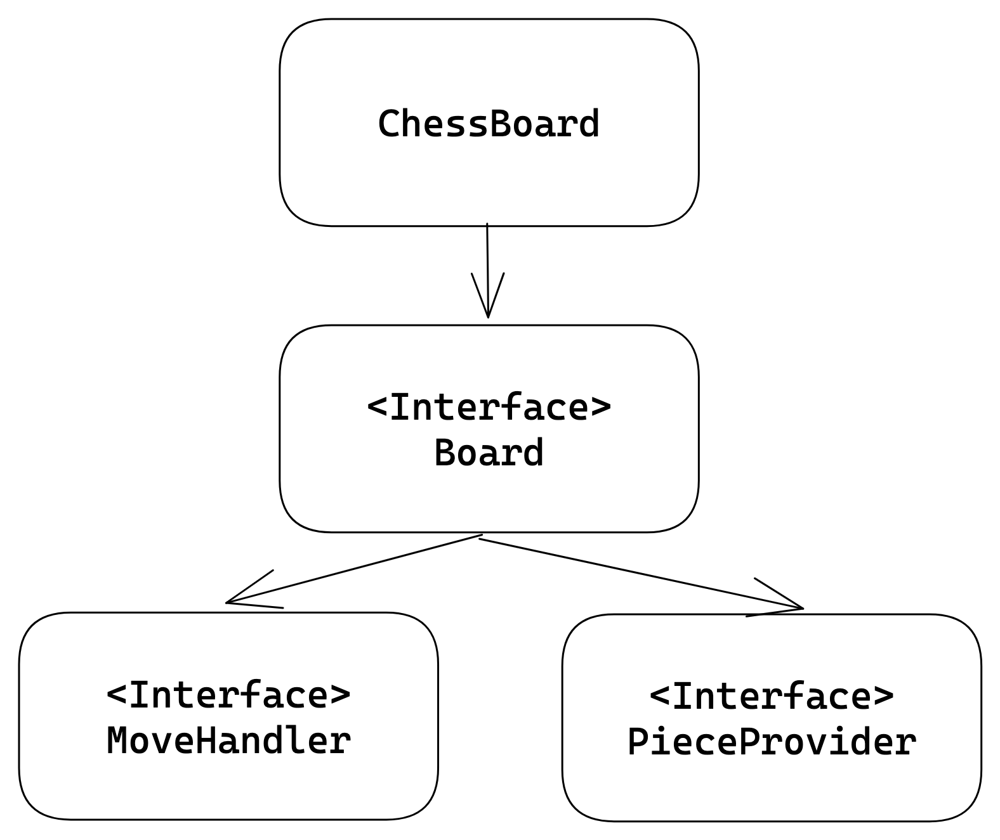

# java-chess

## 미션 4 기능

### DAO

- [x] DB에 접근해 move 명령의 from과 to를 저장한다.
- [x] DB에 접근해 from과 to를 읽어드려 MoveCommand를 생성한다.
- [x] DB에 접근해 움직임들을 초기화한다.

### 시나리오

- [ ] 게임을 시작하기 전에 전에 진행했던 게임의 움직임들을 DB에서 불러온다.
    - [ ] DB의 움직임들을

- [ ] 게임을 진행하면서 움직임들을 DB에 저장한다.

## 미션 3 구조 변경

## 명령 인터페이스 구현 방식

### Command

- getType: 명령의 타입을 반환

### UpdateCommand

- update: 명령을 실행

### QueryCommand

- query: 명령을 실행

## 게임 인터페이스 구현 방식

### Game

- isNotEnd: 게임이 끝났는지 확인

### ActionHandler

- start: 게임을 시작
- end: 게임을 종료
- move: 피스를 이동
- status: 게임 상태를 출력

### BoardProvider

- getBoard: 보드를 반환

## 보드 인터페이스 구현 방식

### Board

- isKingDead : 왕이 죽었는지 확인

### MoveHandler

- checkRoute : 피스들의 이동 경로를 검증
- checkColor: 선택 위치의 피스가 현재턴 색깔인지, 이동하려는 위치에 같은 색깔의 피스가 있는지 검증
- move : 피스 이동

### PieceProvider

- getRankPieces : 랭크에 해당하는 피스들을 반환
- getFilePieces : 파일에 해당하는 피스들을 반환

# 미션 3&4 기능 목록

### 보드

- [x] 왕이 죽었는지 확인

### 게임

- [x] 왕이 죽었다면 게임을 종료 상태로 변경
- [x] 게임 점수 계산 -> Status로 만듬

### Status

- [x] 각 색깔별 점수를 가지고 있는다.
- [x] 점수를 반환한다.

### Score

- [x] 점수를 더한다.

### PieceScore

- [x] 각 피스의 점수를 반환한다.

# 미션 1&2 기능 목록

## 도메인

### 좌표

- [x] 좌표는 file과 rank를 필드로 가진다.
- [x] 좌표는 (A,1) ~ (H,8) 까지 가능
- [x] 좌표는 다른 좌표로의 방향을 구할 수 있다.

### 피스

- [x] 자신의 진영을 필드로 가지고 있다.
- [x] 움직일 수 있는지 검증
    - [x] 폰
    - [x] 나이트
    - [x] 룩
    - [x] 비숍
    - [x] 퀸
    - [x] 킹

### 체스판

- [x] 빈 보드를 생성
- [x] 좌표를 입력으로 주었을때, 좌표의 피스를 반환(getPiece)
    - [x] 좌표에 피스가 존재하는지 확인
    - [x] 같은 색깔 피스 인지 확인.
- [x] 피스를 교체(replace)
- [x] 두 좌표를 주었을때, 두 좌표 사이에 피스가 있는지 검증(checkBetweenRoute)
- [x] 목적지에 같은 색깔의 피스가 있는지 확인(checkSameColor)
- [x] 폰이 움직일 수 있는지 확인(checkRestrictionForPawn)
    - [x] 대각선으로 움직일때, 상대편 피스가 있는지 확인
    - [x] 위,아래 방향으로 움직일때, 칸이 비어있지 않은지 확인
- [x] 폰을 움직이고 왕이 죽었는지 확인

### 피스 팩토리

- [x] 색상에 따라 초기 피스들의 리스트를 반환

### 랭크 : 가로줄을 나타내는 enum

### 파일 : 세로줄을 나타내느 enum

### 게임

- [x] 체스판을 초기화
- [x] 피스를 이동

### 명령

- [x] 입력받은 명령를 검증(start,end,move)
- [x] 입력받은 명령을 실행
- [x] 게임을 종료
- [x] 상태 받아오는 명령어 추가

## UI

### 입력

- [x] 명령어를 입력

### 출력

- [x] 체스판을 출력
