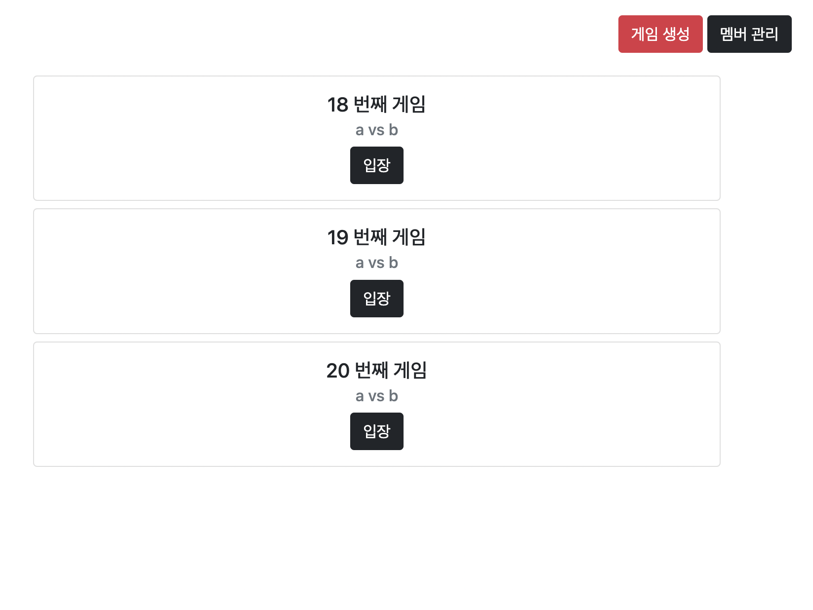
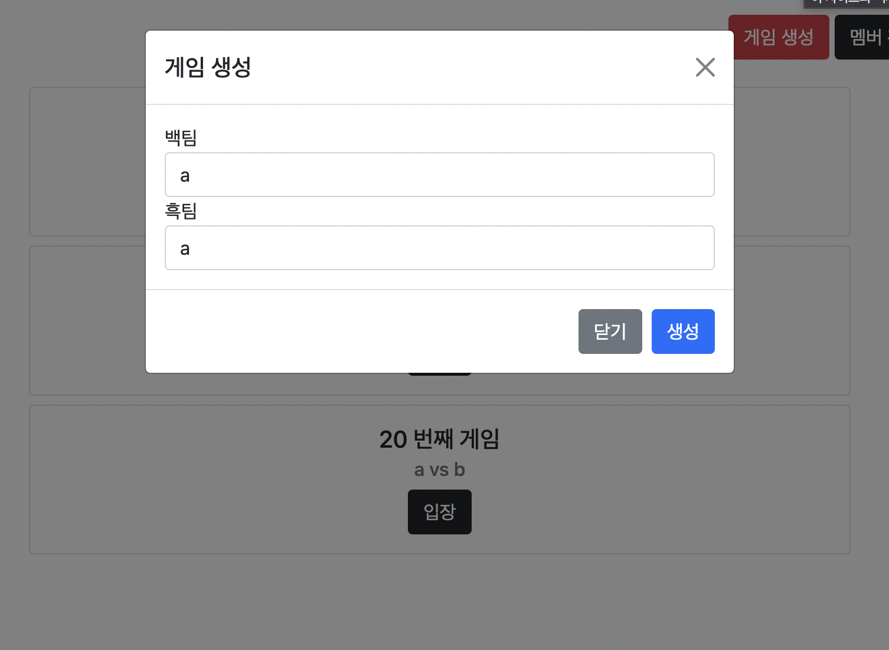
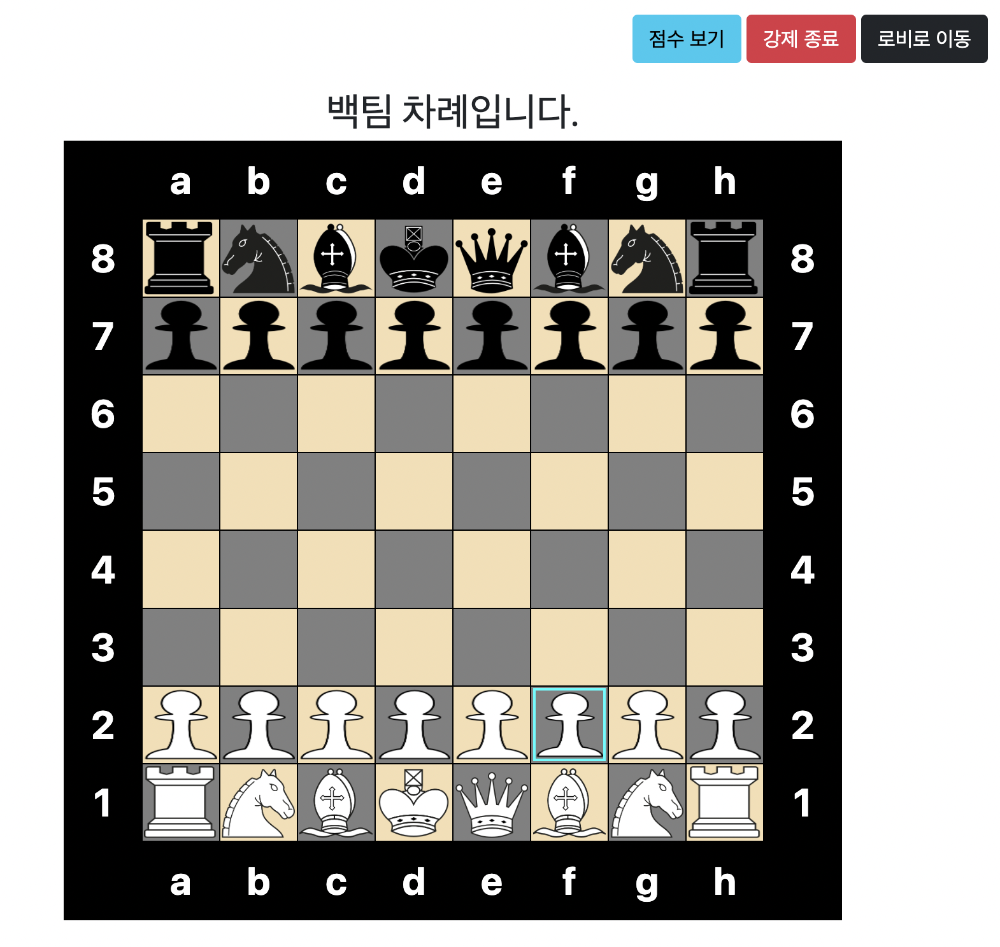
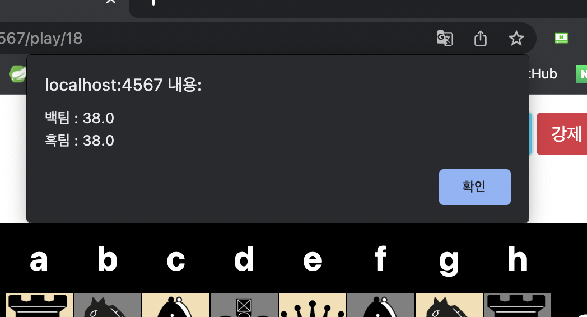
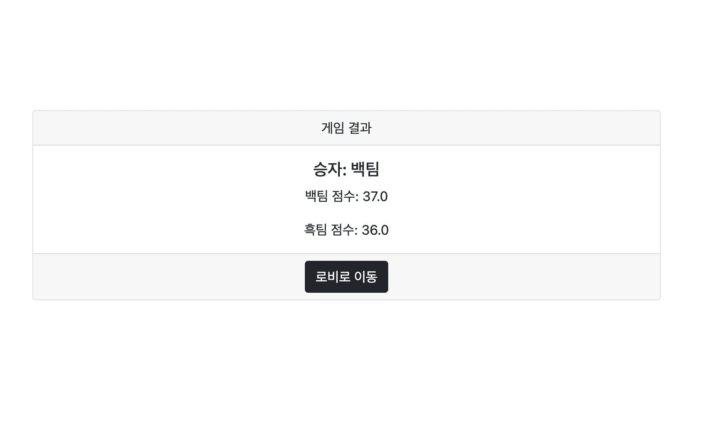
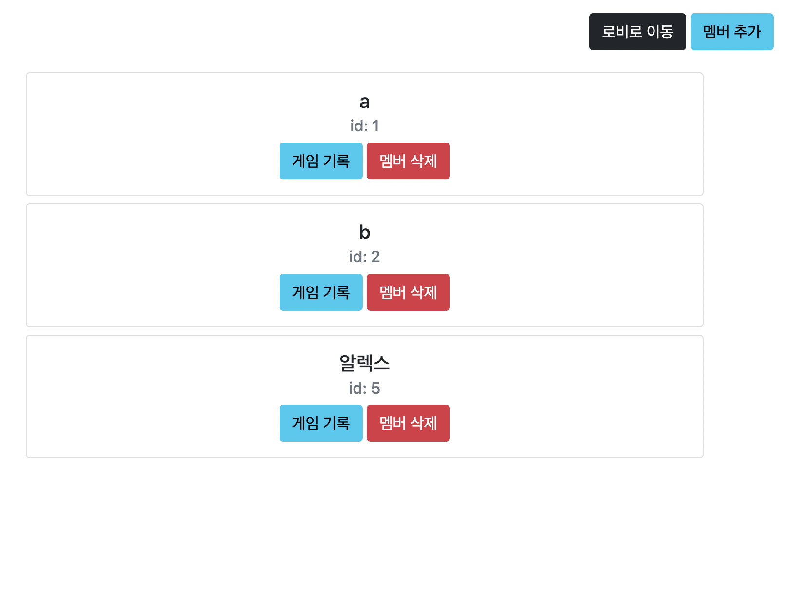
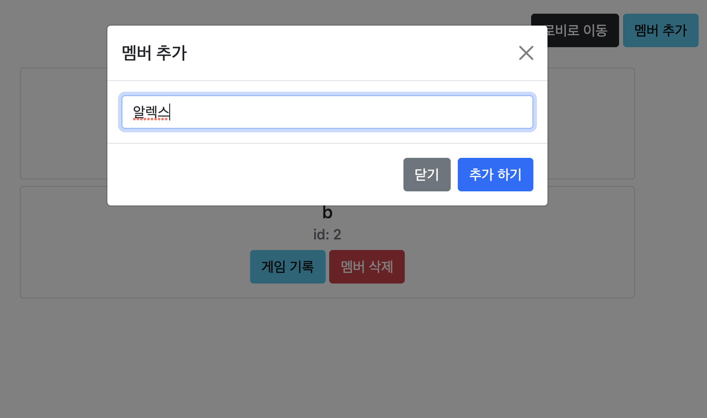
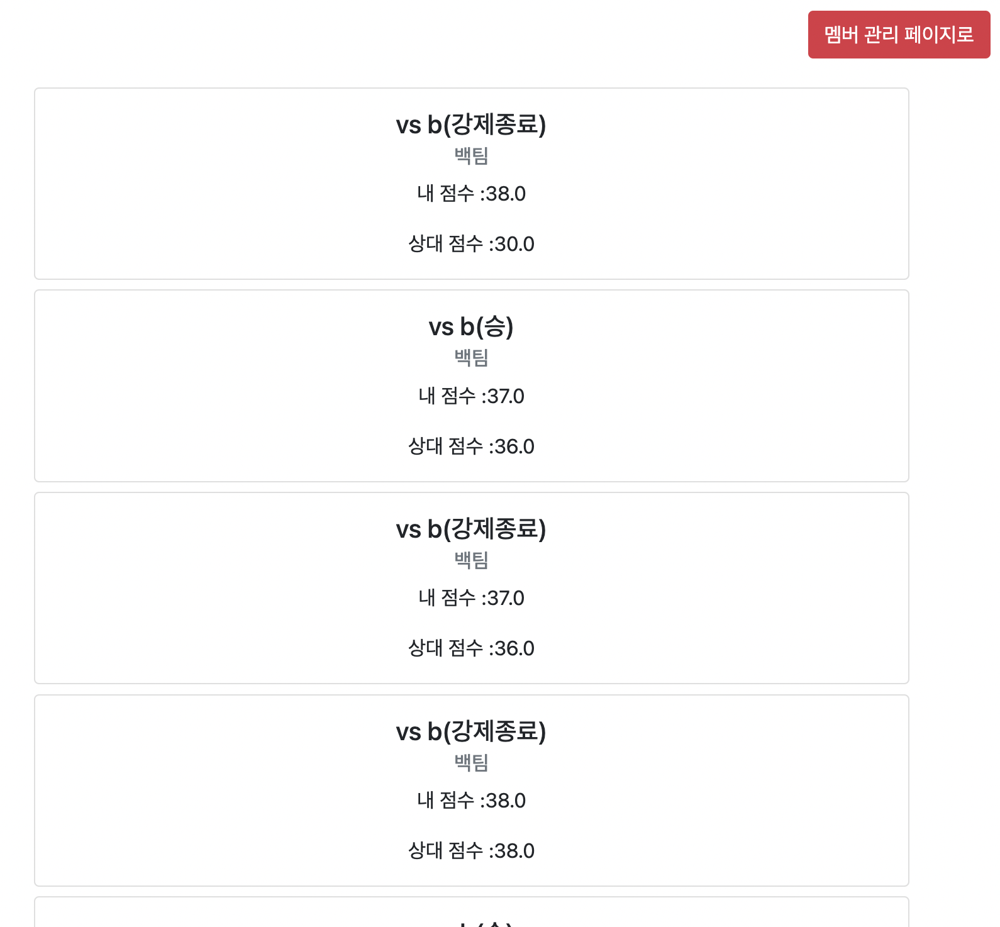

# 체스 미션 저장소

## 체스 웹

### 로비

- 현재 게임중인 방 목록이 나타납니다.
  - `입장` 버튼으로 게임중인 방에 입장할 수 있습니다.
- 페이지 상단의 `게임 생성` 버튼으로 새 게임을 생성할 수 있습니다.
   - `게임 생성`버튼 클릭 시 게임 생성을 위한 모달이 나타납니다.
- 페이지 상단의 `멤버 관리` 버튼으로 멤버 관리 페이지로 이동할 수 있습니다.

### 게임 진행

- 체스 게임을 진행합니다.
  - 기물을 클릭하여 원하는 위치로 이동시킬 수 있습니다.
  - 기물을 클릭할 시 선택된 기물의 테두리에 표시가 나타납니다.
- 페이지 상단의 `점수 보기` 버튼으로 현재 체스판의 스코어를 불러올 수 있습니다.
- 페이지 상단의 `강제 종료` 버튼으로 현재 게임을 종료할 수 있습니다.

### 게임 결과

- 승자와 점수를 보여줍니다.

### 멤버 관리

- 등록된 멤버 목록이 나타납니다.
  - `게임 기록` 버튼을 눌러 해당 멤버의 전적을 확인할 수 있습니다.
  - `멤버 삭제` 버튼을 눌러 해당 멤버를 삭제할 수 있습니다.
- 상단의 `멤버 추가` 버튼을 눌러 멤버 추가 모달을 띄울 수 있습니다.
- 멤버 추가 모달에 멤버 이름을 입력한 후 `추가하기`버튼으로 멤버를 추가할 수 있습니다.

### 멤버 전적

- 멤버 관리 페이지에서 `게임 기록` 버튼을 눌러 넘어오는 페이지입니다.
- 해당 멤버가 포함된 종료된 게임의 기록 목록을 보여줍니다.

---

## 체스 도메인

### 위치(Position)

- x 좌표와 y 좌표를 갖고있다.
- "a1" 과 같은 이름을 갖고있다.

### 이동 벡터(Direction)

- 이동할 x 방향의 숫자와 y 방향의 숫자를 나타낸다.
- 일반 8가지 이동 방향과 나이트의 8가지 이동 방향을 갖고있다.

### 체스 기물(Chess Piece)

모든 체스 기물의 조상이자 추상 클래스.

- 이름을 갖고있다.
- 좌표 값을 알고있다.
- 이동할 수 있다. (이동 가능한 위치로 이동)
- 공격할 수 있다. (이동 가능한 위치로 공격)
- `[ERROR]` 나이트를 제외한 기물은 다른 기물을 넘어갈 수 없다.

### 빈칸(Blank)

- 기물이 위치하지 않는 좌표는 빈칸으로 표시된다.

### 폰(Pawn)

- 적진으로 1칸 씩 전진만 할 수 있다.
- 첫 회 한정으로 2칸을 이동할 수 있다.
- 적진 대각선 방향에 적이 있다면 공격할 수 있다.

### 비숍(Bishop)

- 대각선으로 제한 없이 이동 및 공격할 수 있다.

### 나이트(Knight)

- L자 형태로 이동할 수 있다.
- 이동 경로에 있는 기물을 넘어갈 수 있다.
- 도착지점에 적이 있다면 공격할 수 있다.

### 룩(Rook)

- 전후좌우 방향으로 제한 없이 이동 및 공격할 수 있다.

### 퀸(Queen)

- 8방향으로 제한 없이 이동 및 공격할 수 있다.

### 킹(King)

- 8방향으로 1칸 씩 이동 및 공격할 수 있다.

### 랭크

- 체스판 가로줄을 의미하며 8개의 기물을 갖고있다.

### 체스판

- 체스게임이 시작되면 64개의 체스 기물을 생성 및 초기화한다.
- 8개의 칸을 가진 가로줄(랭크)가 8개가 있다.
- 순서는 백팀(플레이어) 먼저 시작한다.

## 기능 구현 목록

- [x]  체스판을 초기화한다.
    - [x]  1랭크에 rnbqkbnr 순서대로 말을 초기화한다.
    - [x]  8랭크에 RNBQKBNR 순서대로 말을 초기화한다.
    - [x]  2랭크에 pppppppp 순서대로 말을 초기화한다.
    - [x]  2랭크에 PPPPPPPP 순서대로 말을 초기화한다.
    - [x]  빈칸에 모두 `Blank` 를 초기화한다.
- [x]  파일별로 점수를 계산해서 반환한다.
    - [x]  모든 랭크의 같은 인덱스를 모아서 파일을 추출한다.
    - [x]  파일에 있는 말의 포인트?를 모아서 점수를 계산한다. (폰은 2개 이상이면 0.5)
- [x]  선택된 말은 이동할 좌표로 이동할 수 있는 지 판단한다.
    - [x]  좌표로 이동 후 원래 자리는 새로운 빈 칸이 생성된다.
    - [x]  `[ERROR]` 이동할 수 없는 위치입니다.
    - [x]  `[ERROR]` 경로에 장애물이 있습니다.
- [x]  폰은 적진으로 한칸 전진할 수 있다.
    - [x]  폰은 첫 움직임에는 2칸을 전진할 수 있다.
    - [x]  폰은 공격할 때는 대각선으로만 공격할 수 있다.
- [x]  비숍은 대각선으로 제한없이 이동 및 공격할 수 있다.
    - [x]  이동하려는 경로에 장애물이 있으면 이동할 수 없다.
- [x]  나이트는 L자 형태로 이동 및 공격할 수 있다.
- [x]  룩은 전후좌우 방향으로 제한 없이 이동 및 공격할 수 있다.
    - [x]  이동하려는 경로에 장애물이 있으면 이동할 수 없다.
- [x]  퀸은 8방향으로 제한 없이 이동 및 공격할 수 있다.
    - [x]  이동하려는 경로에 장애물이 있으면 이동할 수 없다.
- [x]  킹은 8방향으로 1칸씩 이동 및 공격할 수 있다.
- [x]  랭크로 가로줄을 나타내고 8개의 피스를 가진다.
