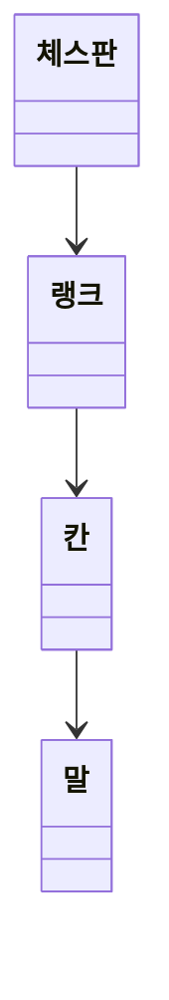

# java-chess

체스 미션 저장소

## 우아한테크코스 코드리뷰

- [온라인 코드 리뷰 과정](https://github.com/woowacourse/woowacourse-docs/blob/master/maincourse/README.md)

---
## 기능 목록

### 입력
- [x] 게임 시작 혹은 종료 명령을 입력한다
- [ ] 게임 이동 명력을 입력한다

### 출력
- [x] 체스판을 출력한다
  - [x] 체스판의 각 행을 출력한다

### 도메인

- 체스판
- [x] 랭크를 초기화할 수 있다
- [x] 랭크들을 알고 있다
- [ ] 좌표에 있는 말을 옮기라고 명령할 수 있다

- 랭크
- [x] 칸을 초기화할 수 있다
- [x] 칸들을 알고 있다
- [ ] 말을 찾을 수 있다
- [ ] 말이 움직일지 말지 결정할 수 있다
  - [ ] 움직일 수 있는 경우, 해당 위치로 말을 이동시킨다

- 말
- [x] 자신의 진영을 알고 있다
- [x] 기물 종류를 알고 있다
- [ ] 움직일 수 있는 좌표들을 계산한다

