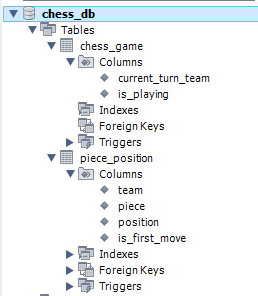

# java-chess
체스 게임 구현을 위한 저장소

## Commit convention
- 커밋 메시지 언어 : 한글
- feat : 기능 추가.
- refactor : 구조 개선, 변수명 및 메소드명 수정.
- fix : 에러가 나는 부분 해결.
- docs : document 파일 관련.
- test : 테스트 코드만 바꿀 때 사용.
- style : 들여쓰기 수정 및 기타 수정 사항.

## 기능 요구 사항
- [x] start를 입력하면, 체스 게임을 시작한다

- [x] 체스판을 생성 한다
    - [x] 8x8 체스판을 생성한다
    - [x] 초기 말을 배치한다

- [x] 체스판을 출력한다
    - [x] 검은색 기물은 대문자로, 하얀색 기물은 소문자로 표현한다
    - [x] 체스판의 행/열에 따라 출력한다
        - [x] 행은 위에서 부터 아래를 8에서 1로 표현한다
        - [x] 열은 왼쪽부터 오른쪽을 a부터 h로 표현한다

- [x] 체스말의 규칙 대로 기물을 이동한다
    - [x] (예외) 출발 지점으로 선택한 칸이 체스판에서 비어있다면, 예외를 발생시킨다
    - [x] (예외) 규칙상 움직일 수 없는 칸으로의 이동 명령이라면, 예외를 발생시킨다
    - [x] 규칙상 움직일 수 있는 칸으로의 이동이라면, 해당 기물을 움직인다
        - [x] 왕과 룩이 처음 움직일 경우 수행할 수 있는 캐슬링 규칙인지 확인한다
        - [x] 폰이 갈 수 있는 마지막 행까지 가면 퀸으로 프로모션을 한다
        - [x] 기물이 체스 규칙상 이동할 수 있는 경로이고, 경로 사이에 다른 기물이 없다면 움직인다
            - [x] 나이트의 경우 경로 사이의 기물을 건너 뛸 수 있다. 
            - [x] 움직인 곳에 상대의 기물이 있다면, 상대의 기물을 잡는다

- [x] end를 입력하면, 체스 게임을 종료한다

## 리팩토링 중점 사안
- [x] 상수들이 의미하는 바를 명확하게 표기할 것
- [x] chessGame에서 move한 뒤, 턴을 내부적으로 바꾸도록 수정
- [x] ChessGame에서 각 팀별에 맞는 PiecePosition을 생성할 때, PiecePosition 내부에서 생성하도록 리팩토링해보자
    - [x] 체스 게임에서 필요한 각 팀의 생성은 Team 클래스에서 담당한다
- [x] 특정 기물을 위한 메서드가 불 필요한 기물들에게까지 노출되는 것 리팩토링
    - [x] 특별 행마가 필요한 기물들에 대해 이동 가능한지 isMovable에서 조건 검사
    - [x] chessGame에서 특별 행마의 경우 처리해 줘야할 로직(캐슬링-룩의 이동, 프로모션-폰을 퀸으로)을 처리해줌
- [x] Controller, Service, DAO는 stateless 하게 만들어 볼 것
- [x] HTTP 상태코드를 명확히 명시해 줄 것
    - [x] Enum으로 HTTP 상태코드를 관리해 볼 것
- [x] JDBC API 자원들을 완벽히 반환할 것
- [x] status code에 따라 알맞게 DTO를 반환할 것
- [x] DAO 내의 상수로 분리할 부분을 분리할 것
- [x] 기존 Game이 종료가 되지 않으면 새로운 게임이 시작하지 않도록 할 것
    - [ ] 현재 게임 삭제 후 재시작 옵션을 제공할 것
- [x] 디버깅용 system.out 삭제
- [x] 파라미터 4개 이하로 유지
- [ ] 외부에서 넣어줘야 하는 파라미터인지 검증
- [ ] synchronized에 대한 공부를 진행하고, 필요성에 대해 재고

## 웹 UI 적용 사안
- [x] GET 요청이 들어오면, 초기 기물 위치를 가진 체스판을 띄워준다
- [x] POST 요청이 start, destination을 가진 형태로 넘어온다
    - [x] 체스 게임 내에서 움직일 수 있는 경로인지 확인하고, status code를 그에 따라 넘겨준다.
- [x] 각 팀의 체스 게임 정보를 UI에서 보여준다
    - [x] 현재 누구의 차례인지 보여준다
    - [x] 현재 점수를 보여준다
    - [x] 현재 잡은 기물을 보여준다
- [x] 체스 게임이 종료가 된 후, 결과 출력 화면을 보여준다
    - [x] 체스 게임을 다시 할 수 있도록 버튼을 만든다
    
## DB 적용 사안
- [x] ChessGame을 새롭게 시작하면,
    - [x] DB에 저장되어 있던 ChessGame을 삭제한다.
    - [x] 새로운 ChessGame을 생성해 그에 대한 정보를 저장한다
- [x] 기존 ChessGame을 로딩하면, 
    - [x] DB에 저장된 정보를 기반으로 ChessGame을 생성하여 플레이한다. 
- [x] 저장 버튼을 누르면,
    - [x] DB에 저장되어 있던 ChessGame을 삭제한다.
    - [x] 현재 ChessGame의 정보를 저장한다.

## DB 테이블 구조

```sql
CREATE DATABASE chess_db;

USE chess_db;

CREATE TABLE chess_game (
    current_turn_team VARCHAR(5) NOT NULL,
    is_playing boolean NOT NULL
);

CREATE TABLE team_info (
    team VARCHAR(5) NOT NULL,
    piece_info VARCHAR(400) NOT NULL,
    primary key (team)
);
```       
