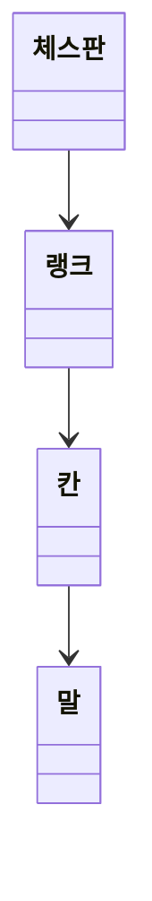

# java-chess

체스 미션 저장소

## 우아한테크코스 코드리뷰

- [온라인 코드 리뷰 과정](https://github.com/woowacourse/woowacourse-docs/blob/master/maincourse/README.md)

---
## 기능 목록

### 입력
- [ ] 게임 시작 혹은 종료 명령 입력한다

### 출력
- [ ] 체스판을 출력한다
  - [ ] 체스판의 각 행을 출력한다

### 도메인

- 체스판
- [ ] 랭크들을 알고 있다

- 랭크
- [ ] 칸들을 알고 있다

- 칸
- [ ] 말이 놓여져 있는지를 알고 있다

- 말
- [ ] 자신의 진영을 알고 있다
- [x] 기물 종류를 알고 있다

