# java-chess
체스 게임 구현을 위한 저장소

# step1 기능 목록
## 포지션
- [x] 0에서 7사이인지 확인, 그 외 에러

## 피스
- [x] 이동 기능
    - [x] 내가 이동 가능한지 여부 확인

- [x] 각 기물에 대한 점수 반환 기능

### 킹
- [x] 점수는 0점을 반환한다
- [x] 가로, 세로, 대각선 방향으로 1칸만 전진할 수 있다
- [x] 킹이 죽을 경우 게임이 끝난다

### 퀸
- [x] 점수는 9점을 반환한다
- [x] 가로, 세로, 대각선 제한없이 전진할 수 있다

### 룩
- [x] 점수는 5점을 반환한다
- [x] 가로, 세로 제한없이 전진할 수 있다

### 비숍
- [x] 점수는 3점을 반환한다
- [x] 대각선으로 제한없이 전진할 수 있다

### 나이트
- [x] 점수는 2.5점을 반환한다
- [x] 1칸 전진 후 대각선 방향으로 1칸 전진한다

### 폰
- [x] 점수는 1 또는 0.5를 반환할 수 있다
  - 같은 열일 경우 0.5, 아니면 1을 반환

- [x] 각 폰은 첫 이동시에 1칸 또는 2칸을 전진할 수 있다
  - 폰이 기본 위치인지 아닌지 확인하는 기능이 있다. 검은색이면 6행, 흰색이면 1행인지 확인.

- [x] 앞에 상대 기물이나 자신의 기물이 있을 경우 전진할 수 없다
- [x] 뒤로 못감
- [x] 1칸 대각선에 상대방 기물이 있을 경우 상대방 기물을 잡을 수 있다


## 추가사항

- [x] Point 캐싱하기
- [x] Position 캐싱하기
- [x] 상태패턴 적용하기
- [x] 일급컬렉션 적용하기

- [x] Blank 삭제하기

- [x] 커맨드 적용하기


## step2 기능목록

### html
- [x] 체스판 배열 만들기
- [x] css 연동하기
- [x] js 연동하기
- [x] 대기방 만들기

### js

- [x] 판을 누를때 이벤트 처리
  - [x] 선택한 말이 해당턴의 말인지 체크
  - [x] 처음 클릭시 빈공간 클릭 금지
  - [x] 클릭시 클릭한 말 표시기능
  - [x] 이동이 가능한 위치 표시하는 기능
  - [x] 클릭한 말을 다시클릭하면 해제하는 기능
  - [x] 게임이 끝났는지 체크
  - [x] 나의 말을 누르고 다른 나의 말을 누르면 변경가능
- [x] promise를 통한 API 통신 

### css

- [x]  배열마다 색상 적용하기
- [x] 마우스가 올라갈때 마우스 모양 바꾸기
- [x] 마우스가 올라갈때 백그라운드 색상 바꾸기


### java

- [x] 기물 선택시 이동이 가능한 위치를 반환하는 기능 추가
- [x] 저장하는 기능
  - [x] 게임이 진행될 때마다 저장
- [x] 불러오는 기능
  - [x] 방을 불러오면 마지막 상태로 불러오기
- [x] 방을 관리하는 기능
  - [x] 생성
  - [x] 입장
- [x] 사용자 기능
  - [x] 검색
  - [x] 방 생성


## 테이블

```mysql
CREATE TABLE board (
	board_id INTEGER NOT NULL AUTO_INCREMENT,
	white_player VARCHAR(12),
	black_player VARCHAR(12),
	turn_is_white BOOLEAN NOT NULL DEFAULT true,
	is_finish BOOLEAN NOT NULL DEFAULT false, 
	PRIMARY KEY (board_id)
);
```


```mysql
CREATE TABLE piece (
	piece_id INTEGER NOT NULL AUTO_INCREMENT,
	board_id INTEGER NOT NULL,
	piece_position VARCHAR(2) NOT NULL,
	piece_symbol VARCHAR(1) NOT NULL,
	PRIMARY KEY (piece_id),
	FOREIGN KEY (board_id) REFERENCES board (board_id)
);
```


## 이미지

### 1. 대기방

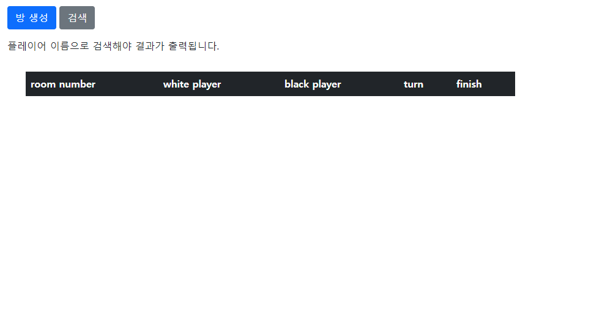

### 2. 검색

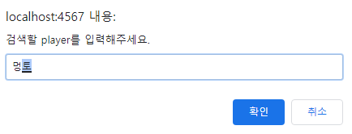

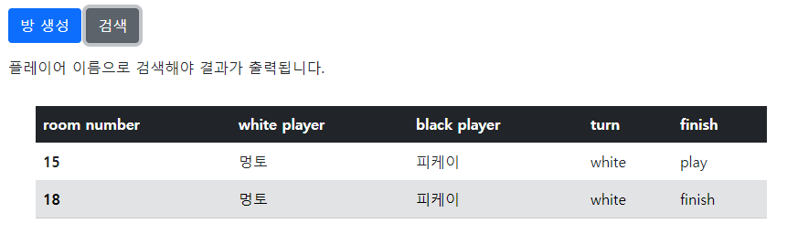

### 3. 방생성

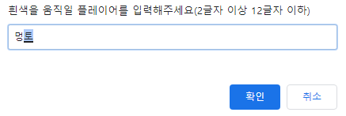

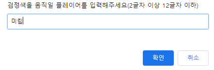

### 4. 방입장

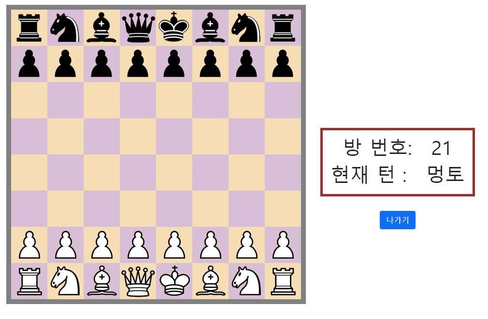

### 5. 마우스 호버

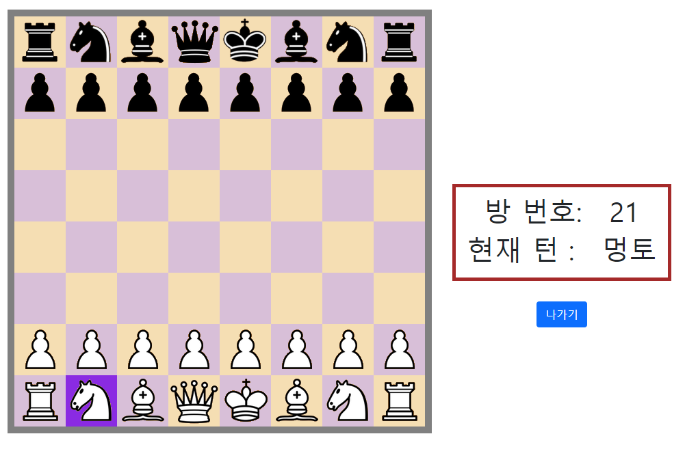

### 6. 말 클릭시 경로 표시 및 클릭한 말 표시

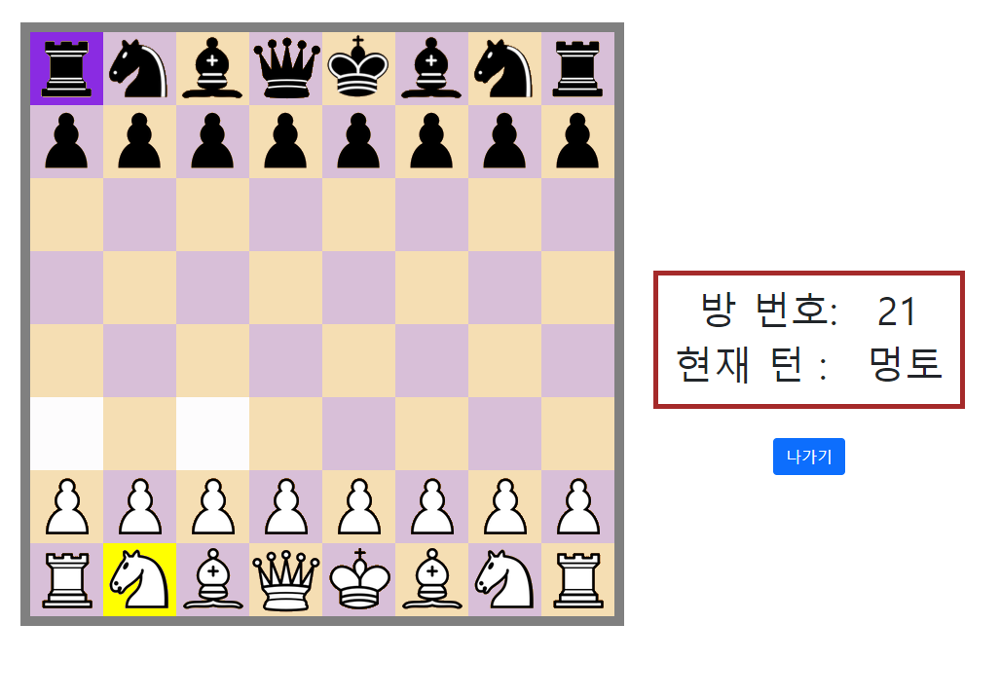

### 7. 이동 후 턴 변경

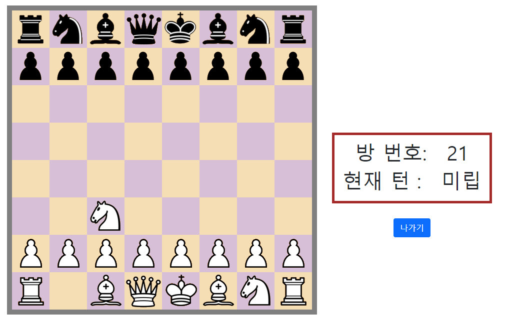

### 8. 불가능한 위치 이동시

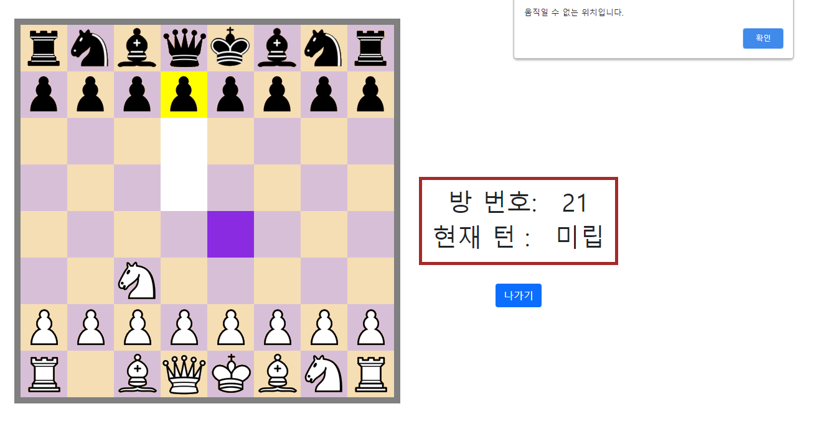

### 9. 왕이 죽은 후 턴 -> 승리자로 변경

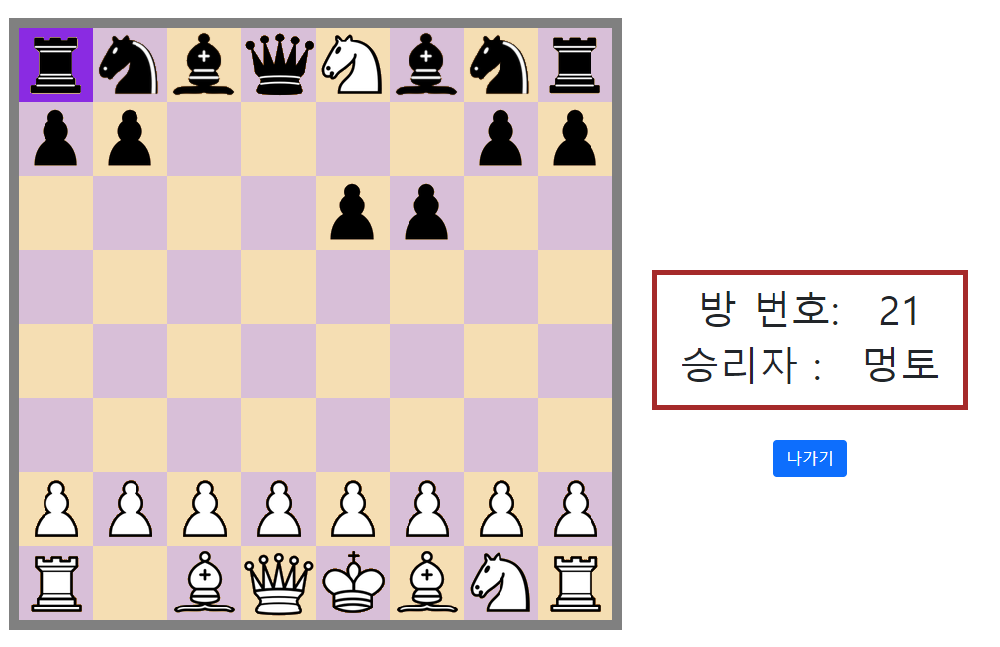

### 9. 게임이 끝난 후 진행하려 한다면

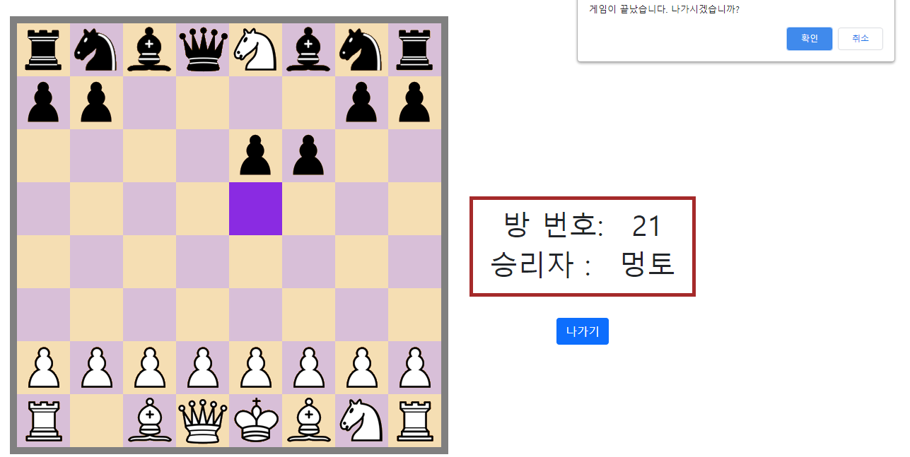