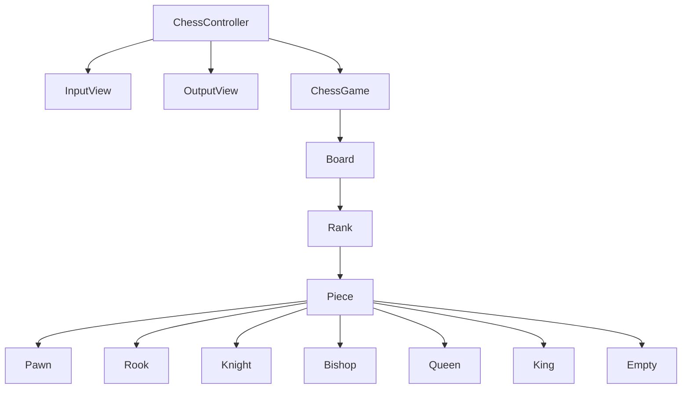

# java-chess

체스 미션 저장소

## 우아한테크코스 코드리뷰

- [온라인 코드 리뷰 과정](https://github.com/woowacourse/woowacourse-docs/blob/master/maincourse/README.md)

현## 도메인 다이어그램

## 도메인

### 체스 게임

- [ ] 게임 진행 상태를 확인할 수 있다.
- [ ] 커맨드를 통해 게임 진행 상태를 바꿀 수 있다.

### 체스판

### 기물

- [ ] 이름을 가진다.
- [ ] 진영을 가진다.

### 입력

- [ ] 커맨드를 입력 받는다.

### 출력

- [ ] 시작 문구를 출력한다.
- [ ] 체스판을 출력한다.