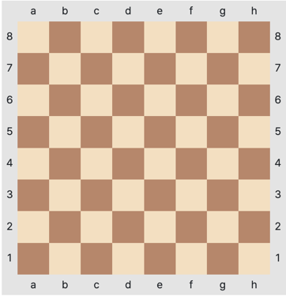

# java-chess

체스 미션 저장소

## 우아한테크코스 코드리뷰

- [온라인 코드 리뷰 과정](https://github.com/woowacourse/woowacourse-docs/blob/master/maincourse/README.md)

## 구현할 기능 목록
### 게임 진행
- 백이 먼저 시작한다.
- move 기물 시작위치 목적지 로 움직일 수 있다.
  - ex) move P a2 a3
  
### 게임 종료
- 자신의 킹이 상대의 기물 한개 이상에 의해 공격받고 있을 때 그 상태를 "체크"라고 한다.
- 만약 체크를 막거나 피할 수 없는 상황이 된다면 자신은 체크메이트당한 것이며 경기는 체크메이트를 당한 선수의 패배로 끝난다.

### 기물 행마법 / 기물 잡는 법
#### 킹 (K, k)
- 상하좌우, 대각선 방향으로 각각 1칸씩만 움직일 수 있다. 1 1경기마다 각 선수는 단 1번 "캐슬링"이라는 특별 행마를 할 수 있다.
#### 퀸 (Q, q)
- 상하좌우, 대각선 방향으로 기물이 없는 칸에 한해서 칸수의 제한 없이 움직일 수 있다.
#### 룩 (R, r)
- 상하좌우 방향으로 기물이 없는 칸에 한해서 칸수의 제한 없이 움직일 수 있다. 룩은 캐슬링을 할 때 따라 움직인다.
#### 비숍 (B, b)
- 대각선 방향으로 기물이 없는 칸에 한해서 칸수의 제한 없이 움직일 수 있다.
#### 나이트 (N, n)
- 수직 방향으로 한칸 움직인 후 수평 방향으로 두칸 움직이거나 수직 방향으로 두칸 움직인 후 수평 방향으로 한칸 움직인다.
- 나이트는 유일하게 다른 기물을 넘어다닐 수 있다.
#### 폰 (P, p)
- 행마법과 기물을 잡는 법이 다른 유일한 기물이다.
- 바로 앞의 칸이 비어 있다면 앞으로 한 칸 전진할 수 있다.(바로 앞에 상대의 기물이 있어도 잡을 수 없다.)
- 경기중 단 한번도 움직이지 않은 폰은 바로 앞의 두칸이 비어 있을 때 두칸 전진할 수 있다.(한칸만 전진해도 된다.)
- 폰은 앞쪽으로만 움직이며 절대 뒤쪽으로 행마하지 않는다.
- 폰은 대각선 방향으로 바로 앞에 위치한 기물을 잡을 수 있다.(대각선 방향으로 바로 앞에 위치한 칸이 비어 있더라도 그곳으로 전진할 수 없다.)

#### 기타
- 폰을 제외한 기물들은 행마법과 기물 잡는 법이 동일하다.
- 앙파상은 고려하지 않는다.

### 고려할 수 있는 규칙들 (현재 적용 X)
- 캐슬링
- 프로모션
- 앙파상