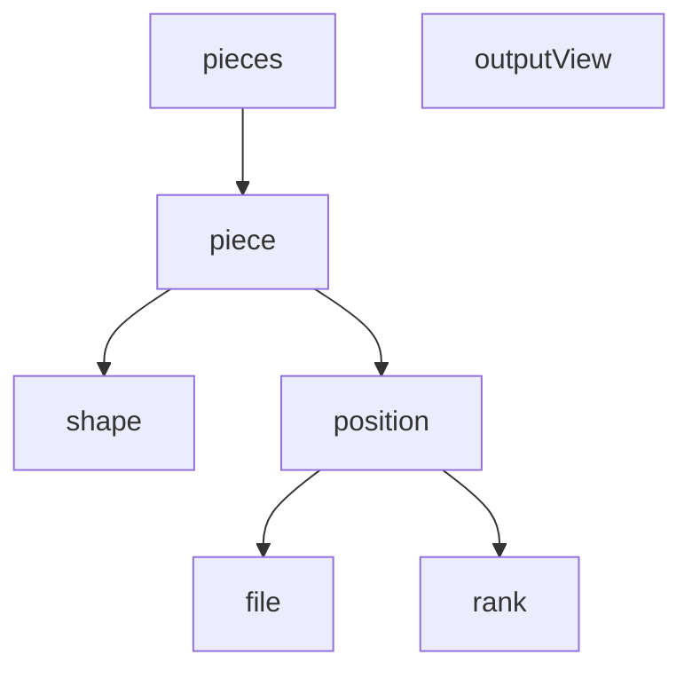

# java-chess

체스 미션 저장소

## 우아한테크코스 코드리뷰

- [온라인 코드 리뷰 과정](https://github.com/woowacourse/woowacourse-docs/blob/master/maincourse/README.md)

### 기능 요구 사항

## View

### In
- [ ] start 또는 end 입력
  - [ ] start 입력시 시작
  - [ ] end 입력시 끝

### Out
- [ ] `체스 게임을 시작합니다.` 출력
- [ ] `게임 시작은 start, 종료는 end 명령을 입력하세요.` 출력
- [ ] 체스 판 출력
  - [ ] 가로 8칸, 세로 8칸

## Domain

### Players

- [ ] white player와 black player를 가진다.

### Player

- [ ] 기물들을 관리하는 객체를 가진다.
- [ ] 진영(white, black)을 가진다.

### Pieces

- [x] 기물들을 가진다.
- [x] 진영에 따라 기물들을 생성한다.
  - [x] 폰을 8개 생성한다.
  - [x] 킹, 퀸을 1개씩 생성한다.
  - [x] 비숍, 룩, 나이트를 2개씩 생성한다.

### Piece

- [x] 좌표를 가진다.
- [x] 모양을 가진다.

### Shape

- [x] 기물 모양을 관리한다.

### Position

- [x] 가로(rank), 세로(file) 를 가진다.
  - [x] 가로는 a~h, 세로는 최소 0, 최대 7 까지의 값을 가진다.
  - [x] 가로가 a~h, 세로가 0~7 범위를 벗어나면 예외가 발생한다.
