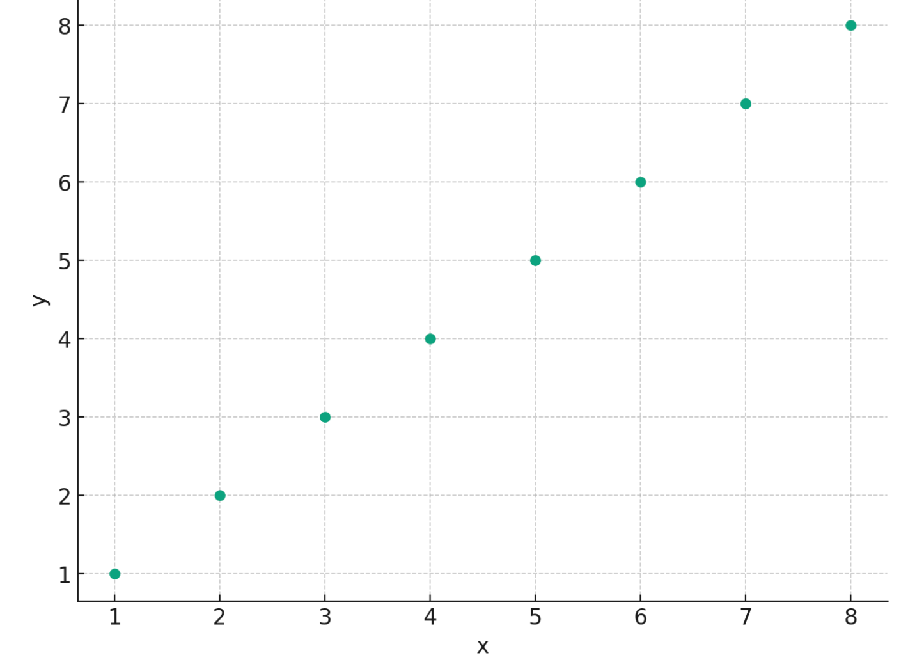

# java-chess

체스 미션 저장소

## 우아한테크코스 코드리뷰

- [온라인 코드 리뷰 과정](https://github.com/woowacourse/woowacourse-docs/blob/master/maincourse/README.md)

# 체스 게임 설명

- [대한체스연맹](http://www.kchess.or.kr/%EB%8C%80%EA%B5%AD%EB%B0%A9%EB%B2%95/)의 대국방법을 차용했습니다.

## 행마법

- 비숍(Bishop)
    - 비숍은 대각선으로 원하는 만큼 움직입니다.
- 룩(Rook)
    - 룩은 직선으로 원하는 만큼 움직입니다.
- 퀸(Queen)
    - 퀸은 직선과 대각선으로 원하는 만큼 움직입니다.
- 나이트(Knight)
    - 옆으로 한 칸, 앞으로 두 칸 움직입니다. 또는 옆으로 두 칸, 앞으로 한 칸 움직인다고 말할 수 있습니다.
    - 나이트는 전후좌우 모든 방향으로 이와 같이 움직일 수 있으며, 다른 기물들을 뛰어넘을 수 있습니다.
- 폰(Pawn)
    - 폰은 시작 포지션에 있을 경우에는 두 칸 직진할 수 있으며, 앞 방향으로 한 칸씩 직진합니다.
    - 폰은 옆이나 뒤로는 움직일 수 없습니다. 또한 폰의 바로 앞 칸에 기물이 있을 경우에는 그 폰은 움직일 수 없습니다.
    - 폰은 앞 방향 대각선 방향에 상대 기물이 있을 경우, 그 기물을 잡을 수 있습니다.
- 킹(King)
    - 킹은 전후좌우 대각선 어느 방향이로든 한 칸 움직일 수 있습니다.

## 기본규칙

- 두 사람이 서로 번갈아가면서 체스판 위에서 기물들을 움직이며 둡니다.
- 백색 기물을 잡은 쪽이 항상 먼저 시작합니다.
- 상대방 킹에게 공격을 가하여 그 공격을 피하거나 방어 할 수 있는 수단이 없는 상황을 체크메이트 라고 합니다.
- 체크메이트를 당하면 게임에서 패배하게 됩니다.

# 구현 기능 목록

## 비즈니스 기능

1. 보드를 초기화한다 ✅
    - 보드는 64개의 칸으로 구성한다
    - 각 기물을 시작 위치에 초기화한다


## 입출력 기능

### 입력

1. 게임 시작/종료 명령을 입력받는다
    - strat, end

### 출력

1. 게임 시작 안내 문구를 출력한다
2. 체스판을 출력한다

# 부록

## 고민한 부분

- 체스판의 좌표를 어디까지 추상화(객체로 분리)할 것인가?
    - a1을 물론 a 와 1을 각각 추상화해 객체로 다룬다면, 도메인단에서 체스판의 위치까지 더 명확하게 드러낼 수 있지만,
    - 코드 복잡성이 올락가기에 이 부분은 뷰에서만 a1 이란 좌표를 알아도 충분하다고 판단했다.
    - 코드 복잡성과 추상화 사이의 트레잉드오프 관계라 판단했다.

  

  ```
    (8,1), (8,2), (8,3), (8,4), (8,5), (8,6), (8,7), (8,8)
    (7,1), (7,2), (7,3), (7,4), (7,5), (7,6), (7,7), (7,8)
    (6,1), (6,2), (6,3), (6,4), (6,5), (6,6), (6,7), (6,8)
    (5,1), (5,2), (5,3), (5,4), (5,5), (5,6), (5,7), (5,8)
    (4,1), (4,2), (4,3), (4,4), (4,5), (4,6), (4,7), (4,8)
    (3,1), (3,2), (3,3), (3,4), (3,5), (3,6), (3,7), (3,8)
    (2,1), (2,2), (2,3), (2,4), (2,5), (2,6), (2,7), (2,8)
    (1,1), (1,2), (1,3), (1,4), (1,5), (1,6), (1,7), (1,8) -> 모델이 아는 좌표
    
    (h,1), (h,2), (h,3), (h,4), (h,5), (h,6), (h,7), (h,8)
    (g,1), (g,2), (g,3), (g,4), (g,5), (g,6), (g,7), (g,8)
    (f,1), (f,2), (f,3), (f,4), (f,5), (f,6), (f,7), (f,8)
    (e,1), (e,2), (e,3), (e,4), (e,5), (e,6), (e,7), (e,8)
    (d,1), (d,2), (d,3), (d,4), (d,5), (d,6), (d,7), (d,8)
    (c,1), (c,2), (c,3), (c,4), (c,5), (c,6), (c,7), (c,8)
    (b,1), (b,2), (b,3), (b,4), (b,5), (b,6), (b,7), (b,8)
    (a,1), (a,2), (a,3), (a,4), (a,5), (a,6), (a,7), (a,8) -> 뷰가 아는 좌표. a1 이란 의미를 뷰만 알자~
  ```

- 
