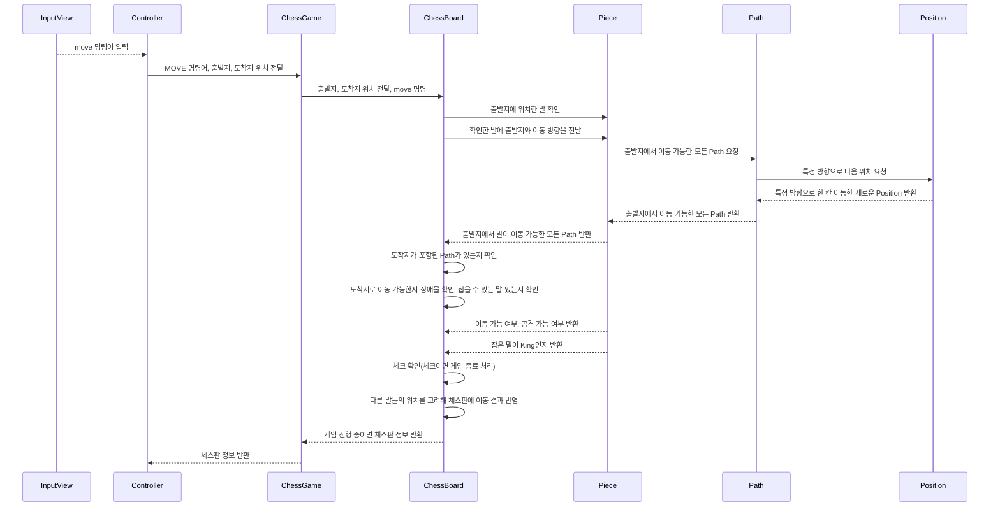
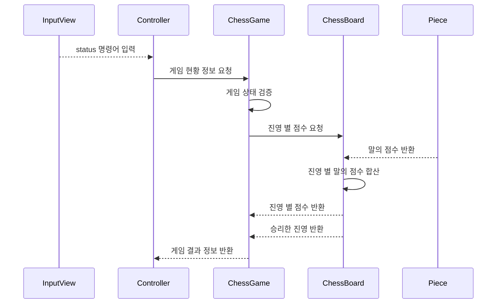

# java-chess

체스 미션 저장소

## 우아한테크코스 코드리뷰

- [온라인 코드 리뷰 과정](https://github.com/woowacourse/woowacourse-docs/blob/master/maincourse/README.md)

## 기능 목록

### 체스 규칙

- 두 개의 진영이 있다.
    - 각 진영은 하얀색, 검정색으로 구분한다.
- 진영 당 8개의 폰, 2개의 룩, 2개의 나이트, 2개의 비숍, 킹, 퀸을 가지고 있다.
    - 각 말 타입마다 다른 이동 규칙을 가진다.
    - 각 말 타입마다 점수를 가진다.
        - 룩
            - 동서남북으로 장애물이 없을 때까지 원하는 만큼 이동 가능하다.
            - 점수: 5점
        - 나이트
            - 동서남북 1칸 이동 후 대각선으로 1칸 이동 가능하다.
            - 나이트는 장애물을 무시할 수 있다.
            - 점수: 2.5점
        - 비숍
            - 대각선으로 장애물이 없을 때까지 원하는 만큼 이동 가능하다.
            - 점수: 3점
        - 퀸
            - 동서남북, 대각선으로 장애물이 없을 때까지 원하는 만큼 이동 가능하다.
            - 점수: 9점
        - 킹
            - 동서남북, 대각선으로 1칸만 이동 가능하다.
            - 점수: 없음(0)
        - 폰
            - 처음에는 앞으로 1칸 또는 2칸 이동 가능, 이후에는 앞으로만 1칸 이동 가능하다.
            - 말을 잡을 때에는 앞으로 대각선 1칸만 가능하다.
            - 점수: 기본 1점, 같은 세로줄에 같은 색의 폰이 있는 경우 0.5점
- 자신의 진영의 King 이 잡히면 게임에서 진다.
- 게임의 승패가 결정되면(King 이 잡히면) 게임을 종료한다.

### 시퀀스 다이어그램

- move 명령에 대한 도메인 시퀀스 다이어그램

- status 명령에 대한 도메인 시퀀스 다이어그램

### 도메인 기능

- ChessGame
    - [x] 게임 상태를 관리한다. (READY, RUNNING, OVER)
    - [x] 요청을 받아 상태를 확인하고 기능을 수행한다.
    - [x] 한 턴의 이동을 수행한 뒤, 게임을 끝내야 하는지 확인한다.
    - [x] 게임을 끝내야 하면 게임 상태를 OVER 로 변경한다.
    - [ ] 게임 결과 정보를 반환한다.
        - [ ] 이긴 진영을 확인한다.
        - [ ] 진영 별 점수를 확인한다.
- ChessBoard
    - [x] 비어 있는 체스판을 생성한다.
        - [x] 체스판에 초기 말을 세팅한다.
    - [x] 출발지에 있는 말을 주어진 도착지로 움직인다.
        - [x] 출발지에 있는 말을 찾는다.
            - [x] `예외` 출발 위치에 말이 없으면 이동할 수 없다.
        - [x] 도착지에 상대방의 말이 있다면 잡는다.
            - [x] `예외` 출발지와 도착지가 동일할 수 없다.
        - [x] 도착지로의 경로를 따라 이동이 가능한지 확인한다.
            - [x] `예외` 이동 경로에 다른 말이 있으면(장애물) 이동할 수 없다.
        - [x] 현재 플레이어 턴을 관리한다.
    - [x] 이동 시 말을 잡았다면, 해당 말이 King 인지 여부를 확인한다.
    - [x] 현재 남아있는 말의 점수를 진영 별로 합산한다.
        - [x] 같은 세로줄에 같은 색의 폰이 있는 경우 점수 계산이 다르다.
- Piece
    - [x] 말은 움직일 수 있고, 종류 별로 구현할 수 있다.
        - [x] 종류에는 킹(King), 퀸(Queen), 룩(Rook), 비숍(Bishop), 나이트(Knight), 폰(Pawn)이 있다.
        - [x] 종류마다 이동 규칙이 다르다.
        - [x] 말은 이동 가능한 모든 방향을 가지고 있다.
        - [x] 말은 점수를 가진다.
    - [x] 말은 출발지를 전달받아서 이동 가능성이 있는 모든 경로를 반환한다.
        - [x] 이동 가능성이 있는 모든 경로는 특정 위치를 가진 경로만 반환할 수 있다.
    - [x] 말은 소속 진영을 가진다.
        - [x] 폰의 경우, 하얀색 팀이면 북행이 전진이고, 검정색 팀이면 남행이 전진이다.
    - [x] 말은 출발지와 도착지를 전달받아 빈 위치로 이동 가능 여부를 반환한다.
        - [x] 다른 말은 항상 이동 가능하고, 폰은 공격을 위한 이동 방향일 경우 불가능하다.
    - [x] 말은 출발지와 도착지, 타겟 말을 전달받아 공격 가능 여부를 반환한다.
        - [x] 타겟 말이 같은 팀이면 공격 불가능하다.
        - [x] 폰은 타겟 말이 다른 팀이어도, 공격을 위한 이동 방향이 아니면 불가능하다.
- Path
    - [x] 한 방향에서 갈 수 있는 모든 도착 가능한 위치들의 목록을 가지고 있다.
        - [x] 출발지와 방향을 전달받아 도착 가능한 위치들의 목록을 생성한다.
            - [x] 단일 칸 이동경로 생성 (경로를 이루는 칸이 하나 뿐이다.)
            - [x] 다중 칸 이동경로 생성 (경로를 이루는 칸이 여러가지일 수 있다.)
- Position
    - [x] 말의 위치는 랭크(y축), 파일(x축)로 이루어져 있다.
        - [x] `예외` 가로 및 세로 좌표값가 정해진 범위(8)를 벗어날 수 없다.
    - [x] 위치는 시작 위치에서 현재 방향으로 이동할 수 있는 다음 위치을 반환한다.
- Direction
    - [x] 모든 이동 가능 방향을 가지고 있다.

### 입출력 기능

- 출력
    - [x] 체스 게임 시작 안내문을 출력한다.
    - [x] 초기 세팅 된 체스판을 출력한다.
    - [x] 이동 결과를 출력한다.
    - [x] 말의 타입과 색에 따라 이름을 출력한다.
    - [x] 게임 오버 시 안내문을 출력한다.
- 입력
    - [x] 게임 명령어를 입력받는다. (start, end, move)
        - [x] `예외` 명령어가 유효하지 않으면 예외를 발생시킨다.
        - [x] 입력이 start 이면 체스판을 초기화한다.
        - [x] 입력이 move 이면 출발지와 도착지를 함께 입력받는다.
            - [x] `예외` 입력이 move 일 때, 출발지나 도착지 정보가 유효하지 않으면 예외를 발생시킨다.
        - [x] 입력이 end 이면 대기 상태로 돌아가 안내 화면을 출력한다.
        - [ ] 입력이 status 이면 게임 결과 정보(진영 별 점수, 이긴 진영)를 출력한다.
            - [ ] `예외` 게임이 종료되지 않은 상태이면 예외를 발생시킨다.
    - [x] 게임 상태에 맞지 않는 명령어 입력 시 예외를 발생시킨다.

## 리뷰 반영 및 리팩터링 목록

- 요구사항 관련
    - [x] 킹과 퀸의 초기화 위치 수정
    - [x] end 명령 시 애플리케이션 종료 대신 대기 상태로 변경
    - [x] end 명령 시 초기 안내 화면 출력
    - [x] start 명령 시 체스판 초기화하기
        - 애플리케이션의 시작과 종료는 사용자 입력 이전 상위 개념이다.
        - 따라서 end 명령은 애플리케이션 종료가 아니라 해당 게임 종료를 위한 명령이다.
    - [x] 강제종료 커맨드 추가에 따른 안내문구 반영
- 설계 관련
    - [x] 게임 상태 관리를 위한 패턴 검토
        - 패턴에 매몰되지 않고, 조건문 관련 개선에 집중할 것
        - 명령어와 실행 기능을 매핑하고, 매핑 및 실행 로직을 별도로 분리함
    - [x] ChessController 의 진영 전환 책임을 ChessBoard 로 위임하여 이동 로직과 결합
    - [x] 체스판 뷰 변환을 위한 클래스 util 패키지에서 controller 패키지로 이동
    - [x] ChessBoard 의 빈 위치 이동 가능 여부, 공격 가능 여부 확인 Piece 로 책임 이동
    - [x] 변경 없는 도메인 규칙에 대한 외부 주입, 전략패턴 삭제
        - [x] CampSwitcher 불필요한 전략 패턴 삭제
        - [x] 변경이 없는 도메인 규칙에 대해서는 생성자 내부에서 설정해주기(Camp)
    - [x] view 의 Command 삭제, ActionMapper 에서 명령어 직접 정의하기
    - [ ] Piece.canMove~() 에서 이동방향 검증까지 직접 할 수 있도록 개선
- 코드 관련
    - [x] 테스트 하드코딩 개선
    - [x] 의미하는 바를 알기 어려운 매개변수 개선
        - [x] move 메서드의 매개변수명, 데이터 유형 수정
    - [x] 조건문 가독성 개선
        - [x] CheckablePaths 의 특정 위치 포함한 경로 탐색 메서드 stream 으로 변경
        - [x] ChessBoard 의 조건 관련 연산 메서드 분리
    - [x] 개행, 단락 정리
        - [x] Piece 별 Directions 개행 수정
    - [ ] Enum 탐색 로직 map 사용 대신 바로 stream 쓰기 (확인 필요)
