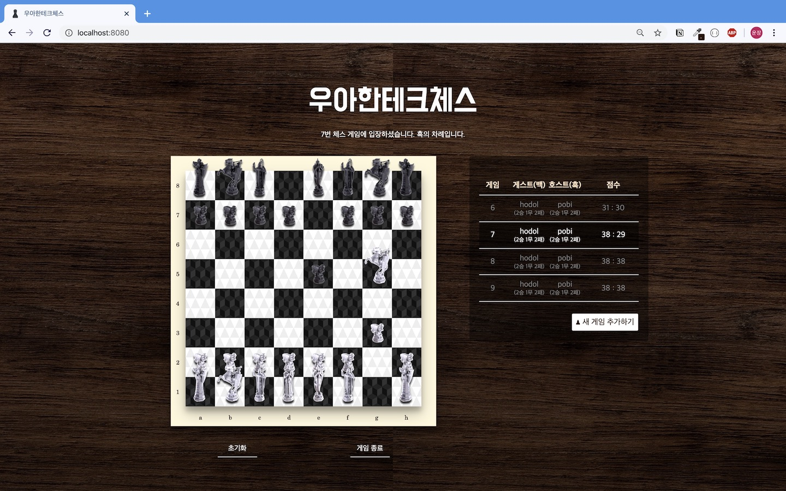

# java-chess



## 4~5단계 Web UI / DB 요구사항

- [x] 콘솔 UI와 더불어 웹으로 체스 게임이 가능해야 한다.
    - [x] 체스말 드래그 중 이동 가능한 경로를 표현
    - [x] HTML Drag and Drop API를 활용해 체스말 이동
    - [x] AJAX 통신을 활용해 새로고침 없이 게임 진행 / 종료 / 방 이동 구현
    - [x] HTML Audio API를 활용해 체스말 이동 또는 적군 공격 시 효과음 추가

- [x] 웹 서버를 재시작하더라도 이전에 하던 체스 게임을 다시 시작할 수 있어야 한다.
    - [x] 플레이어, 보드, 명령 테이블을 만들어 활용
        ```mysql
        create table if not exists player (
            id int not null auto_increment,
            username varchar(15) not null,
            password varchar(60) not null,
            win int,
            lose int,
            draw int,
            primary key (id)
        );
        create table if not exists game (
            id int not null auto_increment,
            white int not null,
            black int not null,
            primary key (id),
            foreign key (white) references player(id),
            foreign key (black) references player(id)
        );
        create table if not exists move (
            id int not null auto_increment,
            game int not null,
            start_position varchar(2) not null,
            end_position varchar(2) not null,
            primary key (id),
            foreign key (game) references game(id)
        );
        ```

- [x] (선택) 체스 게임방을 만들고 체스 게임방에 입장할 수 있는 기능을 추가한다.
    - [x] 방 생성 / 삭제 기능 

- [x] (선택) 사용자별로 체스 게임 기록을 관리할 수 있다.
    - [x] 사용자별 (id 기준) 승, 무, 패 기록 표시

### TODO

- [ ] 플레이어 회원가입 / 로그인 기능 
- [ ] 전체 플레이어 목록 및 전적 조회
- [ ] 체크, 체크메이트, 캐슬링, 프로모션, 앙파상 등 특수 규칙

## 1~3단계 기능 요구사항

- 체스판을 초기화한다.
    - 말의 위치 값은 가로 위치는 왼쪽부터 a ~ h이고, 세로는 아래부터 위로 1 ~ 8로 구현한다.
    - 각 진영은 검은색(대문자)과 흰색(소문자) 편으로 구분한다.

```shell script
RNBQKBNR  8 (rank 8)
PPPPPPPP  7
........  6
........  5
........  4
........  3
pppppppp  2
rnbqkbnr  1 (rank 1)

abcdefgh
```

- [x] 빈 판을 생성한다.
    - [x] 체스말들을 생성한다.
    - [x] 체스말들을 초기 위치에 놓는다.
    - [x] 콘솔 출력

- [x] 체스 말이 이동할 수 있도록 구현한다.
    - [x] `move source위치 target위치`을 실행해 이동한다.
    - King
        - 전방향 1칸 이동
        - start와 target의 (x좌표 끼리의 차이)^2와 (y좌표 끼리의 차이)^2의 합이 2 이하
    - Queen
        - 전방향 무제한 이동
        - Rook or Bishop
    - Rook
        - 상하좌우 무제한 이동
        - start와 target의 x좌표 끼리의 차이 또는 y좌표 끼리의 차이 중하나가 0
    - Bishop
        - 대각선 무제한 이동
        - start와 target의 x좌표 끼리의 차이와 y좌표 끼리의 차이 절대값이 같음
    - Knight
        - 상하좌우 1칸 + 대각선 1칸 이동
        - 다른 말 건너뛰기 가능
        - start와 target의 (x좌표 끼리의 차이)^2와 (y좌표 끼리의 차이)^2의 합이 5
    - Pawn
        - 전방 1칸 이동
        - target의 y좌표 - start의 y좌표가 WHITE면 1, BLACK이면 -1
        - 초기 위치에 있을 시에만 2칸 이동 가능

- [x] King이 잡혔을 때 게임을 종료해야 한다.
- [x] "status" 명령을 입력하면 각 진영의 점수를 출력하고 어느 진영이 이겼는지 결과를 볼 수 있어야 한다.
    - [x] 각 말의 점수는 queen은 9점, rook은 5점, bishop은 3점, knight는 2.5점이다.
    - [x] pawn의 기본 점수는 1점이다. 세로줄에 같은 색의 폰이 있는 경우 1점이 아닌 0.5점을 준다.
    - [x] king은 잡히는 경우 경기가 끝나기 때문에 점수가 없다.
    - [x] 한 번에 한 쪽의 점수만을 계산해야 한다.
