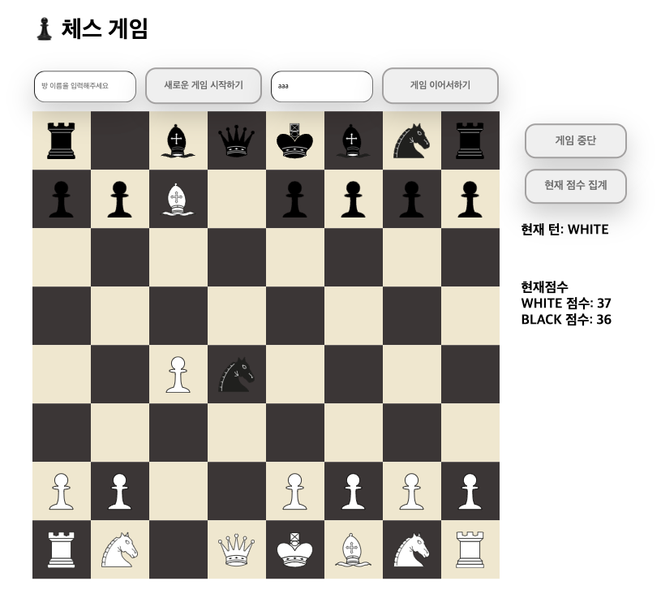

# java-chess


# 환경 구축
## 1. Docker MySql 설치
`/docker` 디렉터리에 이동하여 터미널에 `docker-compose -p chess up -d` 명령어를 입력하여 도커에 프로젝트 db설치 및 실행한다.

## 2. MySql 터미널 접속하기
`docker exec -it chess_db_1 bash` 를 통해 docker안에 있는 db 터미널 접속한다.

## 3. DB테이블 생성하기
아래의 DDL을 사용하여 DB에 테이블을 생성한다.
### 테이블을 만들 때 사용한 DDL
```sql
create table game (
    room_name varchar(10) not null,
    turn_color varchar(10) not null,
    primary key (room_name)
);

create table pieces (
    room_name varchar(255) not null,
    position varchar(2) not null,
    piece_type varchar(20) not null,
    piece_color varchar(20) not null,
    foreign key(room_name) references game (room_name)
    on delete cascade
);
```

## 기능 구현 목록
### 1단계
- [x] 체스판을 초기화한다.
  - [x] 말의 위치 값은 가로 위치는 왼쪽부터 a ~ h이고, 세로는 아래부터 위로 1 ~ 8로 구현한다.
    - [x] 우리는 실제 체스말과 같이 그림으로 표현한다.
    - 
  - [x] 체스판에서 각 진영은 검은색(대문자)과 흰색(소문자) 편으로 구분한다.
- [x] 시작, 종료 입력을 받는다.
  - [x] start를 받으면 시작하고, end를 받으면 종료한다.

### 2단계
- `move source위치 target위치`의 입력에 맞게 말을 움직여야 한다.
- [x] 체스 말을 움직인다.
  - [x] 각각의 말들의 속성에 따라 움직이게 한다.
    - [x] Pawn
      - [x] 기본적으로 앞으로 한 칸 이동할 수 있다.
      - [x] 첫 턴에는 1칸 또는 2칸 이동이 가능하다.
      - [x] 상대방의 말을 죽일 때는 대각선으로 한 칸 이동 가능하다.
    - [x] Rook
      - [x] 상하/좌우로 자유롭게 이동할 수 있다.
    - [x] Knight
      - [x] 상하좌우로 한칸 대각선으로 한 칸 이동할 수 있다.
      - [x] 말을 뛰어넘을 수 있다.
    - [x] Bishop
      - [x] 대각선으로 자유롭게 이동할 수 있다.
    - [x] Queen
      - [x] 모든 방향으로 자유롭게 이동할 수 있다.
    - [x] King
      - [x] 모든 방향으로 한 칸 이동할 수 있다.
  - [x] 이동하는 경로에 말이 있는 경우 움직일 수 없다.
    - [x] Knight의 경우 해당하지 않는다.
  - [x] 도착지에 아군 말이 있어서는 안 된다.
  - [x] 출발지에 아군 말이 있어야 한다.
  - [x] 킹이 죽으면 게임이 종료된다.

### 3단계
- [x] `status`명령어를 입력하면 각 진영의 점수와 승패를 출력한다.
  - [x] 각 말에 점수를 부여한다.
  - [x] Pawn은 1점이다.
    - [x] 세로줄에 같은 색의 폰이 있는 경우 0.5점이다.
  - [x] Bishop은 3점이다.
  - [x] Rook은 5점이다.
  - [x] Knight는 2.5점이다.
  - [x] Queen은 9점이다.
  - [x] King은 0점이다.

### 4단계
- [x] `/` url 접속시 체스 보드 페이지가 나와야 한다.
- [x] `/start` url 접속시 보드에 말이 생기며 게임이 시작되어야 한다.
- [x] `/move` url 접속시 말을 이동시켜야 한다.
- [x] `/status` url 접속시 현재 게임 통계 점수가 나와야 한다.
- [x] `/finish` url 접속시 게임이 종료되어야 한다.
- [x] 모든 응답/요청은 json으로 정보를 전달한다.

### 5단계
- [x] 웹 서버를 재시작하더라도 이전 게임을 다시 시작할 수 있어야 한다.
- [x] 게임 방을 생성하여 게임을 한다.
- [x] 게임 방을 검색하여 이전 게임을 이어서 한다.
- [x] 게임 종료시 방을 삭제할지 선택후, 삭제할 수 있다.

## 프로그래밍 요구사항
- [x] 자바 코드 컨벤션을 지키면서 프로그래밍했는가?
- [x] 한 메서드에 오직 한 단계의 들여쓰기(indent)만 허용했는가?
- [x] else 예약어를 쓰지 않았는가?
- [x] 모든 원시값과 문자열을 포장했는가?
- [x] 콜렉션에 대해 일급 콜렉션을 적용했는가?
- [x] 3개 이상의 인스턴스 변수를 가진 클래스를 구현하지 않았는가?
- [x] getter/setter 없이 구현했는가? (디티오 제외)
- [x] 메소드의 인자 수를 제한했는가?(4개 금지, 3개 고민)
- [x] 코드 한 줄에 점(.)을 하나만 허용했는가? (디미터의 법칙)
- [x] 메소드가 한가지 일만 담당하도록 구현했는가?
- [x] 클래스를 작게 유지하기 위해 노력했는가?
- [x] 4,5 단계 구현을 할 때 도메인의 변경을 최소화해야 한다.


## 우아한테크코스 코드리뷰

- [온라인 코드 리뷰 과정](https://github.com/woowacourse/woowacourse-docs/blob/master/maincourse/README.md)


