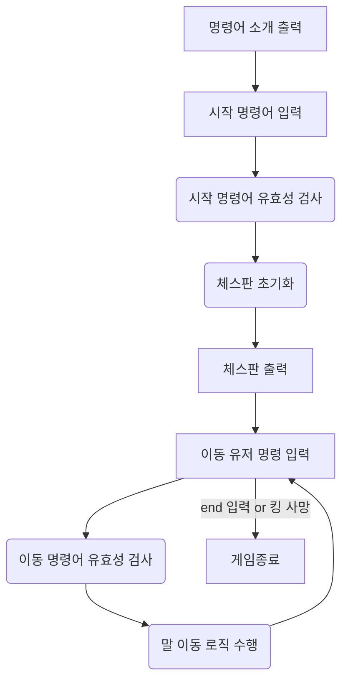
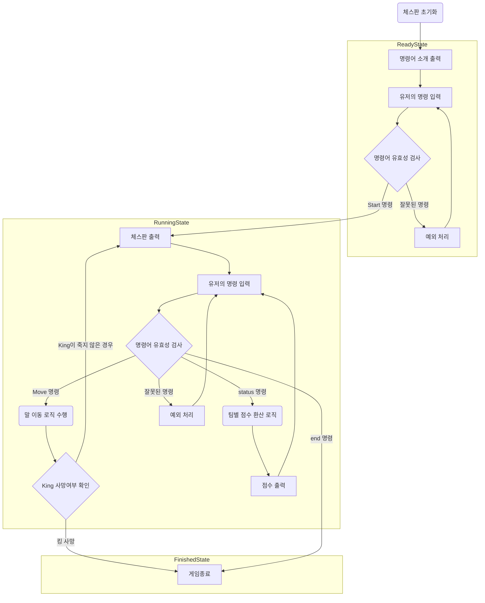
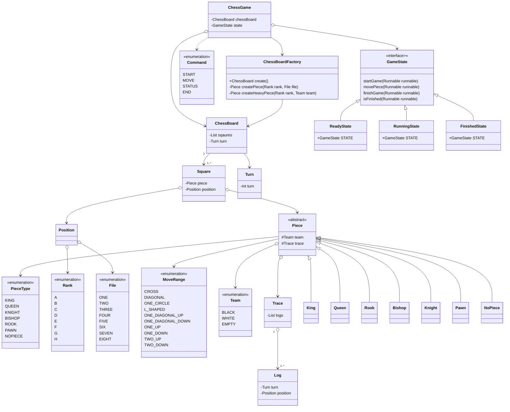
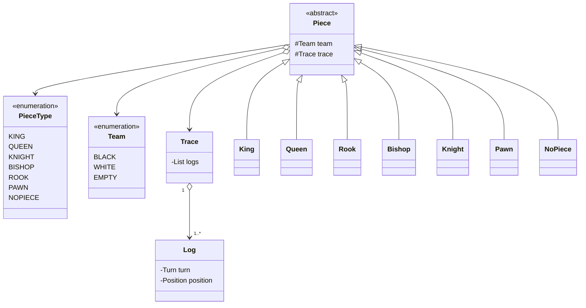
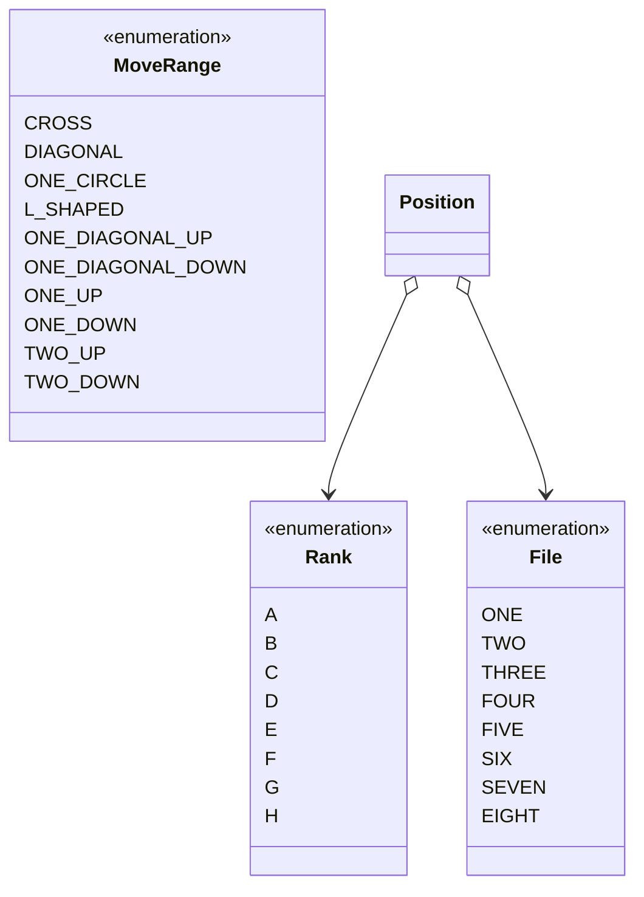
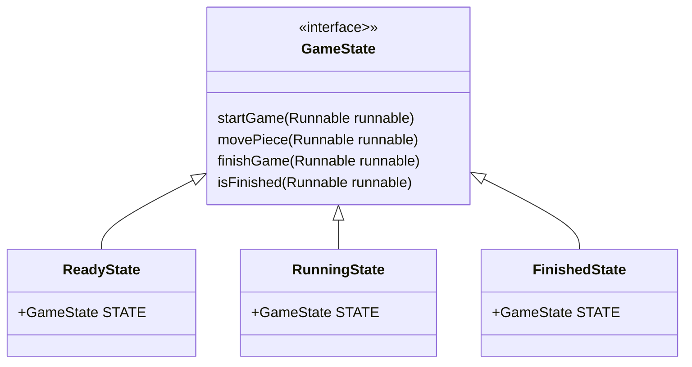

# java-chess

<br>

# 📚 도메인 모델 네이밍 사전

| 한글명   | 영문명       | 설명                               | 분류               |
|---------|-------------|-----------------------------------|-------------------|
| 팀     | Team      | Black, White로 구별되는 팀 정보          | enum             |
| 로그    | Log       | 기물이 이동 명령을 받았을 떄의 위치와 게임 턴 수를 저장 | class            |
| 기록    | Trace     | 로그의 목록                           | class            |
| 기물    | Piece     | 체스판의 말                           | (abstract) class |
| 행     | File      | 체스판의 세로 위치 정보 (1 ~ 8)            | enum             |
| 열     | Rank      | 체스판의 가로 위치 정보 (a ~ h)            | enum             |
| 좌표    | Position  | 행과 열로 이루어진 체스판의 위치정보             | class            |
| 칸     | Square    | 좌표와 기물 정보를 가지고 있는 체스판의 구성요소      | class            |
| 턴     | Turn      | 체스 게임의 턴                         | class            |
| 체스 판  | ChessBoard | 칸을 가지고 있는 보드            | class            |
| 체스 판 생성기  | ChessBoardFactory | 체스 판을 초기화한다.                  | class            |
| 게임 상태 | GameState | 체스 게임의 상태                        | interface             |
| 체스 게임 | ChessGame | 체스 게임 진행을 관리                     | class            |
| 점수 | Score | 팀의 점수                                      | class            |
| 심판 | ScoreManager | 팀별 점수를 계산하고 저장                   | class            |

# 게임 용어 사전

- 체크(Check) : 킹이 다른 기물에게 공격을 받는 것
- 승진(Promotion) : 폰은 체스판 반대편에 도달하면 다른 기물로 변할 수 있다.(모든 기물로 승진 가능)
- 캐슬링(Castling) : 킹과 룩 사이에 아무것도 없고, 둘다 움직인 적이 없으며 적에게 위협받고 있지 않을 때 킹이 룩의 방향으로 2칸 이동, 룩은 그 반대 방향으로
  킹으로부터 한 칸
- 앙파상(EnPassant) : 상대 폰이 2칸을 이동했을 때 내 폰이 해당 폰의 옆에 존재할 경우 해당 폰의 뒤칸으로 이동하면서(대각선이동) 상대방 폰을 잡을 수 있다.
- 아군(Ally) : 우리 팀, 현재 차례의 팀
- 적군(Enemy) : 상대 팀, 다음/이전 차례의 팀


- 기물의 종류
    - 킹(King) - 0점
    - 퀸(Queen) - 9점
    - 룩(Rook) - 5점
    - 비숍(Bishop) - 3점
    - 나이트(Knight) - 2.5점
    - 폰(Pawn) - 같은 세로줄에 같은 팀의 폰이 존재할 경우 0.5점, 그 외 1점

<br>

# 프로그램 흐름도

- 1,2단계 흐름도



- 3단계 흐름도



# 클래스 다이어그램



- piece 패키지



- position 패키지



- state 패키지



# 👨‍🍳 기능 목록

## 입력(InputView)

- [ ] 게임 시작 전 명령을 입력 받는다.
    - [ ] 새 게임 명령 : new로 새 게임을 실행한다.
    - [ ] 이어하기 명령 : continue로 이전에 중단된 게임을 이어한다.
- [x] 게임 중 명령을 입력 받는다.
    - [x] 이동 명령 : move source위치 target위치을 실행해 이동한다.
    - [x] 종료 명령 : end로 프로그램을 종료한다.
    - [ ] 상태확인 명령 : status 명령을 받으면 각 진영의 점수를 출력하고 어느 진영이 이겼는지 결과를 볼 수 있어야 한다.

## 도메인(domain)

#### 체스 게임(ChessGame)

- [x] 게임의 턴 정보를 가진다.
    - [x] 게임 중 명령이 정상적으로 수행되면 턴을 증가시킨다.
- [x] 시작 명령을 받으면 게임을 시작한다.
    - [x] start 명령어가 파라미터로 제대로 전달되었는지 검사한다.
- [x] 이동 명령을 받으면 체스판에 명령을 전달한다.
- [x] 종료 명령을 받으면 게임을 종료한다.
- [x] 킹이 잡히면 게임을 종료한다.

#### 점수(Score)(값객체)

- [x] equals 구현
- [x] 더하기 구현

#### 심판(ScoreManager)

- [ ] 인스턴스로 팀 별 점수 맵 데이터를 가진다.
- [ ] ChessBoard과 팀을 입력으로 받아 해당 팀의 점수를 계산한다.
    - [ ] 특정 팀의 열 별 점수를 구한다.
    - [ ] 폰의 경우, 같은 열에 같은 팀의 폰이 존재하면 0.5점으로 계산한다.
- [ ] ChessBoard를 입력으로 받아 이긴 팀을 구한다.
- [ ] 현재 남아있는 말에 대한 점수를 구한다.

#### 체스판공장(ChessBoardFactory)

- [x] 새 게임 시작 시 체스판의 초기 상태를 초기화한다.
- [ ] 애플리케이션 재시작 시 DB로부터 받은 데이터를 기반으로 체스판을 초기화한다.

#### 체스판(ChessBoard)

- [x] 체스판을 초기화한다.
    - [x] 체스판은 64개의 칸으로 이루어져 있다.
    - [x] 각 칸은 자신의 기물정보와 위치정보를 초기화한다.
        - [x] 칸은 a ~ h 의 File과 1 ~ 8 의 Rank의 Position을 가진다.
    - [x] 체스판은 이동 또는 공격을 수행한다.
        - [x] 체스판은 이동 또는 공격이 가능한지 확인한다.
        - [x] 입력받은 두 칸의 기물을 변경한다.
        - [x] 이동 기록(Log)을 기물에 추가한다.
- [ ] 현재 남아있는 말에 대한 점수를 구한다.
    - [ ] 한번에 한 세로줄의 점수를 구한 뒤 합산한다.

#### 기물(Piece)

- [x] 기물의 이동 가능 여부를 판단한다.
    - [x] 모든 기물은 자기 자신의 위치로 이동할 수 없다.
    - [x] 킹은 주변 8방향으로 1칸 범위에서 이동 가능하다.
    - [x] 퀸은 주변 8방향으로 칸 제한없이 이동 가능하다.
    - [x] 룩은 상하좌우로 칸 제한없이 이동 가능하다.
    - [x] 비숍은 대각선으로 칸 제한없이 이동 가능하다.
    - [x] 나이트는 상하좌우로 두 칸 움직인 후 꺾어서 한 칸인 위치로 이동가능하다.
    - [x] 폰 이동과 공격이 분리된다.
    - 이동
        - [x] 한 번도 움직이지 않았다면 두 칸 앞으로 이동할 수 있다.
        - [x] 한 칸 앞으로 이동할 수 있다.
    - 공격
        - [x] 앞으로 한 칸 움직인 후 옆으로 꺾어서 한 칸인 위치에 상대방의 기물이 있다면 공격할 수 있다.

## 출력(OutView)

- [x] 게임의 명령어 가이드를 출력한다.
- [x] 현재 체스 판의 정보를 출력한다.
    - [x] 체스판에서 각 진영은 검은색(대문자)과 흰색(소문자)편으로 구분한다.
- [ ] 각 팀의 점수를 출력한다.
- [ ] 게임 종료 후 어느 팀이 승리하였는지에 대한 정보를 출력한다.

## DB

- [ ] 체스게임 정보를 DB에 저장하는 기능
- [ ] 체스 게임 정보를 불러와 DTO에 매핑하는 기능
- [ ] 체스 게임 정보를 업데이트하는 기능
    - DB에 게임이 끝난 여부도 함께 저장하도록 해야 할 듯

# 프로그래밍 요구사항

도메인의 의존성을 최소한으로 구현한다. 한 줄에 점을 하나만 찍는다. 게터/세터/프로퍼티를 쓰지 않는다. 모든 객체지향 생활 체조 원칙을 잘 지키며 구현한다. 프로그래밍
체크리스트의 원칙을 지키면서 프로그래밍 한다.

# 📌 Commit Convention

커밋 메시지는 다음과 같은 형태로 작성합니다.

```Bash
> "커밋의 타입: 커밋 메세지 내용"
ex) "docs: 기능 목록 추가"
```

커밋의 타입은 아래 10가지 중 가장 적절한 것을 선택해 작성합니다.

| 커밋의 타입 |                       설명                        |
| :---------: | :-----------------------------------------------: |
|    feat     |                 새로운 기능 추가                  |
|     fix     |                     버그 수정                     |
|   comment   |             필요한 주석 추가 및 변경              |
|    test     |                 테스트 코드 추가                  |
|    docs     |      문서를 추가 혹은 수정 (ex. README 수정)      |
|   rename    |     파일 혹은 폴더명을 수정하거나 옮기는 작업     |
|   remove    |            파일을 삭제하는 작업만 수행            |
|    chore    |    빌드 태스크 업데이트, 패키지 매니저를 설정     |
|  refactor   |                   코드 리팩토링                   |
|    style    | 코드 포맷팅, 세미콜론 누락, 코드 변경이 없는 경우 |

- 상세한 컨벤션
  내용은 [Angular JS Git Commit Message Conventions](https://gist.github.com/stephenparish/9941e89d80e2bc58a153)
  를 참고

<br>

# 📌 Code Convention

- 구글 Java 코딩 컨벤션을 준수합니다.
- IntelliJ의 Formatter를 적용합니다.