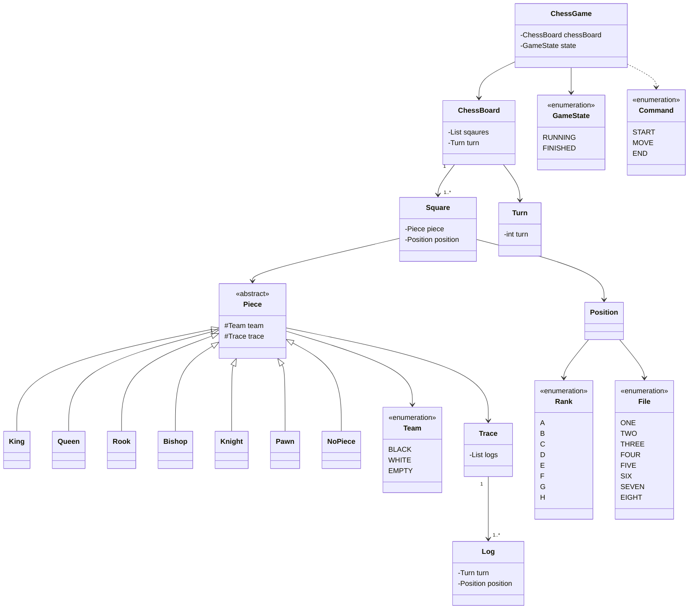

# java-chess

<br>

# 📚 도메인 모델 네이밍 사전

| 한글명   | 영문명       | 설명                               | 분류               |
|-------|-----------|----------------------------------|------------------|
| 팀     | Team      | Black, White로 구별되는 팀 정보          | enum             |
| 로그    | Log       | 기물이 이동 명령을 받았을 떄의 위치와 게임 턴 수를 저장 | class            |
| 기록    | Trace     | 로그의 목록                           | class            |
| 기물    | Piece     | 체스판의 말                           | (abstract) class |
| 행     | File      | 체스판의 세로 위치 정보 (1 ~ 8)            | enum             |
| 열     | Rank      | 체스판의 가로 위치 정보 (a ~ h)            | enum             |
| 좌표    | Position  | 행과 열로 이루어진 체스판의 위치정보             | class            |
| 칸     | Square    | 좌표와 기물 정보를 가지고 있는 체스판의 구성요소      | class            |
| 체스 판  | ChessBoard | 칸을 가지고 있는 일급컬렉션                  | class            |
| 턴     | Turn      | 체스 게임의 턴                         | class            |
| 게임 상태 | GameState | 체스 게임의 상태                        | enum             |
| 체스 게임 | ChessGame | 체스 게임 진행을 관리                     | class            |

# 게임 용어 사전

- 체크(Check) : 킹이 다른 기물에게 공격을 받는 것
- 승진(Promotion) : 폰은 체스판 반대편에 도달하면 다른 기물로 변할 수 있다.(모든 기물로 승진 가능)
- 캐슬링(Castling) : 킹과 룩 사이에 아무것도 없고, 둘다 움직인 적이 없으며 적에게 위협받고 있지 않을 때 킹이 룩의 방향으로 2칸 이동, 룩은 그 반대 방향으로 킹으로부터 한 칸
- 앙파상(EnPassant) : 상대 폰이 2칸을 이동했을 때 내 폰이 해당 폰의 옆에 존재할 경우 해당 폰의 뒤칸으로 이동하면서(대각선이동) 상대방 폰을 잡을 수 있다.

- 기물의 종류
  - 킹(King)
  - 퀸(queen) - 9점
  - 룩(rook) - 5점
  - 비숍(bishop) - 3점
  - 나이트(knight) - 2.5점
  - 폰(pawn)
<br>


# 프로그램 흐름도

- 1단계 흐름도


# 클래스 다이어그램


# 👨‍🍳 기능 목록


## 입력(InputView)

- [x] 시작 명령을 입력 받는다.
- [x] 게임 중 명령을 입력 받는다.
  - [x] 이동 명령 : move source위치 target위치을 실행해 이동한다.
  - [x] 종료 명령 : end로 프로그램을 종료한다.

## 도메인(domain)

#### 체스 게임(ChessGame)
- [x] 게임의 턴 정보를 가진다.
  - [x] 게임 중 명령이 정상적으로 수행되면 턴을 증가시킨다.
- [x] 시작 명령을 받으면 게임을 시작한다.
  - [x] start 명령어가 파라미터로 제대로 전달되었는지 검사한다.
- [x] 이동 명령을 받으면 체스판에 명령을 전달한다.
- [x] 종료 명령을 받으면 게임을 종료한다.
- [x] 킹이 잡히면 게임을 종료한다.
#### 체스판(ChessBoard)
- [x] 체스판을 초기화한다.
  - [x] 체스판은 64개의 칸으로 이루어져 있다.
  - [x] 각 칸은 자신의 기물정보와 위치정보를 초기화한다.
    - [x] 칸은 a ~ h 의 File과 1 ~ 8 의 Rank의 Position을 가진다.
  - [x] 체스판은 이동 또는 공격을 수행한다.
    - [x] 체스판은 이동 또는 공격이 가능한지 확인한다.
    - [x] 입력받은 두 칸의 기물을 변경한다.
    - [x] 이동 기록(Log)을 기물에 추가한다.
#### 기물(Piece)
- [x] 기물의 이동 가능 여부를 판단한다.
  - [x] 모든 기물은 자기 자신의 위치로 이동할 수 없다.
  - [x] 킹은 주변 8방향으로 1칸 범위에서 이동 가능하다.
  - [x] 퀸은 주변 8방향으로 칸 제한없이 이동 가능하다.
  - [x] 룩은 상하좌우로 칸 제한없이 이동 가능하다.
  - [x] 비숍은 대각선으로 칸 제한없이 이동 가능하다.
  - [x] 나이트는 상하좌우로 두 칸 움직인 후 꺾어서 한 칸인 위치로 이동가능하다.
  - [x] 폰 이동과 공격이 분리된다.
   - 이동
     - [x] 한 번도 움직이지 않았다면 두 칸 앞으로 이동할 수 있다.
     - [x] 한 칸 앞으로 이동할 수 있다.
   - 공격
     - [x] 앞으로 한 칸 움직인 후 옆으로 꺾어서 한 칸인 위치에 상대방의 기물이 있다면 공격할 수 있다.


## 출력(OutView)

- [x] 게임의 명령어 가이드를 출력한다.
- [x] 현재 체스 판의 정보를 출력한다.
  - [x] 체스판에서 각 진영은 검은색(대문자)과 흰색(소문자)편으로 구분한다.

# 프로그래밍 요구사항

도메인의 의존성을 최소한으로 구현한다.
한 줄에 점을 하나만 찍는다.
게터/세터/프로퍼티를 쓰지 않는다.
모든 객체지향 생활 체조 원칙을 잘 지키며 구현한다.
프로그래밍 체크리스트의 원칙을 지키면서 프로그래밍 한다.

# 📌 Commit Convention

커밋 메시지는 다음과 같은 형태로 작성합니다.

```Bash
> "커밋의 타입: 커밋 메세지 내용"
ex) "docs: 기능 목록 추가"
```

커밋의 타입은 아래 10가지 중 가장 적절한 것을 선택해 작성합니다.

| 커밋의 타입 |                       설명                        |
| :---------: | :-----------------------------------------------: |
|    feat     |                 새로운 기능 추가                  |
|     fix     |                     버그 수정                     |
|   comment   |             필요한 주석 추가 및 변경              |
|    test     |                 테스트 코드 추가                  |
|    docs     |      문서를 추가 혹은 수정 (ex. README 수정)      |
|   rename    |     파일 혹은 폴더명을 수정하거나 옮기는 작업     |
|   remove    |            파일을 삭제하는 작업만 수행            |
|    chore    |    빌드 태스크 업데이트, 패키지 매니저를 설정     |
|  refactor   |                   코드 리팩토링                   |
|    style    | 코드 포맷팅, 세미콜론 누락, 코드 변경이 없는 경우 |

- 상세한 컨벤션
  내용은 [Angular JS Git Commit Message Conventions](https://gist.github.com/stephenparish/9941e89d80e2bc58a153)
  를 참고

<br>

# 📌 Code Convention

- 구글 Java 코딩 컨벤션을 준수합니다.
- IntelliJ의 Formatter를 적용합니다.