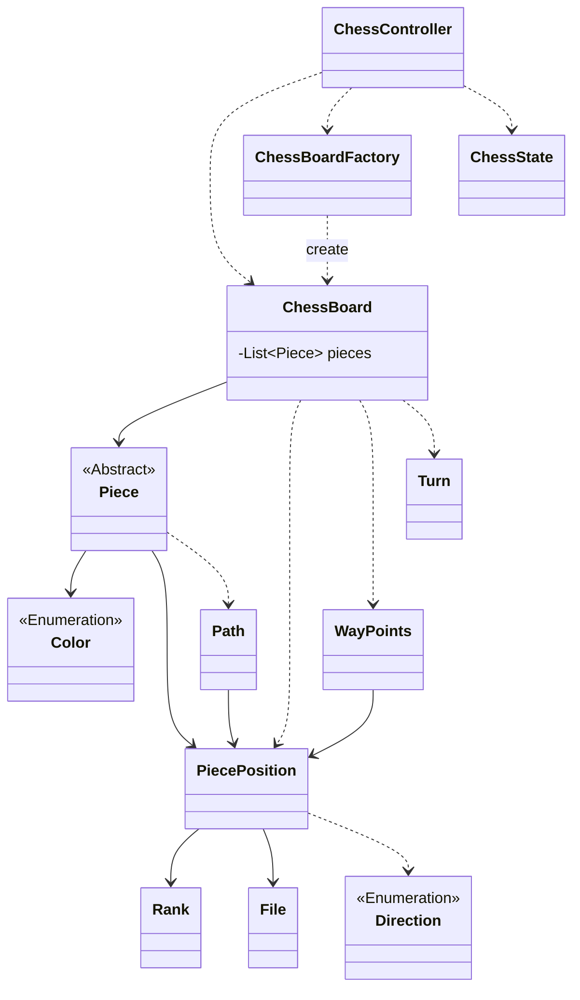
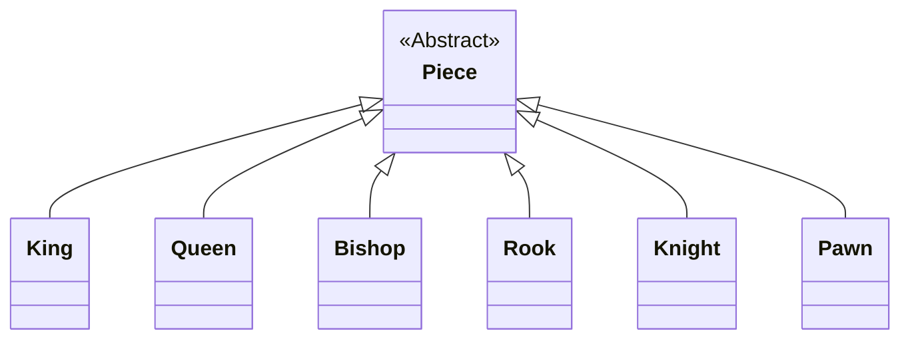
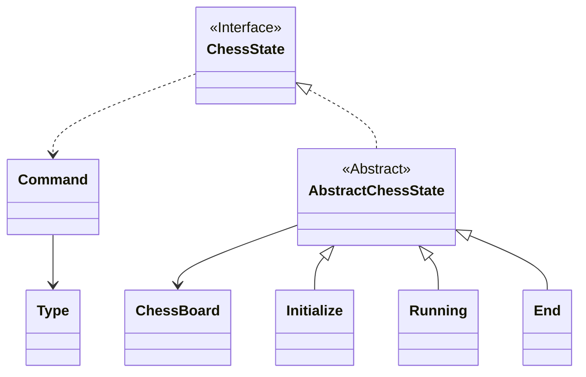

## 1단계 기능 요구 사항

- [x] 게임 시작 메세지 출력
- [x] 커맨드 입력 메세지 출력
- [x] 커맨드 입력 기능
- [x] 체스판 출력
- [x] 체스판 만드는 기능

### 기물

- [x] 위치를 갖는다.
- [x] 종류는 킹, 퀸, 룩, 나이트, 비숍, 폰 이 있다.

### 체스 판

- [x] 가로는 Rank 이다.
- [x] 세로는 File 이다.
- [x] 8 X 8 이다.

### Piece 추상 클래스

### 상태 패턴

---
