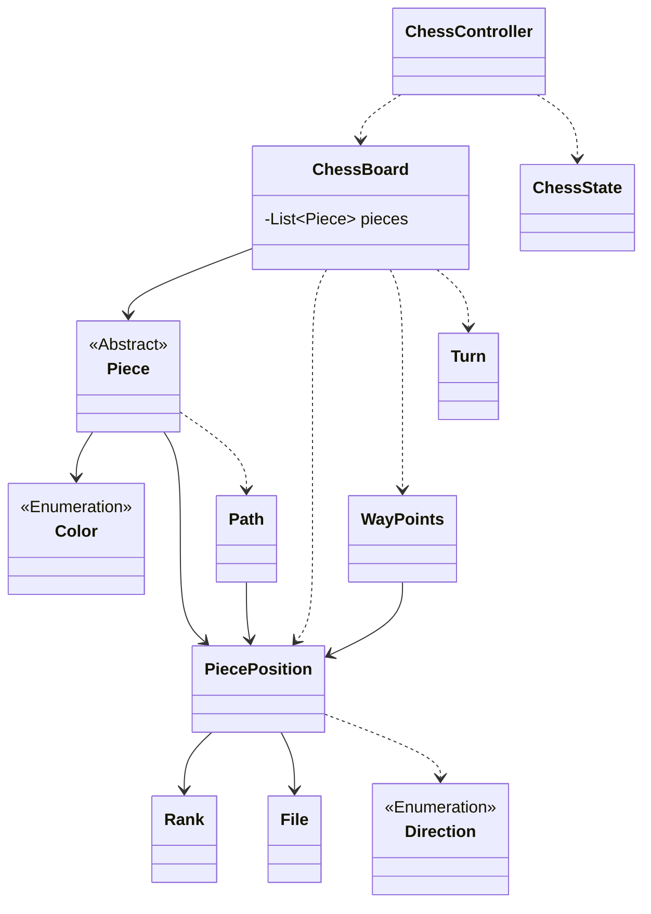
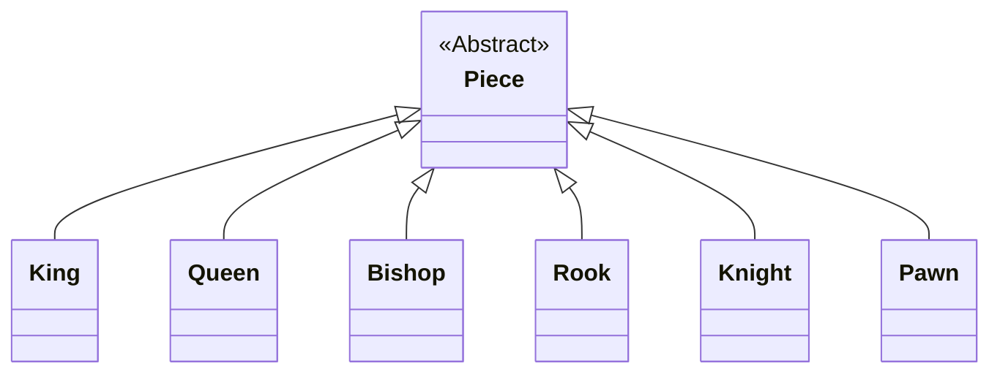
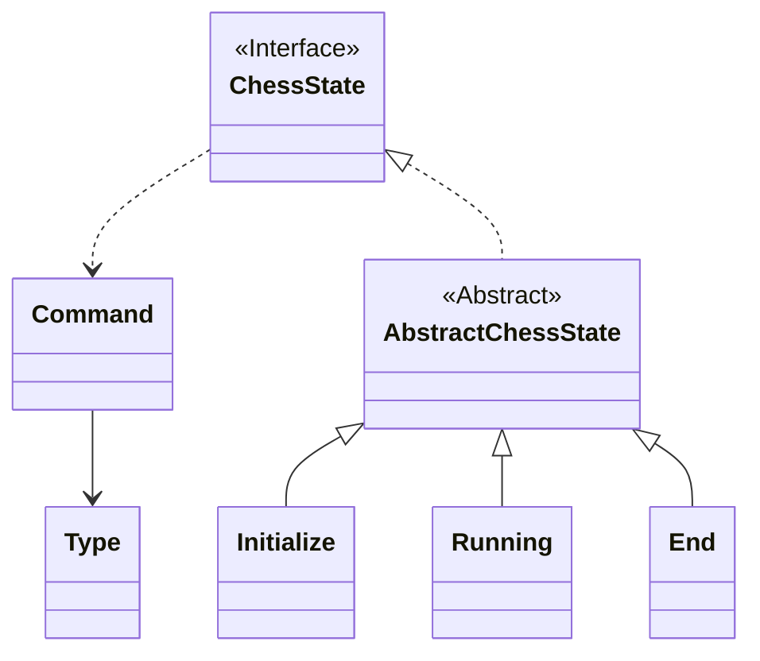

## 클래스 다이어그램

### 주요 클래스 구조

### Piece 추상 클래스

### 상태 패턴

---

## 1단계 기능 요구 사항

- [x] 게임 시작 메세지 출력
- [x] 커맨드 입력 메세지 출력
- [x] 커맨드 입력 기능
- [x] 체스판 출력
- [x] 체스판 만드는 기능

### 기물

- [x] 위치를 갖는다.
- [x] 종류는 킹, 퀸, 룩, 나이트, 비숍, 폰 이 있다.

### 체스 판

- [x] 가로는 Rank 이다.
- [x] 세로는 File 이다.
- [x] 8 X 8 이다.

---

## 2단계 기능 요구 사항

- [x] 게임 시작 및 커맨드 메세지 출력
- [x] 이동 커맨드 입력 기능 추가
- [x] White, Black 턴 반복 기능 추가
- [x] start, move, end 커맨드에 대한 로직 구현

### 기물 이동

- 공통
  - [x] 도착지에 아군 기물이 있을 경우, 이동 불가능
  - [x] 도착지에 상대 기물이 있을 경우, 이동 후 상대 기물 제거(Pawn 예외)
  - [x] 도착지까지 가는 경로에 기물이 있을 경우, 이동 불가능(Knight 예외)
  - [x] 상대 말 이동 불가능
- King
  - [x] 주변 한 칸만 이동 가능
- Queen
  - [x] 직선 거리 or 대각선 거리로 이동 가능
- Bishop
  - [x] 대각선 거리로 이동 가능
- Rook
  - [x] 직선 거리로 이동 가능
- Knight
  - [x] 앞으로 두 칸 -> 옆으로 한 칸 이동 가능 (8개)
- Pawn
  - [x] 첫 이동인 경우, 앞으로 두 칸까지 이동 가능
  - [x] 첫 이동이 아닌 경우, 앞으로 한 칸만 이동 가능
  - [x] 앞에 상대 기물이 있는 경우, 이동 불가능
  - [x] 대각선 위치에 상대 기물이 있는 경우, 이동 후 상대 기물 제거 가능

---

## 1, 2단계 리팩토링 요구 사항

- [x] `createExclusivePawn` 메서드 명 변경
- [x] 생성자에서 방어적 복사 하도록 변경
- [x] `PiecePosition`에서 File, Rank 순서 변경
- [x] 상태가 기물을 직접 움직이지 않도록 변경
- [x] 정적 팩토리 메서드와 생성자 사이에 기준 정하기
- [x] 부정 연산자 사용하지 않도록 수정
- [x] `incorrect` 메서드 명 변경 및 메서드 순서 변경
- [x] 한 줄에 점 하나만 찍도록 수정
- [x] getter 사용 지양하기

---

## 3단계 기능 요구 사항

### King이 잡히면 게임 종료
- [x] 이동한 위치의 상대가 King인지 확인
- [x] Finished 상태로 변경
- [x] 승패 계산
- [x] 승패 출력

### 점수 계산
- [ ] status 명령어 입력에 대한 처리
- [ ] 색깔 별로 점수 총합 계산
- [ ] queen : 9점, rook : 5점, bishop : 3점, knight : 2.5점
- [x] pawn인지 확인
- [ ] pawn인 경우 같은 File(세로 줄)에 pawn이 있는지 확인
  - 있으면 0.5점
  - 없으면 1점
- [ ] 점수 출력

