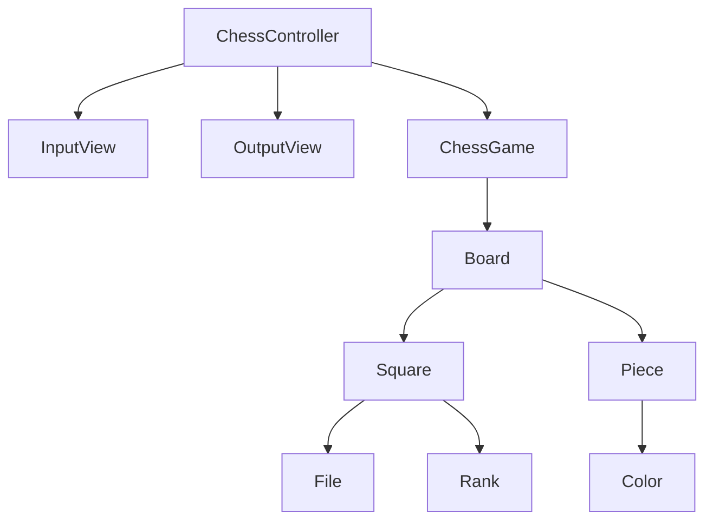

## 도메인 객체 그래프

## 구현 기능 목록

### 체스 보드

- 체스 기물 위치를 알고 있다.
    - [ ] 체스 기물 위치를 초기화한다.

### 체스 칸

- 세로줄 (File)
    - [ ] 왼쪽부터 a ~ h이다.
- 가로줄 (Rank)
    - [ ] 아래부터 1 ~ 8이다.

### 체스 기물

- 색을 가진다.
    - [x] 흑과 백이 존재한다.

### 입력

- [ ] 게임 시작/종료 여부를 입력한다.

### 출력

- [ ] 게임 시작 문구를 출력한다.
- [ ] 체스판을 출력한다.
