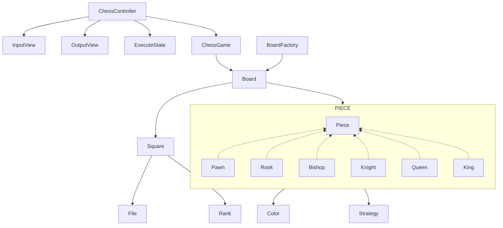

## 도메인 객체 그래프

## 구현 기능 목록

### 체스 게임

- [x] 기물을 이동시킨다.

### 체스 보드

- [x] 체스 기물 위치를 알고 있다.
- [x] 특정 칸에 존재하는 기물을 확인한다.
- [x] 이동 경로로 이동할 수 있는지 확인한다.
- [x] 폰이 이동 경로로 이동할 수 있는지 확인한다.
- [x] 기물 위치를 업데이트한다.

### 체스 칸

- 세로줄 (File)
    - [x] 왼쪽부터 a ~ h이다.
    - [x] [예외사항] 존재하지 않는 인덱스라면 예외를 던진다.
    - [x] 파일 간 거리를 계산한다.
    - [x] 다음 파일을 반환한다.
    - [x] 이전 파일을 반환한다.
- 가로줄 (Rank)
    - [x] 아래부터 1 ~ 8이다.
    - [x] [예외사항] 존재하지 않는 인덱스라면 예외를 던진다.
    - [x] 랭크 간 거리를 계산한다.
    - [x] 다음 랭크를 반환한다.
    - [x] 이전 랭크를 반환한다.

### 체스 기물

- 여러 가지 기물이 존재한다.
    - 폰
    - 룩
    - 나이트
    - 비숍
    - 퀸
    - 킹
- 색을 가진다.
    - [x] 흑과 백이 존재한다.
    - [x] 검은색인지 확인한다.
    - [x] 같은 색인지 확인한다.
- [x] 움직이는 경로를 반환한다.
- [x] 폰인지 확인한다.

### 방향 벡터

- [x] 움직이려는 방향으로 갈 수 있는지 확인한다.
- [x] 방향의 다음 파일을 반환한다.
- [x] 방향의 다음 랭크를 반환한다.

### 입력

- [x] 게임 실행 명령을 입력한다.

### 출력

- [x] 게임 시작 문구를 출력한다.
- [x] 체스판을 출력한다.
- [x] 에러 메시지를 출력한다.
