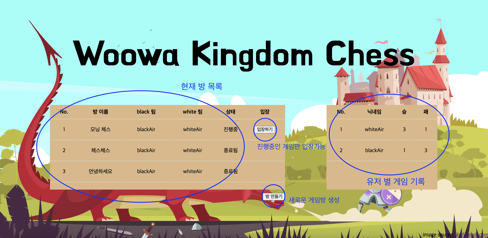
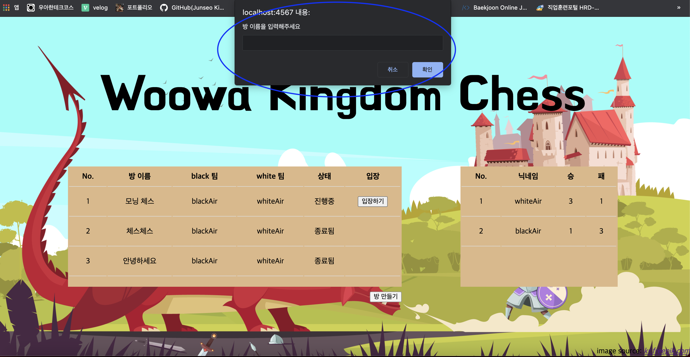
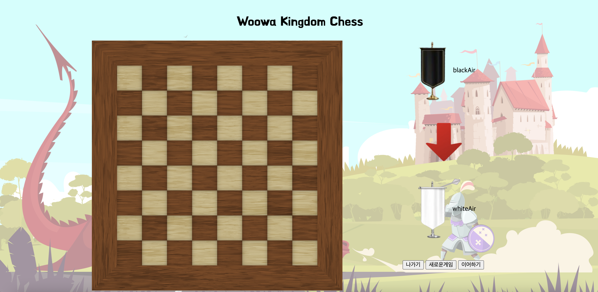
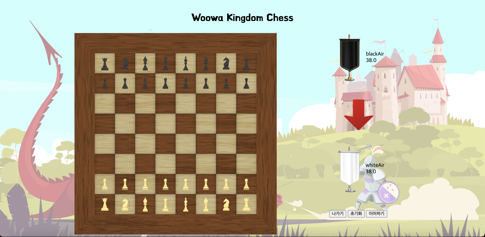
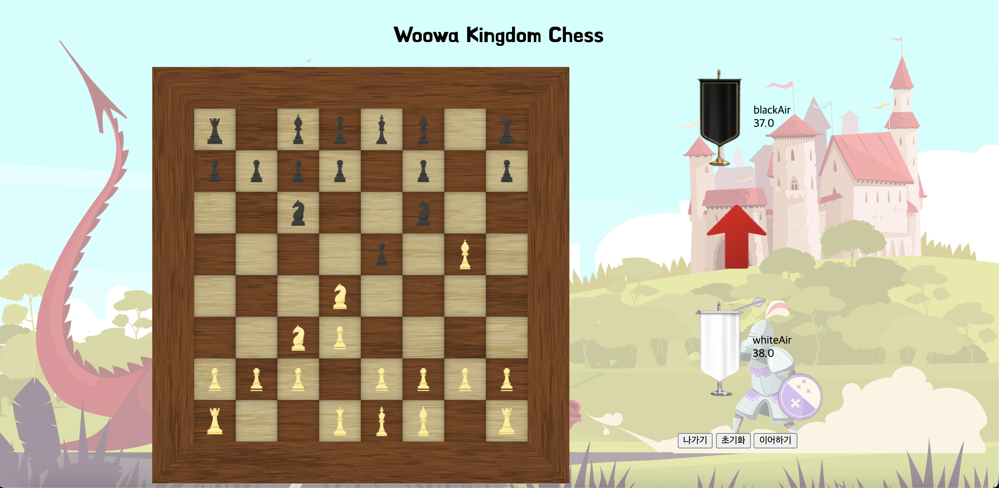

[DB 초기 세팅](../../../../initializeDB.sql) 를 참고하여 DB 생성 후 http://localhost:4567 로 접속하면 아래와 같은 창이 보입니다.

현재 유저는 default로 2명의 유저(`blackAir`, `whiteAir`)만 존재하며 추가하고, 선택할 수 있는 기능은 없습니다😭

`방 만들기` 클릭 시 방 이름을 입력할 수 있는 팝업이 뜨고 방 이름을 입력하면 방이 생성됩니다. 이때 black팀은 `blackAir`로 white팀은 `whiteAir`로 자동 지정됩니다.

끝나지 않은 상태의 방은 `입장하기`를 눌러서 방에 입장할 수 있습니다.

방에 입장 후, 우측 하단의 `새로운 게임`을 누르면 새로운 게임이 시작됩니다.(전에 진행하던 상태가 있는 경우에는 진행하던 상태가 사라지고 새로운 게임이 시작됩니다.)

우측 하단의 `이어하기`를 누르면 진행하던 상태가 있는 경우, 진행하던 상태에서 게임을 시작할 수 있습니다.

